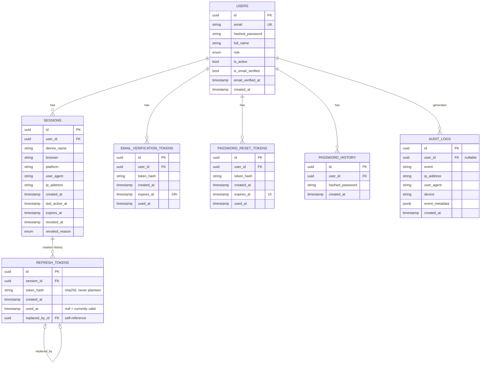

# Auth Data Model — Module 2.5

**Reading the model:** a `SESSIONS` row is one login/device. Its
`REFRESH_TOKENS` rows are the rotation history for that session — exactly
one has `used_at IS NULL` at any time (the currently valid token); every
prior one points at its replacement via `replaced_by_id`. See
[ADR-0014](../adr/0014-refresh-token-and-session-model.md) for the full
rotation/reuse-detection design this shape supports.
