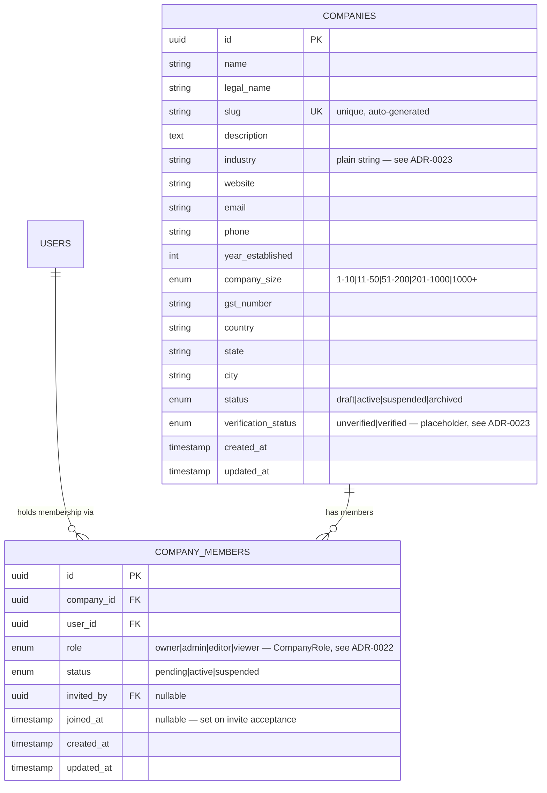

# Company Core Data Model — Module 3A (as implemented)

This documents the **actual implemented schema** (migration 0003), not
the aspirational full domain model — see `docs/domain/04-entity-relationship-diagram.md`
for the long-term design and `docs/adr/0023-module-3a-scope-simplifications.md`
for exactly where and why this diverges from it (`industry` as a plain
string, `verification_status` as a placeholder).

## Constraints enforced at the database level (not just application code)

| Constraint | Enforced by | Business rule |
|---|---|---|
| `companies.slug` unique | Unique index | Two companies can never collide on their public URL |
| One `owner`-role `company_members` row per `company_id` | Partial unique index (`WHERE role = 'owner'`) | "A company must have exactly one Owner" — see `docs/domain/08-business-rules.md`. Verified directly by `tests/test_company_members.py::test_database_enforces_single_owner_even_if_application_logic_were_bypassed`, which bypasses the service layer entirely. |
| One `company_members` row per `(company_id, user_id)` | Unique constraint | A user can't hold two simultaneous memberships in the same company |
| `company_members.company_id` → `companies.id` | FK, `ON DELETE CASCADE` | Deleting a company (not done in practice — see below) removes its memberships |
| `company_members.user_id` → `users.id` | FK, `ON DELETE CASCADE` | Deleting a user removes their memberships |

## Why `companies.status` handles "delete," not a physical row deletion

`DELETE /companies/{id}` sets `status = 'archived'` — see
`company_service.archive_company`. The company row, and its members,
remain in the database (excluded from search and public-profile lookup,
per `get_by_slug` and `search_companies` both filtering on
`status = 'active'`). This preserves the audit trail
(`company_deleted` event, `AuditLog`) and matches
`docs/domain/03-core-entities.md`'s Company lifecycle
(Draft → Active → Suspended/Archived) rather than a hard delete.
