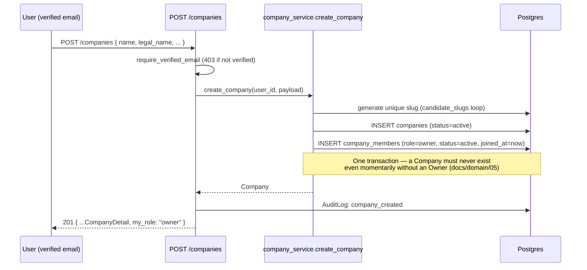
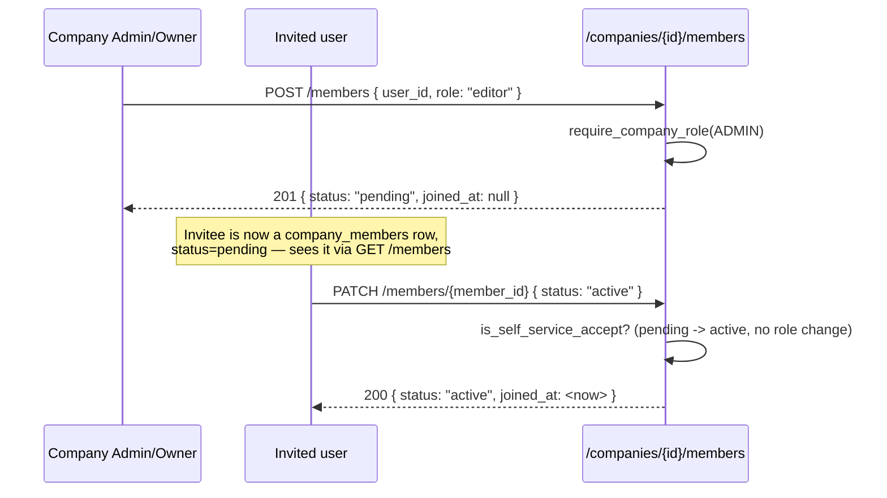
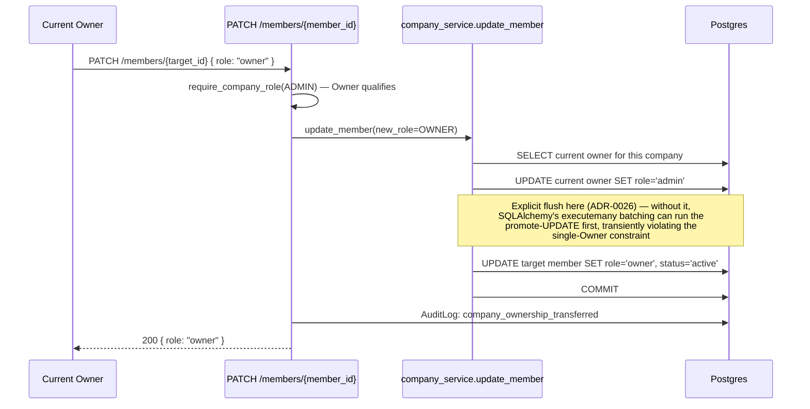
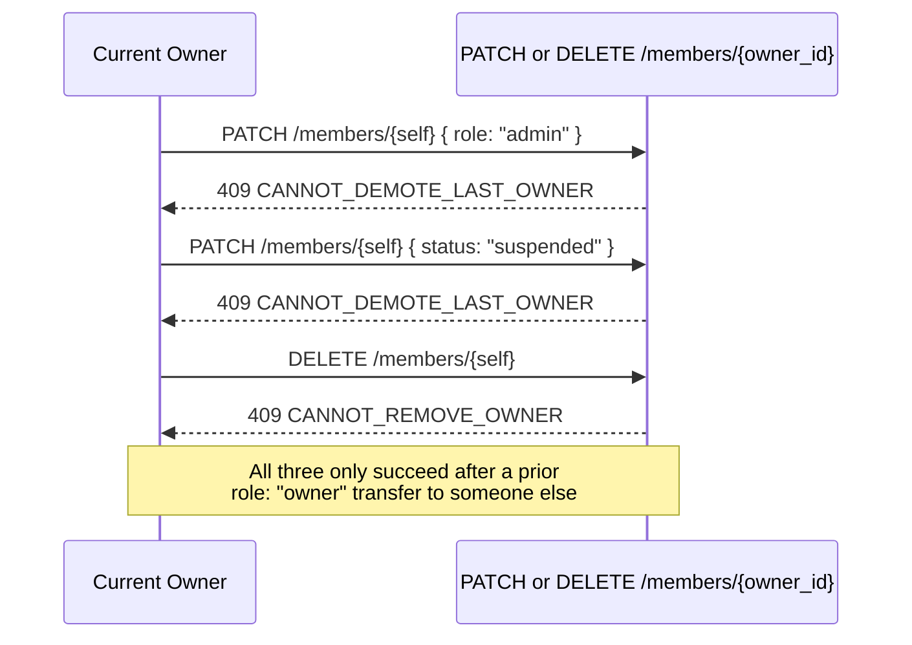

# Company Core Sequences — Module 3A

## Company creation → automatic Owner membership

## Member invite → self-service accept

## Ownership transfer (see ADR-0024, ADR-0026)

## Guard rails that reject, rather than silently allow

