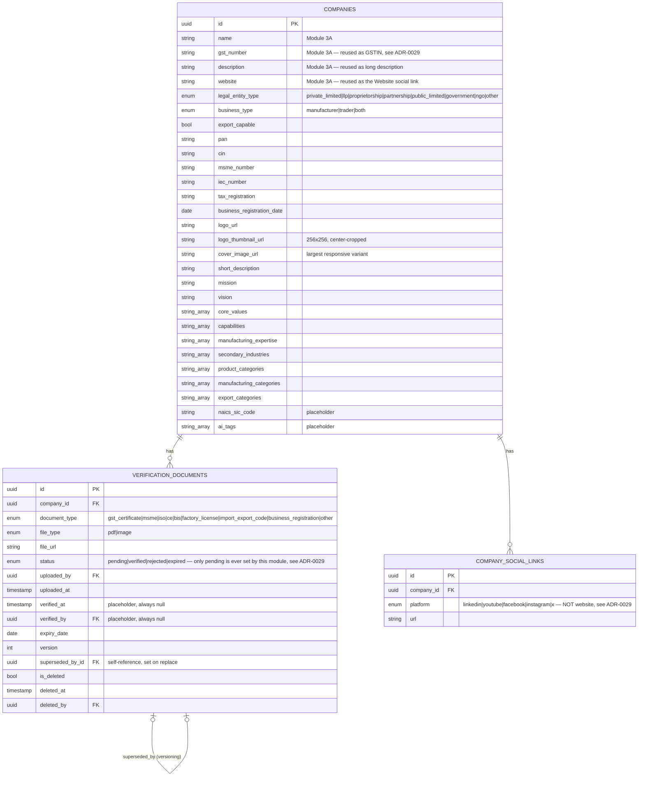

# Company Verification & Industrial Identity Data Model — Module 3B (as implemented)

Purely additive to `docs/architecture/company-core-data-model.md` (Module
3A) — no existing column is altered or dropped. See
`docs/adr/0029-module-3b-verification-and-identity.md` for why several
fields the module brief lists aren't new columns (they reuse Module 3A's
`gst_number`, `description`, and `website`).

## The verification score is NOT a column

Deliberately absent from this diagram: there is no
`verification_percentage` or `verification_level` column anywhere.
`docs/adr/0029`'s decision #1 explains why — the score is computed live,
every request, by `app.services.verification_score_service.calculate`,
from the data shown above plus `users.is_email_verified` (via the
company's Owner). This is what makes "no manual editing" a structural
guarantee rather than a policy nobody enforces.

## Constraints enforced at the database level

| Constraint | Enforced by |
|---|---|
| One social link per `(company_id, platform)` | Unique constraint — matches `docs/architecture/company-core-data-model.md`'s style of enforcing business rules in the schema, not just application code |
| `verification_documents.company_id` / `company_social_links.company_id` → `companies.id` | FK, `ON DELETE CASCADE` |
| `verification_documents.superseded_by_id` → `verification_documents.id` | Self-referencing FK, nullable |
