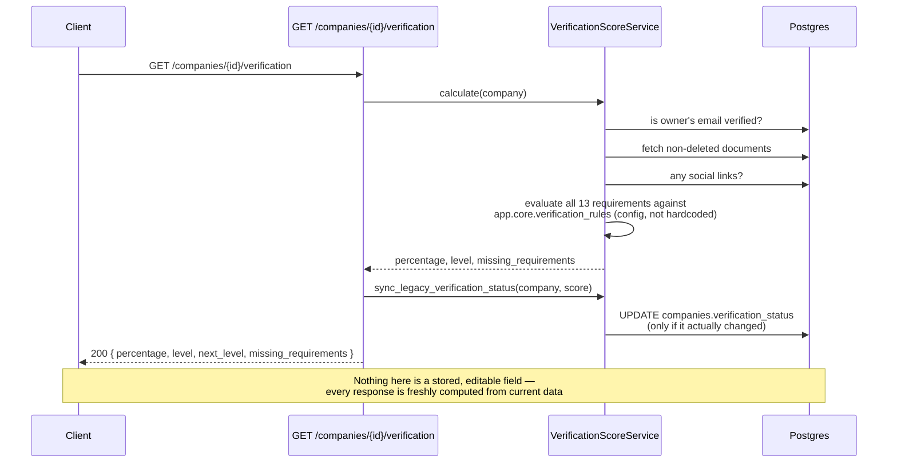
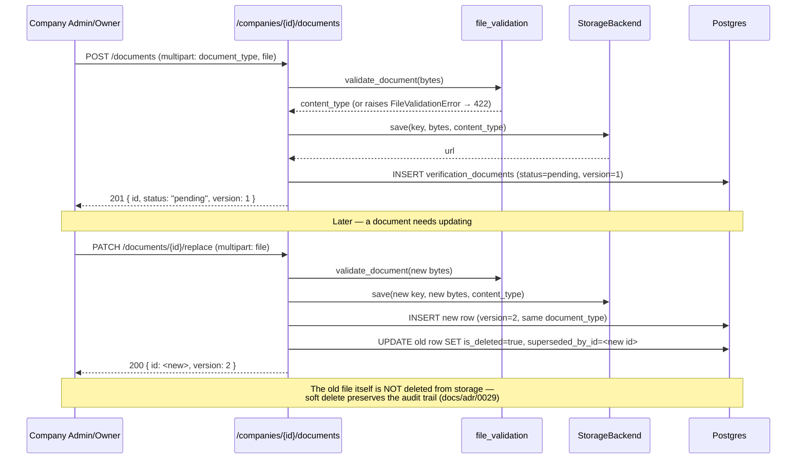
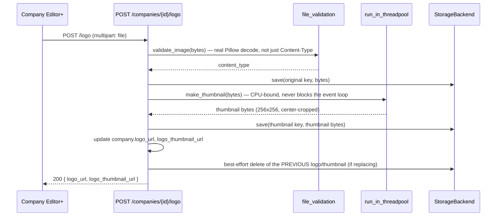

# Company Verification Sequences — Module 3B

## Verification score computation (always live, never stored)

## Document upload → replace (versioning)

## Logo upload (image processing off the event loop)

