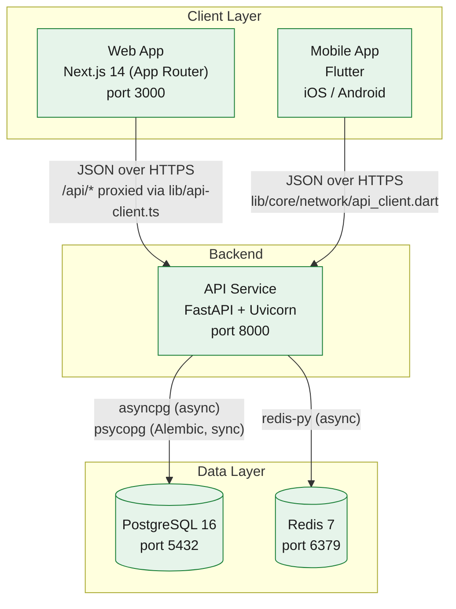

# Container Diagram — Module 1

```mermaid
flowchart TB
    subgraph Client Layer
        WEB["Web App\nNext.js 14 (App Router)\nport 3000"]
        MOB["Mobile App\nFlutter\niOS / Android"]
    end

    subgraph Backend
        API["API Service\nFastAPI + Uvicorn\nport 8000"]
    end

    subgraph Data Layer
        PG[("PostgreSQL 16\nport 5432")]
        RD[("Redis 7\nport 6379")]
    end

    WEB -- "JSON over HTTPS\n/api/* proxied via lib/api-client.ts" --> API
    MOB -- "JSON over HTTPS\nlib/core/network/api_client.dart" --> API
    API -- "asyncpg (async)\npsycopg (Alembic, sync)" --> PG
    API -- "redis-py (async)" --> RD

    classDef shipped fill:#e6f4ea,stroke:#1a7f37,color:#1a1a1a;
    class WEB,MOB,API,PG,RD shipped;
```

All five nodes above are implemented and runnable via `docker compose up`
as of Module 1. Nothing in this diagram is aspirational.
