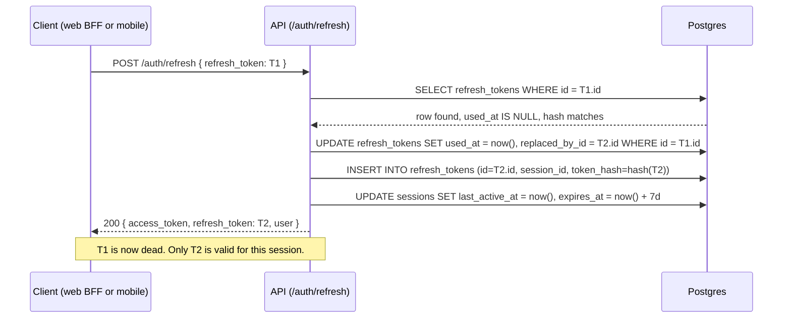
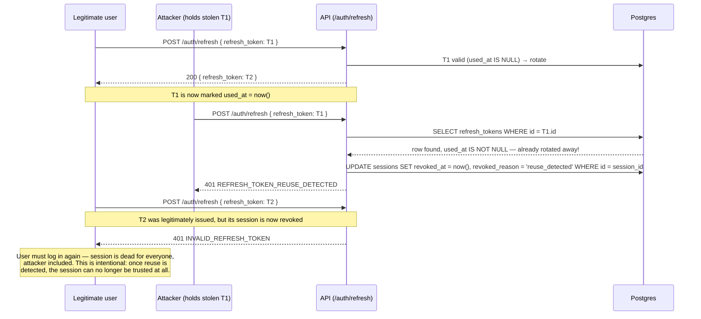

# Sequence — Refresh Token Rotation & Reuse Detection

Two flows, matching [ADR-0014](../adr/0014-refresh-token-and-session-model.md)
and verified directly by `tests/test_sessions.py`.

## Normal rotation

## Reuse detected (stolen token replayed)

