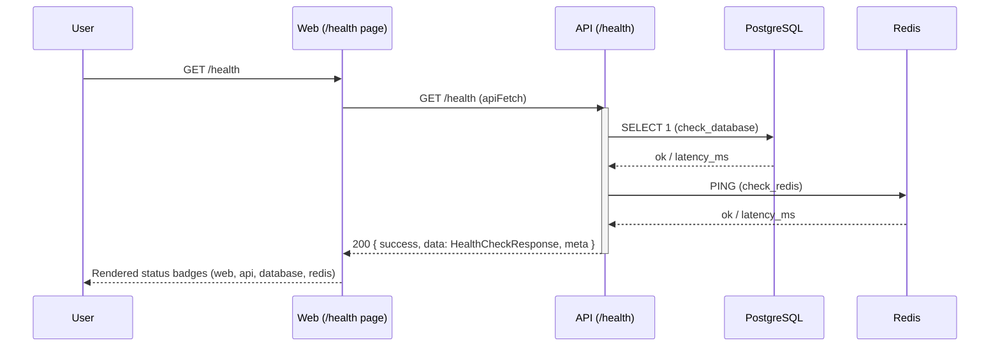

# Request Lifecycle — Health Check (Module 1 reference flow)

Every hop above already exists in code:
`apps/web/src/app/health/page.tsx` → `apps/web/src/lib/api-client.ts` →
`apps/api/app/api/v1/health.py` → `apps/api/app/db/health.py` /
`apps/api/app/db/redis_client.py`.
