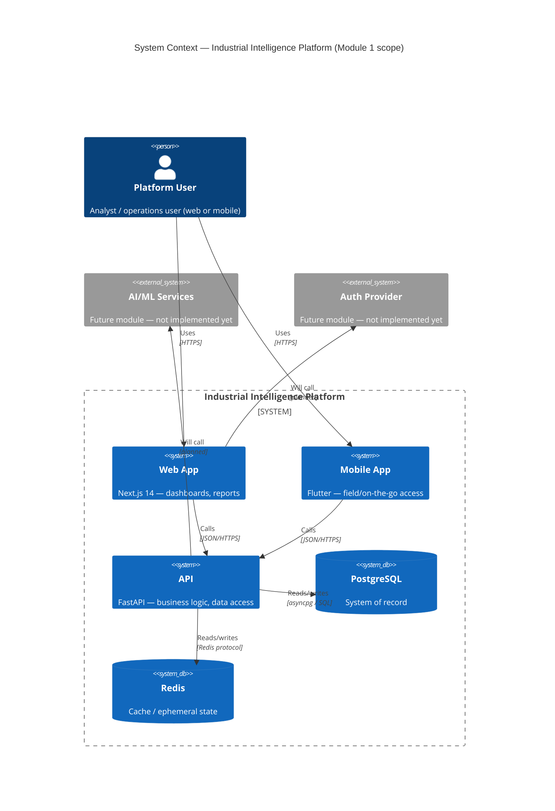

# System Context — Module 1

Scope: infrastructure and app shells only. No authentication, no domain
features (asset tracking, procurement, trust scoring) exist yet — those
are represented as "future modules" for orientation only.

