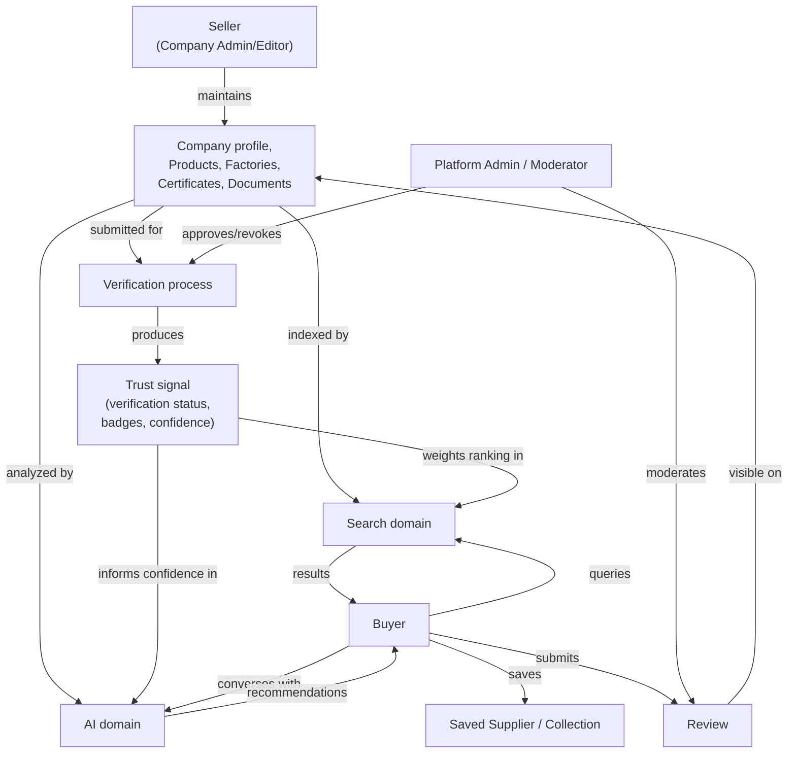

# 1. Business Domain Overview

## What is the platform?

The Industrial Intelligence Platform is a **system of record and trust
layer for industrial suppliers, buyers, and the products/certifications
that connect them.** At Stage 1 (today's build target), it answers one
question well: *"Is this industrial supplier who they say they are, and
can I trust the products/certificates they're showing me?"* It does this
by combining verified company and product data with AI-assisted search
and analysis — not by listing every supplier who signs up and hoping
buyers sort out the trustworthy ones themselves (that's a directory; see
"What this is not" below).

Stages 2–4 layer transaction capability (RFQ, quotes, purchase orders),
then full procurement workflow, then network effects (cross-border trade
intelligence, regional regulatory data, multi-party logistics) on top of
that trust layer — each stage's data model is additive to Stage 1's, not
a replacement for it.

### What this is not

- **Not a directory/marketplace-first product.** A directory optimizes
  for listing volume; this platform optimizes for verified trust first,
  transaction volume later. This shapes the entire domain model:
  `Verification` is a first-class entity with its own lifecycle, not a
  boolean flag on `Company`.
- **Not a generic B2B SaaS CRM.** The domain is specific to industrial
  procurement: `Certificate`, `Factory`, `Industry`/`Category` taxonomy,
  and `Product Variant` (spec/tolerance-level product data) are
  first-class because industrial buyers need that granularity — a
  generic "Product" entity with a name and price is insufficient.

## Who uses it

| Actor | Stage 1 relationship to the platform |
|---|---|
| **Buyer** | Searches for verified suppliers/products, uses AI to shortlist, saves suppliers, reads reviews. No transaction capability yet (Stage 2). |
| **Seller (Supplier)** | Represents a `Company` — manages its profile, products, factories, certificates, and verification status. |
| **Company Owner** | The accountable individual for a `Company` — see Business Rule "a company must have one owner," Section 8. |
| **Company Admin/Editor/Viewer** | Delegated company-scoped roles under an Owner — see Section 9's permission matrix. |
| **Platform Admin** | Operates the platform itself — user/company management, dispute handling, platform-wide configuration. |
| **Support** | Front-line operational role — assists Buyers/Sellers, cannot alter verification or platform config. |
| **Moderator** | Reviews flagged content (reviews, product listings, documents) for policy compliance. |
| **AI System** (non-human actor) | Consumes verified data to generate recommendations, summaries, and match suggestions — never a source of truth itself; see Section 11. |

A single human `User` account can hold different relationships to
different companies simultaneously (buyer for one search, admin of their
own supplier company for another) — see Business Rule "a user may own
multiple companies," Section 8, and the multi-company design in Section
10.

## What problems does it solve

1. **Trust asymmetry.** Industrial buyers historically can't verify a
   supplier's claims (certifications, factory existence, production
   capability) without expensive third-party audits or in-person visits.
   The platform centralizes verifiable evidence (`Certificate`,
   `Document`, `Factory` with `Location`) and a structured `Verification`
   process so that trust signal is visible and comparable across
   suppliers.
2. **Discovery inefficiency.** Finding the right supplier for a specific
   industrial need (exact material, tolerance, certification, capacity)
   is currently manual and relationship-driven. AI-assisted search
   (Section 11, Section 12) turns unstructured buyer intent into
   structured matches against verified supplier/product data.
3. **Fragmented supplier information.** A supplier's certificates,
   factories, and product catalog are usually scattered across PDFs,
   emails, and a static website. The platform gives a supplier one place
   to maintain this, and gives it structure (so it's searchable/
   comparable), not just storage.
4. **(Stage 2+) Transaction friction.** Once trust and discovery exist,
   RFQ → quote → order → fulfillment can be layered on without
   rebuilding the trust/discovery layer underneath it — this is why
   Section 13 designs procurement-adjacent shapes now even though
   they're inert until Stage 3.

## How information flows

## How value flows

**Stage 1 (today):** value is informational, not transactional. A Seller
gets discoverability and a credible trust signal proportional to the
rigor of their verification (this is the retention/upgrade incentive for
future paid verification tiers — see the platform's separate commercial
strategy, outside this document's scope). A Buyer gets reduced due-
diligence cost and faster, better-matched discovery. The platform's value
capture at this stage is verification-tier fees and/or platform
subscription — not take-rate on transactions, because no transactions
exist yet.

**Stage 2+ (future, informing today's model but not built today):** value
flow adds a transactional layer — RFQ → Quotation → Purchase Order — where
the platform can capture a take-rate or transaction fee. Section 13
designs the entity shapes so this layer attaches to the existing
`Company`/`Product` graph rather than requiring a parallel one.

## Domain terminology (glossary)

| Term | Meaning in this domain |
|---|---|
| **Company** | A business entity on the platform — may act as Seller, Buyer, or both. Not "Organization"/"Tenant" — see Section 18 for why that naming was chosen deliberately. |
| **Verification** | The structured process and resulting state of confirming a Company's or Certificate's claims are genuine. Tiered (see Section 8), not boolean. |
| **Trust signal** | The aggregate, buyer-visible representation of a Company's verification status, certificate validity, and review standing. Not a stored entity itself — a computed view over `Verification`, `Certificate`, and `Review`. |
| **Factory** | A physical production site belonging to a Company. A Company may have zero (trading/distribution only), one, or many. |
| **Saved Supplier** | A private, Buyer-owned bookmark of a Company — never visible to the bookmarked Company or other Buyers. |
| **Collection** | A Buyer-owned, named group of Saved Suppliers and/or Products (e.g. "Q3 packaging RFQ candidates") — organizational, not transactional. |
| **AI Conversation** | A structured, persisted chat session between a Buyer (or Seller) and the platform's AI assistant, distinct from raw prompt/completion pairs — see Section 11. |
| **RFQ / Quotation / Purchase Order** | Stage 3 concepts, designed for (Section 13) but not built at Stage 1. |
