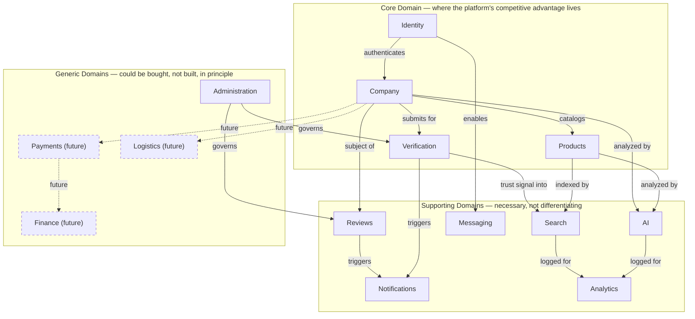

# 2. Bounded Contexts

A bounded context is a boundary within which a domain model and its
terminology are internally consistent — the same word (e.g. "Owner") can
mean different things in different contexts without that being a
modeling error, as long as each context's meaning is unambiguous within
itself and translations at the boundary are explicit.

## Context map

## Why each bounded context exists

### Identity
**Owns:** `User`, `Session`, authentication/authorization primitives
(already built — Module 2/2.5). **Why separate:** identity is a solved,
stable problem that every other context depends on but shouldn't
re-implement. Keeping it separate means Company/Verification/Products can
evolve rapidly without touching auth.

### Company
**Owns:** `Company`, `CompanyMember`, `Factory`, `Location`, `Gallery`.
**Why separate:** this is the platform's core unit of trust and identity
for suppliers/buyers-as-organizations. It's deliberately *not* merged
with Identity — a `User` and a `Company` have different lifecycles (a
user can exist with zero companies; a company can outlive the specific
user who created it, e.g. an Owner transfer).

### Verification
**Owns:** `Verification`, `Certificate`. **Why separate from Company:**
verification is a *process* with its own state machine, actors (who
requested it, who approved it), and audit trail — modeling it as a field
on `Company` would lose that history and make "who approved this and
when" unanswerable. It's the context most directly responsible for the
platform's core value proposition (trust), so it gets architectural
weight proportional to that importance.

### Products
**Owns:** `Product`, `Product Variant`, `Category`, `Industry`. **Why
separate:** product taxonomy (industry → category → product → variant)
is a distinct modeling problem from company identity — a company's
product catalog changes far more often than its verification status, and
product search/filtering has different query patterns than company
search.

### Search
**Owns:** `Search Query`, `Search History`, ranking logic, autocomplete/
suggestion state. **Why separate:** search is a read-optimized,
denormalized view over Company/Product/Verification data — coupling it
directly into those contexts would force their write-side models to
compromise for read-side query performance. Section 12 details this.

### AI
**Owns:** `AI Conversation`, `AI Recommendation`, and AI-specific derived
data (risk/confidence scores, document summaries). **Why separate:** AI
outputs are *derived*, not source-of-truth — the AI context reads from
Company/Products/Verification but never writes back to them directly
(see Section 11's anti-coupling explanation). Keeping it separate means
an AI model/vendor change never touches core domain models.

### Messaging
**Owns:** direct communication between Buyer and Seller (Stage 1: likely
inquiry/contact-request shaped, not full chat — scoped narrowly on
purpose; see Section 18). **Why separate:** communication has different
data-retention, moderation, and privacy requirements than the rest of the
platform (e.g. message content may need different encryption-at-rest
policy than a product description).

### Notifications
**Owns:** the delivery mechanism (in-app, email, push — email transport
already exists as a stub per Module 2.5's `EmailSender`) and
`Notification` records. **Why separate:** notifications are triggered
*by* events from every other context (see Section 7) but shouldn't
require every other context to know about delivery channels — this is a
classic fan-in integration point, cleanly modeled as its own context
subscribing to domain events.

### Reviews
**Owns:** `Review`, moderation state. **Why separate from Company:**
reviews are buyer-authored content *about* a company, with their own
moderation lifecycle (flagged → under review → published/removed) —
distinct enough from the company's own self-maintained profile data to
warrant a boundary, and this boundary is exactly where a Moderator role's
authority is scoped (Section 9).

### Analytics
**Owns:** aggregated, derived reporting data — search analytics, company
profile views, verification funnel metrics. **Why separate:** analytics
is read-only and eventually-consistent by nature; coupling it into
transactional contexts would risk analytics queries degrading write-path
performance.

### Administration
**Owns:** platform-level configuration, Platform Admin/Support/Moderator
tooling, dispute handling. **Why separate:** administrative operations
cut across every other context (an admin can act on any Company,
Verification, or Review) — modeling Administration as its own context
with explicit cross-context authority (via the permission matrix, Section
9) is clearer than scattering "if current_user.is_admin" checks through
every other context's logic.

### Payments, Logistics, Finance *(future — Stage 3+)*
**Not owned by anything today.** Named here only so Section 13 and
Section 17 can reason about where they'll attach (to `Company` and a
future `Order`/`PurchaseOrder` aggregate) without today's model
accidentally foreclosing that attachment point.

## Context dependency table

| Context | Depends on | Reason |
|---|---|---|
| Company | Identity | A Company is created/administered by authenticated Users |
| Verification | Company | Verification targets a Company (and its Certificates) |
| Products | Company | Products belong to a Company |
| Search | Company, Products, Verification | Search indexes denormalized views of these three |
| AI | Company, Products, Verification, Search | AI reads verified data and search intent to generate recommendations |
| Reviews | Company, Identity | A Review is authored by a User about a Company |
| Notifications | *(all)* | Subscribes to domain events from every other context |
| Messaging | Identity, Company | Messages are between Users, contextualized by Company |
| Analytics | *(all, read-only)* | Aggregates events/data from every other context |
| Administration | *(all, cross-cutting)* | Platform-level authority over every other context |
