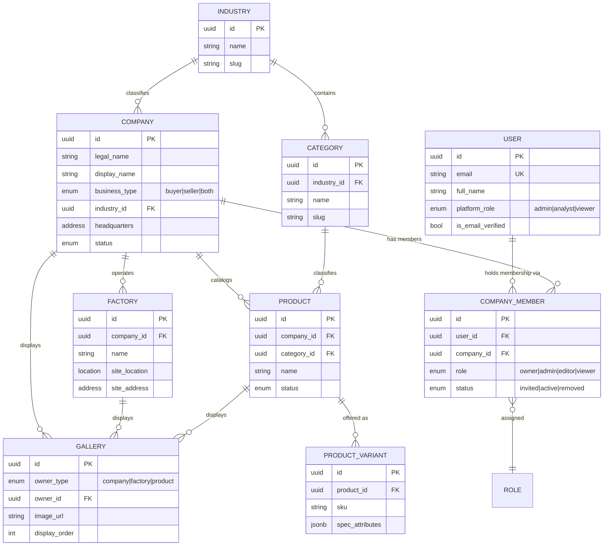
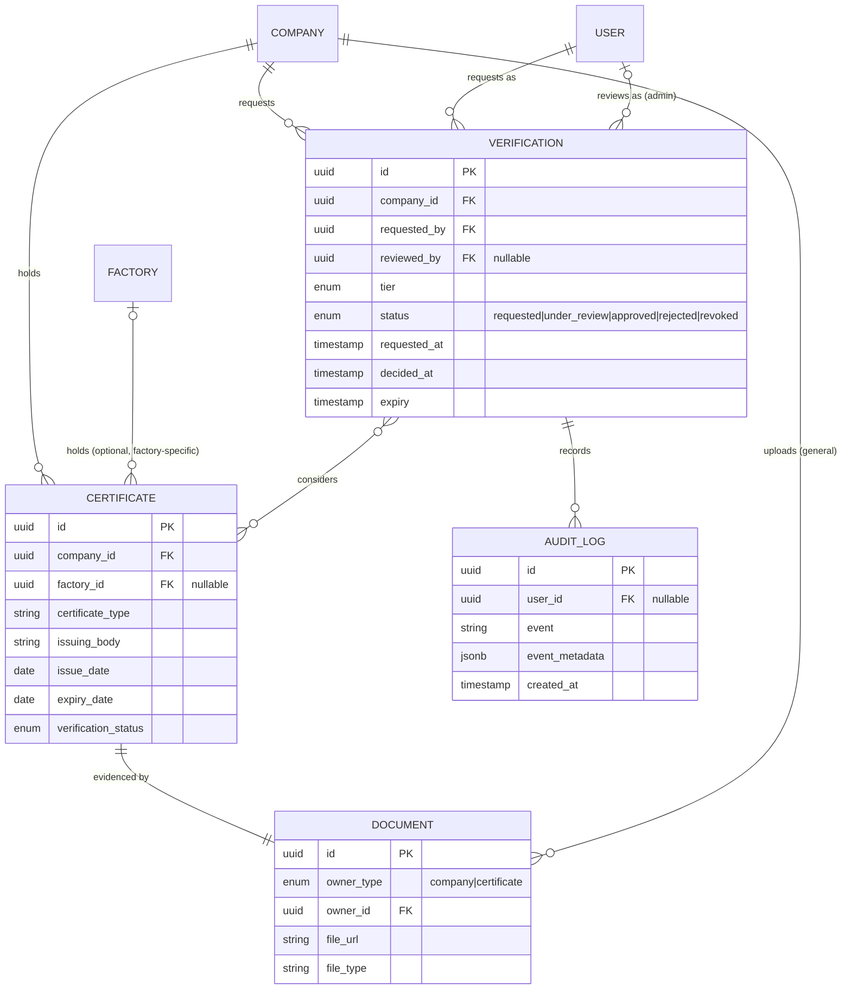
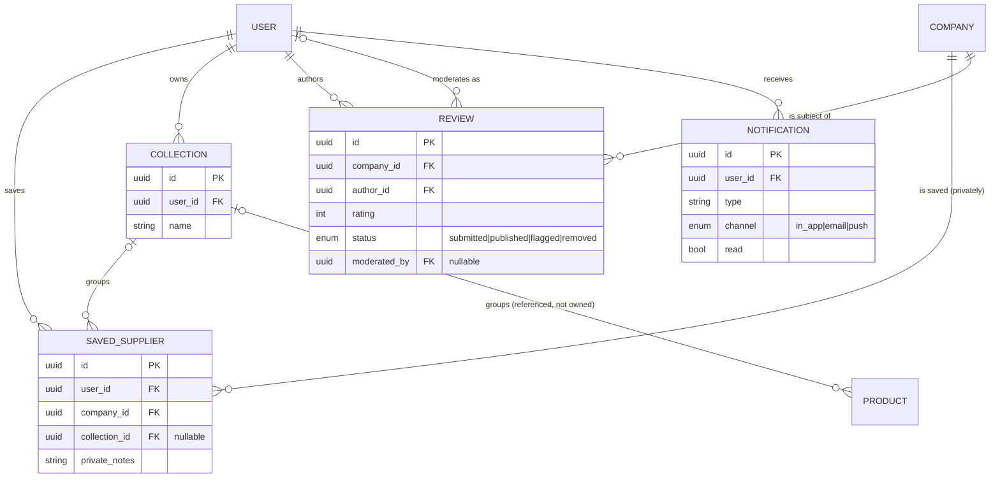
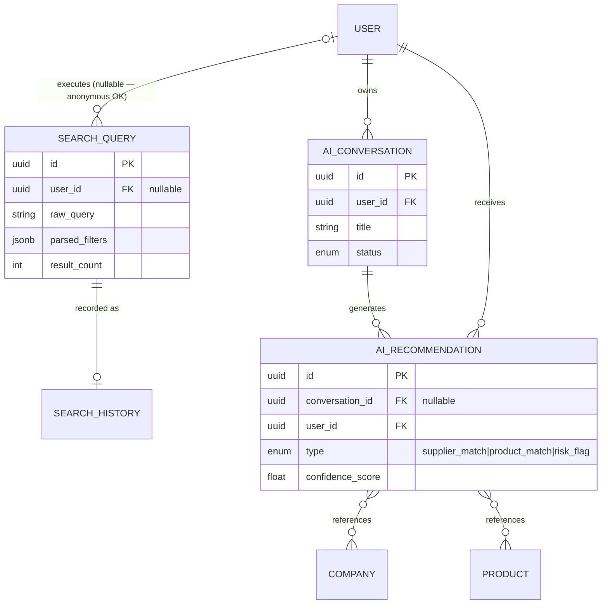

# 4. Entity Relationship Diagram

Split into four diagrams for readability — a single 26-entity diagram
renders illegibly. Read them as one connected model; entities that
appear in more than one diagram (e.g. `Company`, `User`) are the seams.

## 4.1 — Identity, Company & Product core

**Reading notes:** `COMPANY_MEMBER` is the many-to-many join between
`USER` and `COMPANY`, carrying the company-scoped `ROLE`. `GALLERY`'s
`owner_type`/`owner_id` pair is a polymorphic reference (see Section 3's
note and Section 18's critique of this choice) rather than three
separate foreign keys.

## 4.2 — Verification & trust

**Reading notes:** `VERIFICATION }o--o{ CERTIFICATE` is deliberately
many-to-many (a Verification decision may consider multiple Certificates
at once, and a Certificate may be referenced by more than one
Verification event over its life, e.g. initial verification + a later
renewal). `AUDIT_LOG` already exists (Module 2.5) — this diagram shows
its extended relationship to `VERIFICATION`, not a redesign.

## 4.3 — Buyer-side: saving, reviewing, organizing

**Reading notes:** `COMPANY ||--o{ SAVED_SUPPLIER` is drawn as a normal
relationship for completeness, but the *business rule* (Section 8) is
that the Company side of this relationship is never queryable by the
Company itself — an enforcement rule, not a schema shape.

## 4.4 — Search & AI

**Reading notes:** `AI_RECOMMENDATION`'s references to `COMPANY`/
`PRODUCT` are read-only pointers, never foreign keys the AI context can
cascade-affect — see Section 11's anti-coupling explanation for why this
matters architecturally, not just as a diagram note.

## Cross-diagram entities (appear in more than one)

| Entity | Appears in | Role |
|---|---|---|
| `USER` | 4.1, 4.2, 4.3, 4.4 | The universal actor — every context ultimately traces back to a User |
| `COMPANY` | 4.1, 4.2, 4.3 | The universal subject — every context ultimately traces back to a Company |
| `PRODUCT` | 4.1, 4.3, 4.4 | Referenced by Collections and AI Recommendations without being owned by them |

## Future extensibility notes (not drawn, to avoid clutter)

- **Stage 3 (Procurement):** a future `RFQ` entity attaches to `COMPANY`
  (buyer side) and `PRODUCT`/`PRODUCT_VARIANT` (what's being requested),
  with `QUOTATION` attaching to `RFQ` and `COMPANY` (seller side). See
  Section 13 for the full shape — deliberately not drawn into these
  diagrams since it doesn't exist yet, but the foreign-key attachment
  points above are exactly where it will connect.
- **Stage 2+ (Multi-currency/region):** `Money` value objects (Section 6)
  used in future `PRODUCT_VARIANT.price` and any Stage 3 financial entity
  carry a currency code from day one, so this ER shape doesn't need
  retrofitting when multi-currency support activates.
