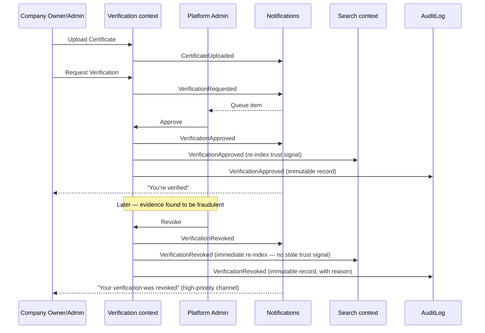

# 7. Domain Events

Domain events are the platform's future event-driven backbone —
Notifications, Analytics, and Activity feeds (Section 3) are all
consumers of the same event stream, not independently-triggered
side-effects scattered through service code. At Stage 1, these can be
implemented as in-process events (e.g. published within the same
transaction, consumed synchronously); the *shape* below is what makes a
later move to a real message bus (Kafka, SNS/SQS, Postgres LISTEN/NOTIFY)
additive rather than a redesign — see Section 17.

## Event design convention

Every event carries: `event_id`, `event_type`, `occurred_at`,
`actor_id` (who/what caused it — a User id or "system" for AI/automated
events), a `payload` (event-specific), and enough context to be consumed
without the consumer needing to query back for basic details (e.g.
`CompanyCreated` includes the company name, not just its id) — this
keeps consumers (Notifications especially) fast and decoupled.

## Core events

| Event | Publisher (context) | Consumers | Business purpose |
|---|---|---|---|
| `CompanyCreated` | Company | Notifications (welcome flow), Analytics, Search (initial index) | Marks a new Company's existence; triggers onboarding |
| `CompanyUpdated` | Company | Search (re-index), Analytics | Keeps denormalized Search index and Analytics in sync with profile edits |
| `CompanyMemberInvited` | Company | Notifications (invite email), Activity | Same underlying event as "User Invited" in the brief — see naming note below |
| `CompanyMemberJoined` | Company | Notifications, Activity, Analytics | Confirms an invitation was accepted |
| `CompanyOwnershipTransferred` | Company | Notifications, AuditLog, Activity | High-sensitivity event — see Business Rules, Section 8 |
| `ProductAdded` | Products | Search (index), Notifications (to Buyers who follow this Company — future), Analytics | New catalog item now discoverable |
| `ProductUpdated` | Products | Search (re-index), Analytics | Keeps Search index current |
| `CertificateUploaded` | Verification | Notifications (to Platform Admin queue), Activity | Signals new evidence awaiting review |
| `VerificationRequested` | Verification | Notifications (Platform Admin queue), Analytics (funnel tracking) | Starts the review clock |
| `VerificationApproved` | Verification | Notifications (to Company), Search (trust-signal re-index), Analytics, AuditLog | The platform's core trust-producing event |
| `VerificationRejected` | Verification | Notifications (to Company, with reason), Analytics (funnel tracking), AuditLog | |
| `VerificationRevoked` | Verification | Notifications (to Company — high priority), Search (immediate re-index — trust signal must never be stale), AuditLog | Highest-sensitivity Verification event — see Business Rules |
| `SupplierSaved` | Company (buyer-side action) | Analytics (aggregated only — never per-Company-visible, per Section 8's privacy rule) | |
| `SearchExecuted` | Search | Analytics, AI (as training/context signal) | Every search is a demand signal |
| `AIRecommendationGenerated` | AI | Analytics, Notifications (if proactive, e.g. "new match found") | |
| `ReviewSubmitted` | Reviews | Notifications (to Moderator queue), Activity, Analytics | |
| `ReviewPublished` | Reviews | Notifications (to Company — informational), Search (re-index rating aggregate), Activity | |
| `ReviewFlagged` | Reviews | Notifications (to Moderator queue) | |
| `UserInvited` | Company | Notifications (invite email) | Naming note below |

### Naming note: "User Invited" vs. "CompanyMemberInvited"

The brief lists `User Invited` as an example event. This document treats
it as the same event as `CompanyMemberInvited` above — inviting someone
is always inviting them *to a Company* in this domain (there's no
context-free "invite a user to the platform" concept at Stage 1). Naming
it `CompanyMemberInvited` is more precise and avoids ambiguity with
platform-level user registration (which is not an "invitation" — see
Module 2's open registration flow). Flagged explicitly rather than
silently renaming without explanation.

## Event flow example — Verification lifecycle

## Future event-driven architecture readiness

At Stage 1, events can be published and consumed in-process (within the
same request/transaction) without any message broker — this is
appropriate given current scale and avoids infrastructure this platform
doesn't need yet (see Section 17's "avoid premature infrastructure"
principle). The design is broker-ready because:

1. **Every event is self-contained** (carries enough payload to be
   consumed independently) — no consumer needs to query back to the
   publishing context for basic facts, which is what a distributed
   broker requires anyway.
2. **Publishers never depend on consumers.** The Verification context
   publishes `VerificationApproved` without knowing Notifications, Search,
   and AuditLog all consume it — this fan-out is exactly the topology a
   pub/sub broker expects, so the *code* doesn't need to change when the
   *transport* does, only the publish/subscribe plumbing.
3. **Idempotency is a stated expectation**, not an afterthought: any
   consumer (especially Search re-indexing and Notifications) should be
   safe to receive the same event twice (broker at-least-once delivery is
   the norm) — this is a Module 3A implementation requirement inherited
   from this design, flagged here so it isn't missed.

## Events NOT included (deliberately deferred)

Stage 3 events (`RFQCreated`, `QuotationSubmitted`, `PurchaseOrderPlaced`,
etc.) are intentionally not designed here — see Section 13's principle
of designing *attachment points*, not the full future feature. Naming
them prematurely risks guessing their shape wrong before Stage 3's actual
requirements are known.
