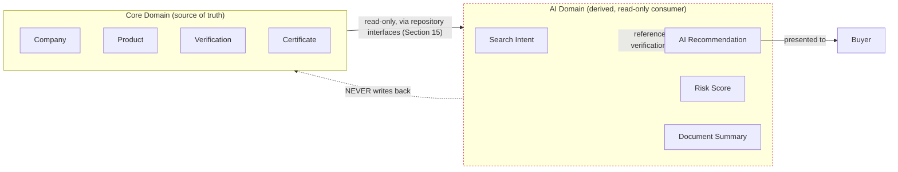

# 11. AI Domain

## Design principle: AI is a consumer and annotator, never a source of truth

Every entity in this section reads from the core domain (Company,
Product, Verification) and produces *derived, clearly-labeled-as-derived*
output. None of them can write back to Company, Product, or Verification
directly — an AI-generated risk score does not silently become a
Company's official status. This is the single most important
architectural decision in this section, and it's what Section 8's "AI
recommendations are generated from verified information" rule actually
enforces at the entity level.

## Entities

### Conversation
Already specified as `AIConversation` in Section 3/5 (an aggregate
root). Included here for completeness of the AI domain's entity list.

### Prompt
**Purpose:** a single user-authored turn within an `AIConversation` — the
finer-grained unit that Section 3's "message/turn history" referred to
without naming.

**Key Attributes:** id, conversation_id (FK), role (user | assistant),
content, created_at. Assistant-role turns reference the
`AIRecommendation`(s) they produced, if any, so a Buyer/auditor can trace
"this response led to this specific recommendation."

**Relationships:** many Prompt → one AIConversation.

### Recommendation
Already specified as `AIRecommendation` in Section 3/5. This section adds
the traceability requirement: an `AIRecommendation` must reference
**which source entities and their verification status** it drew on
(e.g. "matched based on: Company X's verified ISO-9001 certificate,
Product Y's published spec") — modeled as a structured `basis` field
listing referenced entity ids alongside a snapshot of their verification
state *at generation time* (verification state can change after the
recommendation was made — the snapshot is what makes the recommendation
auditable against what was true when it was generated, not misleadingly
re-evaluated against current state).

### Search Intent
**Purpose:** the AI domain's structured interpretation of a Buyer's
natural-language query or conversational request — e.g. turning "I need
a supplier for anodized aluminum extrusions, ISO 9001, based in
Southeast Asia" into `{category: "Aluminum Extrusions", certifications:
["ISO 9001"], region: "Southeast Asia"}`.

**Key Attributes:** id, source (SearchQuery id or AIConversation/Prompt
id), parsed filters (structured — the same shape `SearchQuery.
parsed_filters` uses, see Section 12), confidence.

**Relationships:** many Search Intent → one SearchQuery or Prompt (either
can produce one).

**Why its own entity, not just a field on SearchQuery:** a Search Intent
can be produced by AI *interpretation* of unstructured input (a
conversational request), distinct from a SearchQuery's own directly-
supplied structured filters (Section 12) — keeping them separate lets
Search Analytics compare "how often did AI's interpretation match what a
structured search would have found" as its own signal.

### Supplier Match
**Purpose:** the specific `AIRecommendation.type = "supplier_match"`
case, called out here because it's the highest-value AI output and has
its own dedicated evidence shape — a ranked list of Company ids with,
per-match, which Search Intent criteria were satisfied and which
weren't (partial matches are valuable and should be transparent, not
just binary include/exclude).

### Risk Score
**Purpose:** an AI-derived assessment of supplier risk (e.g. based on
verification recency, certificate expiry proximity, review sentiment
trend) — explicitly a *signal to inform*, never a *gate that blocks* (a
low risk score doesn't hide a Company from search, it's a data point a
Buyer sees alongside everything else).

**Key Attributes:** id, company_id (FK, reference only), score
(Confidence Score VO, Section 6, repurposed here — same shape, different
semantic meaning), factors (structured breakdown), computed_at.

**Relationships:** many Risk Score → one Company (reference only, not
owned by Company's aggregate — Risk Score is AI-context data).

**Business rule this enforces:** Risk Score must be recomputed (not just
cached indefinitely) when its underlying Verification/Certificate/Review
data changes — a stale risk score is actively misleading in a way a
stale product description isn't.

### Confidence Score
Already specified as a Value Object in Section 6. Used by
AIRecommendation, Supplier Match, and Risk Score alike — one consistent
shape across every AI output that needs to express "how sure is the
system."

### Document Summary
**Purpose:** an AI-generated plain-language summary of an uploaded
`Document`/`Certificate` (e.g. summarizing a lengthy test report's key
findings) — a Buyer-facing convenience feature, explicitly labeled as
AI-generated and never presented as if it were the Company's own
statement.

**Key Attributes:** id, document_id (FK, reference only), summary_text,
generated_at, model/version metadata (for reproducibility/audit).

### Future AI Agent
**Not designed in entity detail here — intentionally.** The brief names
this as a placeholder for future autonomous-agent capability (e.g. an
agent that proactively negotiates initial RFQ terms on a Buyer's behalf
at Stage 2+). This document's job is to ensure today's AI entities don't
foreclose that future: `AIConversation` and `AIRecommendation` are
already actor-agnostic in shape (an "assistant" Prompt role could
originate from a more autonomous agent later without a schema change) —
that's the extent of "designing for" this future capability that's
appropriate at Stage 1.

## How AI integrates without tightly coupling to business logic

**The mechanism, concretely:**
1. The AI domain reads Company/Product/Verification data through the
   same `Repository Interfaces` (Section 15) every other context uses —
   it has no special/privileged data access path, and critically, those
   read interfaces expose no corresponding write methods to the AI
   context's service layer.
2. Every AI output entity (`AIRecommendation`, `RiskScore`,
   `DocumentSummary`) stores **references** (ids) to what it's about,
   never a copy that could drift from or be confused with the source —
   and never a foreign key relationship that the source entities
   themselves are aware of (Company doesn't have an
   `ai_recommendations` collection; the reference is one-directional).
3. This means swapping AI vendors/models (Section 16's ACL principle
   applied internally) touches only the AI context's implementation, and
   a bug or bad output in the AI domain can be deleted/regenerated
   without any risk of having corrupted core domain data — the blast
   radius of "the AI said something wrong" is contained by construction.
