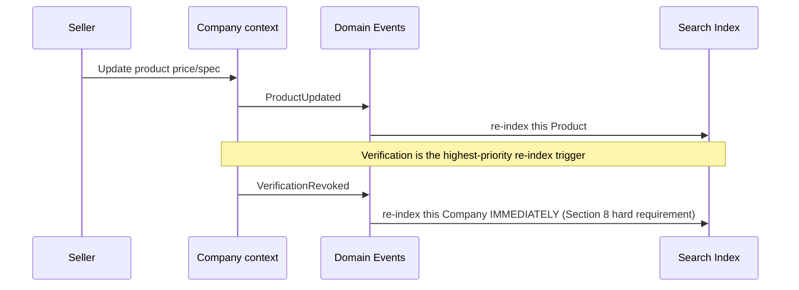

# 12. Search Domain

## Design principle: search is a read-optimized projection, not a source of truth

Everything Search indexes (Company, Product, Verification trust signal)
is owned and written by other contexts; Search's job is to maintain a
denormalized, query-optimized view over that data and keep it
fresh via the domain events (Section 7) those contexts publish. This
mirrors the AI domain's read-only relationship to the core (Section 11)
— the two supporting contexts share the same non-coupling principle for
the same reason.

## Entities and concepts

### Search Query
Already specified in Section 3/4.4. The atomic unit of "a Buyer looked
for something."

### Filters
**Purpose:** the structured, faceted criteria a Buyer applies —
industry, category, region, verification tier, certificate type, price
range (Stage 3+) — either supplied directly (structured UI filter
selection) or derived from AI's `Search Intent` (Section 11) when the
Buyer used natural language instead.

**Key Attributes (conceptual, not stored as its own entity — embedded in
`SearchQuery.parsed_filters`):** a key-value structure where keys map to
a controlled facet vocabulary (Industry ids, Category ids, Verification
tier enum, etc.) — deliberately not free-text per facet, so filters stay
combinable/indexable.

### Saved Searches
**Purpose:** a Buyer-named, re-runnable `SearchQuery` template — distinct
from `Collection` (which saves *results*, i.e. specific Companies/
Products) in that a Saved Search saves the *criteria*, intended to be
re-executed later to catch newly-verified matches (e.g. "notify me when
a new ISO-9001-verified anodized aluminum supplier in Vietnam appears").

**Key Attributes:** id, user_id (FK), name, filters (same shape as
SearchQuery.parsed_filters), notify_on_new_match (bool), created_at.

**Relationships:** many SavedSearch → one User. Not modeled as an
aggregate root of its own weight (Section 5) — it's a simple, single-
actor-owned record with no complex internal invariant, similar in
weight to `SearchHistory`.

**Note:** this entity was not in the brief's minimum list for Section 3
but is required by this section's own brief ("Saved Searches") — added
here rather than retrofitted into Section 3, with a cross-reference so
it isn't lost: Module 3A should treat this as an addition to the Section
3 entity list.

### Search Ranking
**Purpose:** not an entity — the *algorithm/policy* by which SearchQuery
results are ordered. Documented here as a set of ranking factors, not a
black box:

| Ranking factor | Direction | Why |
|---|---|---|
| Verification tier | Higher tier ranks higher | The platform's core value prop — verified suppliers should be more discoverable, not just equally listed (Section 1's "not a directory" principle) |
| Certificate recency/validity | Valid & recent ranks higher; expired certificates contribute nothing (Section 8) | Stale trust signal must not boost ranking |
| Query relevance (text/facet match) | Standard relevance scoring | Baseline requirement for any search system |
| Review rating/volume | Higher rated, more-reviewed ranks higher (with a minimum-volume threshold to avoid a single 5-star review dominating) | Social proof signal |
| Profile completeness | More complete profiles rank slightly higher | Incentivizes Sellers to invest in their profile, improves Buyer experience |
| Recency of activity | Recently-active companies rank slightly higher | Deprioritizes dormant/abandoned listings without hard-deleting them |

**Explicitly NOT a ranking factor:** payment/subscription tier is not
listed here — if the platform's commercial model includes paid
placement in the future, that should be a clearly-labeled "sponsored"
slot, architecturally and visually distinct from organic ranking, to
protect the trust layer's credibility (Section 1's core value
proposition depends on ranking being trust-driven, not
payment-driven) — flagged as a product-strategy recommendation, not a
decision this document makes unilaterally.

### Search Analytics
**Purpose:** aggregated reporting over `SearchQuery` volume, common
filters, zero-result queries (a key signal for catalog gaps — "buyers
keep searching for X and finding nothing" is a sourcing/growth signal),
and query-to-save/query-to-contact conversion.

**Key Attributes (aggregate, not per-query):** query volume by facet,
zero-result rate, top queries, conversion rate by query type.

**Business rule interaction:** must respect the `SavedSupplier` privacy
rule (Section 8) — analytics can report "companies matching filter X are
being searched for at volume Y" but must never expose which specific
User performed which specific search to any Company, and aggregation
thresholds (Section 17) apply here for the same reason they apply to
saved-supplier data.

### Search Suggestions / Autocomplete
**Purpose:** real-time, partial-input-driven suggestions — drawn from a
combination of the Industry/Category taxonomy (Section 3, controlled
vocabulary, cheap to suggest from) and historically popular
`SearchQuery` text (requires minimum-volume thresholding before
surfacing a past query as a suggestion, both for quality and for the
same privacy-aggregation reason as Search Analytics).

### Future semantic search
**Not built at Stage 1 — explicitly designed for, not implemented.**
Today's `SearchQuery.parsed_filters` structured-facet approach and the
AI domain's `Search Intent` interpretation (Section 11) are
complementary, not competing: semantic/vector search (embedding-based
similarity over Product/Company descriptions) would be introduced as an
*additional* ranking/retrieval signal feeding into the same
`SearchQuery` → results pipeline, not a parallel system. The
architectural readiness this requires — Product and Company descriptions
already exist as structured text fields (Section 3), and nothing in this
model assumes search only ever works via exact facet matching — is
already in place; the vector index/embedding pipeline itself is Module
3A+ implementation work.

## Search domain relationship to Company/Product (event-driven freshness)

## Why Search is its own bounded context (cross-reference)

See Section 2's full explanation — restated briefly here for locality:
coupling Search's read-optimized, denormalized query needs directly into
Company/Product's write-optimized transactional model would force both
sides to compromise. Keeping them separate, connected only by domain
events, lets each evolve (e.g. Search adopting a dedicated search engine
like Elasticsearch/Postgres full-text/a vector DB) without touching
Company/Product's schema at all.
