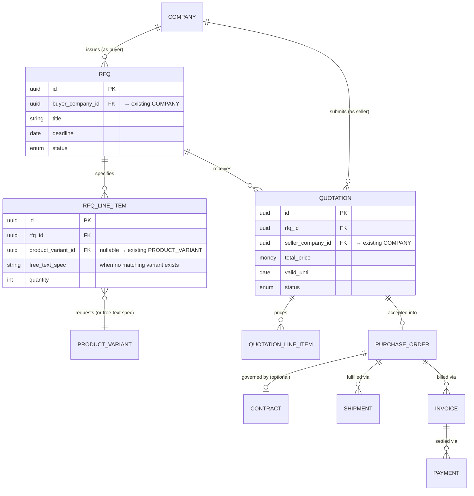

# 13. Procurement Readiness

## Principle: design attachment points, not the future feature

Building `RFQ`, `Quotation`, etc. now — before Stage 3's actual
requirements are known (negotiation workflow, approval chains, payment
terms conventions for this platform's target industries) — risks
guessing wrong and having to redesign later, which is worse than not
building them yet. What *is* worth doing now is making sure Stage 1's
core entities (`Company`, `Product`, `ProductVariant`) have the right
shape and identity stability that a future procurement layer can attach
to cleanly, by reference, without retrofitting.

## Future entity shapes (Stage 3 — not built, sketched for attachment-point validation only)

*(Entities below `QUOTATION` — `PURCHASE_ORDER`, `CONTRACT`, `SHIPMENT`,
`INVOICE`, `PAYMENT` — are shown only as boxes/relationships above, not
detailed with attributes, since their real shape depends on Stage 3
requirements not yet gathered — sketching attributes for them now would
be exactly the "guessing wrong" risk this section exists to avoid.)*

## Attachment-point validation table

For each future entity: what it attaches to, and why today's model
already supports that attachment without change.

| Future entity | Attaches to (today's model) | Why no redesign needed |
|---|---|---|
| `RFQ` | `Company` (buyer side, via `buyer_company_id`) | `Company.business_type` already includes `buyer`/`both` — an RFQ-issuing company is just a normal Company reference by id |
| `RFQLineItem` | `ProductVariant`, or free-text when no variant matches | `ProductVariant`'s structured spec attributes (Section 3) are exactly what an RFQ line item needs to reference precisely; the free-text escape hatch handles the reality that not every RFQ maps to an existing catalog item |
| `Quotation` | `RFQ` + `Company` (seller side) | Same reference-by-id pattern; no change to Company needed |
| `QuotationLineItem` | `ProductVariant` (pricing a specific spec) | `Money` value object (Section 6) already exists in the right shape (amount + currency) for this to use directly |
| `PurchaseOrder` | `Quotation` (accepted) | No core-model dependency beyond what's already established above |
| `Contract` | `PurchaseOrder`, `Company` (both sides) | No core-model dependency |
| `Invoice` | `PurchaseOrder` | Uses `Money`, `Address` (billing address) — both already-established VOs (Section 6) |
| `Shipment` | `PurchaseOrder` | Uses `Address` (shipping address), `Location` — already-established VOs |
| `Payment` | `Invoice` | Uses `Money` — already-established VO |

## What today's Stage 1 model deliberately does NOT do

- **No `price` field exists on `Product` or `ProductVariant` today**
  beyond an optional "price range or quote-on-request flag" (Section 3)
  — real transactional pricing is a Stage 3 concept (a `Quotation`'s
  price, not a catalog list price, is what actually matters once
  negotiation exists). Adding a hard price field now would misrepresent
  Stage 1's actual commercial model (informational, not transactional —
  Section 1).
- **No `Contract`/payment-terms vocabulary is chosen yet** (net-30 vs.
  letter-of-credit vs. escrow are all plausible for an industrial
  platform, and which ones matter depends on which industries/corridors
  the platform actually launches transactions in first — a commercial
  decision, not a domain-modeling one).
- **No inventory/stock-level concept exists.** Whether Stage 3 needs
  real-time inventory tracking (vs. lead-time-based "made to order," which
  is far more common in industrial B2B than retail-style stock) is
  unknown and shouldn't be pre-decided by adding an inventory field now.

## Recommendation for Module 3A and beyond

When Stage 3 begins, this section's attachment-point table should be the
starting checklist — validate each assumption against actual gathered
requirements before building, and update this document (or supersede it
with a Stage-3-specific domain model addendum) rather than silently
diverging from it.
