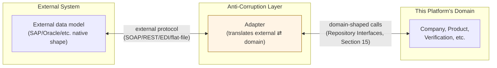

# 16. Anti-Corruption Layer

An Anti-Corruption Layer (ACL) is a translation boundary that prevents an
external system's model/vocabulary from leaking into and distorting this
platform's own domain model. Every integration below follows the same
shape: an **adapter** translates between the external system's data and
this platform's domain entities (Section 3); nothing outside the adapter
ever needs to know the external system's shape.

## Integration strategy (general pattern)

**The core discipline:** the Adapter, not the domain model, absorbs
complexity when an external system's concepts don't map cleanly. If SAP
calls something a "Business Partner" and this platform calls it a
"Company," the Adapter does that translation — this platform's `Company`
entity is never renamed, extended with SAP-specific fields, or otherwise
distorted to make the mapping easier on the SAP side.

## Per-system integration notes

### SAP
**Likely integration point:** `Company` (SAP "Business Partner"/
"Vendor"), `Product` (SAP "Material Master"), and — at Stage 3 —
`PurchaseOrder`/`Invoice` (SAP has mature native concepts here that a
future adapter would map onto this platform's Section 13 entities).
**ACL concern:** SAP's data model is deeply hierarchical and
configuration-heavy (many SAP fields carry meaning only in combination
with client-specific configuration) — the adapter must resolve that
context into this platform's flatter, more universal shape, not import
SAP's configuration complexity wholesale.

### Oracle (ERP/NetSuite)
**Likely integration point:** same as SAP conceptually (`Company`,
`Product`, future procurement entities). **ACL concern:** Oracle's
various product lines (Oracle ERP Cloud, NetSuite, Oracle EBS) have
materially different APIs from each other despite the shared vendor name
— "an Oracle adapter" is likely actually several adapters sharing a
common target (this platform's domain), which is exactly what the ACL
pattern is for: each source system gets its own adapter, all converging
on one unchanged domain model.

### Microsoft Dynamics
**Likely integration point:** `Company`, `Product`, future
`PurchaseOrder`. **ACL concern:** Dynamics' "Entity" customization model
means two different companies' Dynamics instances can have meaningfully
different schemas for what's nominally the same object type — the
adapter needs per-customer field-mapping configuration, which should live
in the adapter/integration layer, never as conditional logic inside
`Company`/`Product` themselves.

### Zoho / HubSpot / Salesforce (CRM-oriented)
**Likely integration point:** primarily `Company` and `CompanyMember`
(contact sync) — these are CRM systems, so their native strength is
company/contact/lead data, less relevant to Product/Verification.
**ACL concern:** CRM systems typically model "Company" more loosely
(a CRM company record can be created from a single email domain with no
verification concept at all) — the adapter must treat CRM-sourced
company data as a *lead*, not directly instantiate or update this
platform's `Company` entity, since this platform's `Company` carries
verification/trust semantics a CRM record has no equivalent for. This is
the clearest example in this section of the ACL doing real protective
work, not just format translation.

### Government registries *(e.g. company registration lookups)*
**Likely integration point:** `Company` (validating registration_number,
legal_name against an authoritative source) and `Verification`
(government registry confirmation could be one evidence type among
several a Verification decision considers). **ACL concern:** registry
data formats vary enormously by country/jurisdiction (Section 10's
"regional regulations" scalability concern) — each country's registry
likely needs its own adapter; the domain model itself stays
country-agnostic (Section 6's `Address`/`Location` already carry a
country code, which is what routes a lookup to the right adapter).

### Certification databases *(e.g. ISO body registries, industry-specific certification authorities)*
**Likely integration point:** `Certificate` (validating a claimed
certificate against the issuing body's own record) — potentially the
single highest-value integration for the platform's trust mission,
since it could make `Verification` partially automatable rather than
fully manual. **ACL concern:** certification bodies are numerous and
none has a universal API standard — this is realistically a
one-adapter-per-certification-body effort, prioritized by which
certifications matter most to the platform's initial target industries
(a commercial/product decision, not a domain-modeling one).

## What this document does NOT do

It does not design the actual adapter implementations, authentication
mechanisms, or data-mapping tables for any of the above — that's
integration-specific engineering work, appropriately deferred until a
specific integration is actually being built (consistent with this
document's overall "design attachment points, not the future feature"
principle from Section 13). What it does establish, now, is that
**no core domain entity should ever be designed with an external
system's native shape in mind** — every integration point named above
attaches to entities (`Company`, `Product`, `Certificate`, `Verification`)
whose shapes were determined entirely by this platform's own business
requirements (Sections 1–9), not by anticipating SAP's or Salesforce's
data model. That ordering — domain first, integrations translate to it,
never the reverse — is the actual anti-corruption principle, more
important than any per-vendor detail above.
