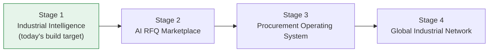

# Domain Model — Industrial Intelligence Platform

**Status:** Draft for approval. This is the Module 3 Preparation
deliverable — a business domain model, not application code. Nothing in
`docs/domain/` is implemented; it is the single source of truth that
Module 3A (and every module after it) will be built from.

**Scope discipline:** no code, no database migrations, no API
definitions, no UI. Where earlier modules (1, 2, 2.5) already made a
technical decision that this domain model touches — e.g. the flat
`Role` enum from [ADR-0013](../adr/0013-rbac-model.md) — this document
says so explicitly and explains how the two reconcile, rather than
silently contradicting or duplicating prior work.

## How to read this

Each numbered section below is its own file. Read them in order the
first time; use this index to jump back in later. Section 18
(Architecture Review) is deliberately last and self-critical — it names
weaknesses in the other 17 sections rather than presenting the model as
beyond question.

| # | Section | File |
|---|---|---|
| 1 | Business Domain Overview | [01-business-domain-overview.md](01-business-domain-overview.md) |
| 2 | Bounded Contexts | [02-bounded-contexts.md](02-bounded-contexts.md) |
| 3 | Core Business Entities | [03-core-entities.md](03-core-entities.md) |
| 4 | Entity Relationship Diagram | [04-entity-relationship-diagram.md](04-entity-relationship-diagram.md) |
| 5 | Aggregate Roots | [05-aggregate-roots.md](05-aggregate-roots.md) |
| 6 | Value Objects | [06-value-objects.md](06-value-objects.md) |
| 7 | Domain Events | [07-domain-events.md](07-domain-events.md) |
| 8 | Business Rules | [08-business-rules.md](08-business-rules.md) |
| 9 | Permission Matrix | [09-permission-matrix.md](09-permission-matrix.md) |
| 10 | Future Scalability | [10-future-scalability.md](10-future-scalability.md) |
| 11 | AI Domain | [11-ai-domain.md](11-ai-domain.md) |
| 12 | Search Domain | [12-search-domain.md](12-search-domain.md) |
| 13 | Procurement Readiness | [13-procurement-readiness.md](13-procurement-readiness.md) |
| 14 | Domain Services | [14-domain-services.md](14-domain-services.md) |
| 15 | Repository Interfaces | [15-repository-interfaces.md](15-repository-interfaces.md) |
| 16 | Anti-Corruption Layer | [16-anti-corruption-layer.md](16-anti-corruption-layer.md) |
| 17 | Technical Debt Prevention | [17-technical-debt-prevention.md](17-technical-debt-prevention.md) |
| 18 | Architecture Review | [18-architecture-review.md](18-architecture-review.md) |

## Company vision (restated for traceability)

The platform is **not** a marketplace. It is an AI-powered Industrial
Intelligence Platform that a marketplace, and later a full procurement
operating system, get built on top of — in that order, without a
rewrite between stages:

Every entity, aggregate, and bounded context in this document is
evaluated against one question: **does this shape still make sense at
Stage 4, or does it quietly assume we'll always be Stage 1?** Section 13
(Procurement Readiness) and Section 17 (Technical Debt Prevention) are
where that question gets answered most directly.

## Relationship to prior modules

- **Module 1** built the technical foundation (monorepo, Next.js,
  FastAPI, Flutter, Postgres, Redis) with zero business entities.
- **Module 2 / 2.5** built `User` (with a flat platform-level `Role`:
  `admin` / `analyst` / `viewer`) and the full auth/session/security
  system. `User` is **not redesigned** here — this document treats it as
  a fixed foundation and builds `Company`, `CompanyMember`, and a
  **company-scoped** role system on top of it. Section 8 and Section 18
  address explicitly how the platform-level `Role` and the new
  company-scoped roles coexist rather than conflict.
- **Module 3A onward** will implement the schema, services, and APIs
  this document describes — but that implementation work is out of
  scope here, per the instructions this document was produced under.
