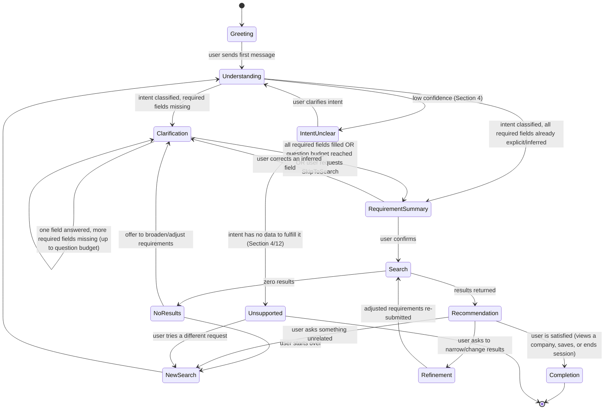
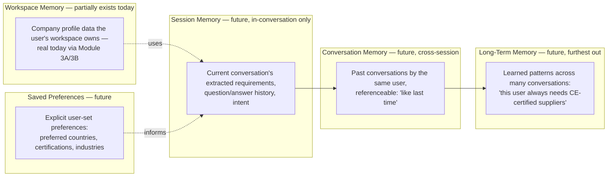
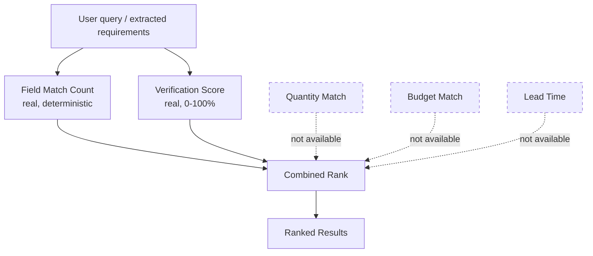
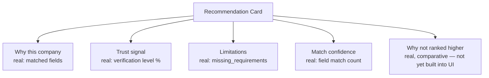
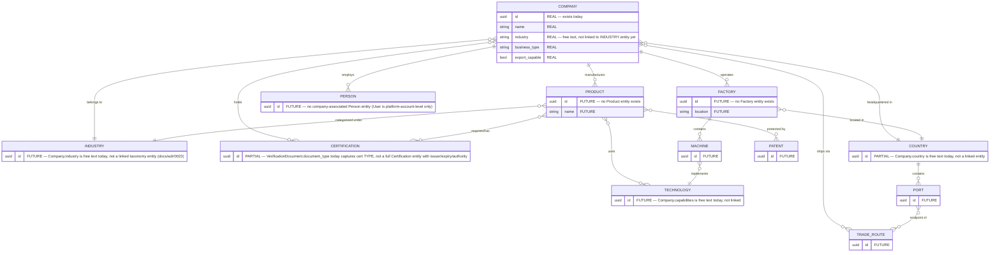
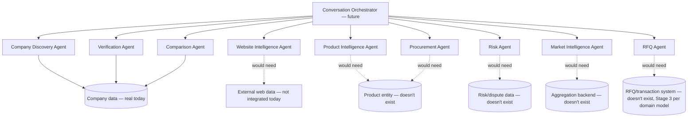

# ForgeX — Phase 3A: AI Conversation & Procurement Intelligence Architecture

**Status:** Architecture only. Nothing in this document is implemented.
No backend, database, or frontend code was written or modified to
produce it. Every claim of "current capability" below was verified
directly against the real, running codebase (models, services, routers)
at the time of writing — not assumed. Every "future capability" is
explicitly labeled as such and is never presented as if it exists
today.

**How to read this document:** Section 12 (Backend Interaction) is the
ground truth this entire architecture is checked against. If a later
section proposes something Section 12 doesn't list as a current
capability, that proposal is future work, and is labeled accordingly at
the point it's introduced — not just in Section 12. Section 15
(Self-Review) is deliberately blunt about where this architecture is
confident versus where it's guessing, and should be read before any
Phase 3B planning begins.

---

## Table of Contents

1. [Product Philosophy](#1-product-philosophy)
2. [AI Personality](#2-ai-personality)
3. [Conversation Principles](#3-conversation-principles)
4. [Intent Classification](#4-intent-classification)
5. [Requirement Extraction](#5-requirement-extraction)
6. [Conversation State Machine](#6-conversation-state-machine)
7. [Memory Architecture](#7-memory-architecture)
8. [Recommendation Strategy](#8-recommendation-strategy)
9. [Explanation Strategy](#9-explanation-strategy)
10. [Industrial Knowledge Graph](#10-industrial-knowledge-graph)
11. [Future Agentic AI](#11-future-agentic-ai)
12. [Backend Interaction](#12-backend-interaction)
13. [UI Architecture](#13-ui-architecture)
14. [Future Roadmap](#14-future-roadmap)
15. [Self-Review: Risks, Ambiguities, Assumptions](#15-self-review-risks-ambiguities-assumptions)

---

## 1. Product Philosophy

### What is ForgeX?

ForgeX is an AI industrial intelligence platform. Its job is to take a
business need, expressed in plain language, and turn it into a
qualified, explained set of industrial partners — manufacturers,
suppliers, distributors, exporters — without requiring the user to
know industrial terminology, filter taxonomies, or procurement jargon.

The unit of value is not a search result. It's an **answer with a
reason**. "Here is a CNC manufacturer in Pune, 67% verified, because
your query matched their name and industry, and they have an uploaded
factory license" is a ForgeX answer. A list of ten companies with no
explanation is not — that's what every existing directory already
does.

### How should users feel?

- **Understood, not filtered.** The user should never feel like they're
  operating a search tool. They should feel like they're talking to
  someone who already knows the industrial landscape.
- **Informed, not overwhelmed.** Every answer should be immediately
  actionable — the user shouldn't have to cross-reference five company
  pages to figure out which one actually fits.
- **Trusting, not persuaded.** Recommendations must be explainable
  enough that the user could independently verify the reasoning. If a
  user asks "why this one?" and the honest answer is "the algorithm
  said so," the product has failed at its core job (see Section 9).

### What should ForgeX never become?

- **A directory with a chatbot bolted on.** If the "AI" layer is just a
  natural-language wrapper around the same filter-and-browse experience
  every B2B marketplace already has, the product has failed. The
  conversation must genuinely change what the user does, not just how
  they phrase it.
- **A black box.** Every recommendation must be traceable to real,
  checkable facts (see Section 9). If an explanation can't be traced to
  something concrete — a matched field, a verification requirement, a
  document — it should not be shown, no matter how confident it sounds.
- **A lead-gen funnel disguised as intelligence.** The moment the
  product optimizes for "get the user to contact a supplier" over "give
  the user an honest answer," it has become IndiaMART with better
  copywriting. Every design decision in this document is checked
  against: *does this serve understanding, or does it serve conversion?*
- **Over-confident.** A platform that invents certainty it doesn't have
  (a fabricated match reason, a made-up trust score, a confident
  recommendation from three results when the market has three hundred
  real candidates) is worse than one that honestly says "I'm not sure
  yet, tell me more."

---

## 2. AI Personality

### Persona

ForgeX's conversational voice is a **Procurement Advisor**, not a
generic chatbot, a sales assistant, or a search engine narrator. This
choice was made against the four alternatives the brief offered:

| Considered | Why not the primary persona |
|---|---|
| Industrial Consultant | Implies deep, unprompted domain opinions ("you should really consider aluminum instead of steel here") — overreaches what a data-grounded system can honestly claim |
| Business Analyst | Reads as backward-looking (analyzing what happened), not forward-looking (finding what's needed) |
| Supply Chain Expert | Too narrow — ForgeX also needs to handle company intelligence, comparison, and research, not just sourcing |
| Research Assistant | Correct posture (helpful, thorough) but too passive — a Research Assistant answers questions; a Procurement Advisor also asks the *right* questions back |

**Procurement Advisor** fits because it's the one persona that
naturally combines *listening* (what does this business actually need),
*asking* (what's missing to act on it), and *recommending with a
rationale* (here's who fits, and why) — which is exactly the loop in
Section 6's state machine.

### Communication style

| Dimension | Position | Why |
|---|---|---|
| Professional vs. casual | Professional, warm — not stiff | Procurement is a business decision; buyers need to trust the source, but a stiff, over-formal tone reads as a legal document, not a helpful advisor |
| Technical vs. plain language | Plain language, with technical terms introduced only when the user uses them first | The whole premise (Section 1) is that the user shouldn't need to know jargon. If ForgeX introduces "MOQ" before the user does, it's violating that premise |
| Concise vs. thorough | Concise by default, thorough on request | Long paragraphs are the opposite of a conversation. One question or one clear statement per turn, not a wall of text |
| Confident vs. hedged | Confident about *facts*, honest about *uncertainty* | "Precision CNC Works matches your industry" is a fact, stated plainly. "This is probably your best option" is an opinion ForgeX has no basis for — see Section 9 |

### What ForgeX's voice never does
- Never uses sales language ("Don't miss out," "Limited time," "Act now")
- Never claims certainty about anything it hasn't verified (Section 9)
- Never pretends to have opinions about product quality, business
  strategy, or which supplier is "best" in a subjective sense — it
  surfaces facts and trust signals, and lets the user decide
- Never apologizes excessively or performs enthusiasm ("Great question!
  I'd love to help you find that!") — this is filler that slows down
  the actual value

---

## 3. Conversation Principles

### How should the AI ask questions?

**One question at a time, always.** The worked example in the brief
(machines → quantity → country → budget → timeline → certifications)
is sequential, not a form. Presenting multiple questions at once
re-introduces the "form to fill out" experience Section 1 explicitly
rejects.

**Questions are ordered by information value, not a fixed script.** The
order in the brief's example (who → how many → where → budget → when →
certifications) is a *reasonable default*, not a rule. If the user's
first message already states "I need 10 CE-certified CNC machines in
India within 45 days," every one of those fields is already known —
ForgeX should acknowledge what it already has and only ask for what's
genuinely missing (see the confidence-scoring mechanism in Section 5).

**Every question must justify itself.** Before asking anything, the
question must map to a specific field in that intent's requirement
schema (Section 5) that measurably improves recommendation quality
(Section 8) once answered. A question that doesn't change the ranking
or the eligible result set shouldn't be asked.

### When should the AI stop asking?

Three independent stop conditions, whichever comes first:

1. **All required fields are filled** for the classified intent
   (Section 5's Required fields list) — proceed to search.
2. **A maximum question budget is reached.** Recommended ceiling: **4
   clarifying questions** per search cycle, even if optional fields
   remain unanswered. Beyond 4, the conversation itself becomes the
   friction it was meant to eliminate. Optional fields left unanswered
   are simply not used to narrow the search — see the confidence
   scoring below.
3. **The user signals impatience or explicitly asks to skip ahead**
   ("just show me what you have," "search now") — this is always
   honored immediately, even mid-question, and is treated as an
   explicit `SkipToSearch` signal (Section 6).

### How many questions are acceptable?

The brief's own example asks 6 questions (who, quantity, country,
budget, timeline, certifications) before searching. That upper bound is
too high as a *default* — it's acceptable only when the user's opening
message is extremely sparse ("I need machines"). The question budget is
adaptive:

| Opening message specificity | Typical questions needed |
|---|---|
| Very sparse ("I need machines") | Up to 4 (the ceiling) |
| Moderate ("I need packaging machines for food") | 2–3 |
| Specific ("10 CE-certified food packaging machines from an Indian manufacturer, ₹50L budget, 45 days") | 0 — proceed straight to Requirement Summary (Section 6) |

### How should uncertainty be handled?

Uncertainty comes in two forms, handled differently:

- **ForgeX is uncertain about what the user means** (ambiguous intent
  or an under-specified field) → ask a clarifying question, don't
  guess. Guessing and being wrong costs more conversational turns than
  asking once.
- **ForgeX is certain what the user means, but the data to fully answer
  is thin or unverified** (e.g., only 2 manufacturers exist in the
  system for a very specific niche) → this is not conversational
  uncertainty, it's a *result-quality* problem, and is surfaced
  honestly in the explanation layer (Section 9's "Limitations" and
  "Unknowns" fields), not hidden by asking more questions the user
  already answered.

### How should ambiguity be resolved?

**Ask, using the user's own words, never a generic multiple-choice
menu invented from nothing.** If a user says "supplier" when they
describe wanting to buy 10,000 units regularly (which sounds more like
they want a manufacturer or distributor relationship), ForgeX should
surface the distinction rather than silently pick one:

> "Just to confirm — are you looking for a manufacturer who can produce
> these directly, or a supplier/distributor who already stocks them?"

This is a **clarification**, not an **intent misclassification
recovery** — the two are architecturally different (see Section 4's
confidence thresholds): clarification resolves ambiguity *within* a
correctly classified intent; misclassification recovery means the
intent classifier itself was wrong and needs to restart.

---

## 4. Intent Classification

### Design principle

Intents are the top-level "what is the user fundamentally trying to
do." Every intent maps to exactly one requirement-extraction schema
(Section 5) and one search/recommendation strategy (Section 8). An
intent is *not* the same as a search filter — "Find Company" and "Find
Manufacturer" are different intents even though both eventually query
the same `Company` data, because they imply different required fields
and different explanation framing (a "manufacturer" match cares about
`business_type` and factory-related verification; a general "company"
match doesn't).

### Primary intents

```mermaid
graph TD
    ROOT[User Message] --> DISCOVERY[Discovery Intents]
    ROOT --> COMPARISON[Comparison Intents]
    ROOT --> RESEARCH[Research Intents]
    ROOT --> RISK[Risk & Trust Intents]

    DISCOVERY --> D1[Find Company]
    DISCOVERY --> D2[Find Manufacturer]
    DISCOVERY --> D3[Find Supplier]
    DISCOVERY --> D4[Find Distributor]
    DISCOVERY --> D5[Find Exporter]
    DISCOVERY --> D6[Find Product *]
    DISCOVERY --> D7[Find Raw Material *]
    DISCOVERY --> D8[Find Machine *]
    DISCOVERY --> D9[Find Technology *]
    DISCOVERY --> D10[Find Industrial Service *]

    COMPARISON --> C1[Compare Companies]
    COMPARISON --> C2[Compare Products *]

    RESEARCH --> R1[Market Research *]
    RESEARCH --> R2[Company Intelligence]
    RESEARCH --> R3[Investment Research *]

    RISK --> K1[Supplier Risk *]

    style D6 stroke-dasharray: 5 5
    style D7 stroke-dasharray: 5 5
    style D8 stroke-dasharray: 5 5
    style D9 stroke-dasharray: 5 5
    style D10 stroke-dasharray: 5 5
    style C2 stroke-dasharray: 5 5
    style R1 stroke-dasharray: 5 5
    style R3 stroke-dasharray: 5 5
    style K1 stroke-dasharray: 5 5
```


*Dashed nodes = intents with no data model to fulfill them today (see
Section 12). They are still classified and documented, but today would
resolve to a "not yet supported" response rather than a search — see
Section 6's `Unsupported` state.*

### Intent catalogue

| Intent | Description | Fulfillable today? | Why / why not |
|---|---|---|---|
| **Find Company** | General company lookup, no role assumed | Yes | `Company` + `GET /companies/search` exist |
| **Find Manufacturer** | Company that produces goods | Yes, partially | `Company.business_type` (`manufacturer/trader/both`) exists; can filter, but no factory/capacity data to verify manufacturing claims beyond the self-reported field + `factory_license` document |
| **Find Supplier** | Company that supplies goods (may or may not manufacture) | Yes, partially | Same as above — `business_type` distinguishes intent, but "supplier" is a looser real-world category the data model doesn't fully capture (no dedicated supplier/trader role beyond `business_type`) |
| **Find Distributor** | Company that distributes/stocks goods for resale | No dedicated field | `business_type` only distinguishes manufacturer/trader/both — "distributor" isn't a modeled value. Falls back to `Find Company` with the term used as a keyword, honestly labeled as approximate |
| **Find Exporter** | Company capable of exporting | Yes, partially | `Company.export_capable` (boolean) + `export_categories` (array) exist |
| **Find Product** | Looking for a specific product/part | **No** | No `Product` entity exists anywhere in the backend (confirmed — see Section 12) |
| **Find Raw Material** | Looking for a raw material supplier | **No** | Same — no Product/Material entity |
| **Find Machine** | Looking for industrial machinery | **No** | Same — machines would be a `Product` subtype that doesn't exist |
| **Find Technology** | Looking for a technology/process capability | Partial | `Company.capabilities` and `manufacturing_expertise` (free-text arrays) exist and could be keyword-matched, but this is not a structured technology taxonomy |
| **Find Industrial Service** | Looking for a service (not a physical good) | **No** | No Service entity; `Company.industry` as free text is the closest proxy |
| **Compare Companies** | Side-by-side comparison of 2+ companies | Yes, partially | All the underlying data (verification, business info) exists per-company; there's no dedicated compare *endpoint*, but a client could call the same public endpoints for each company and present them together — see Section 12 |
| **Compare Products** | Side-by-side comparison of products | **No** | No Product entity |
| **Market Research** | "What does the CNC machining market look like in India?" | **No** | No aggregation/analytics backend at all (confirmed absent — see Section 12 and `docs/frontend/backend-enhancements.md` item 6) |
| **Company Intelligence** | Deep-dive on one specific, named company | Yes | The public company profile + verification endpoints already provide a real, structured deep-dive |
| **Investment Research** | Financial/growth signal research on a company | **No** | No financial data model exists anywhere in this platform |
| **Supplier Risk** | Risk assessment of a specific supplier | Partial | Verification score + missing-requirements list are real risk-adjacent signals; there is no dedicated risk model (credit risk, delivery risk, dispute history) |

### Classification confidence

Every classified intent carries a confidence score (see Section 5 for
the extraction-level equivalent). Three thresholds:

- **High confidence (clear intent, e.g., "find CNC manufacturers"):**
  proceed directly to requirement extraction.
- **Medium confidence (plausible but not certain, e.g., "I need
  something for cutting metal" — could be Find Machine, Find
  Manufacturer, or Find Raw Material):** ask one disambiguating
  question before proceeding, framed using the user's own words (per
  Section 3).
- **Low confidence (no clear mapping to any intent):** do not guess.
  Respond honestly that ForgeX isn't sure what's being asked and invite
  the user to rephrase or pick from 2–3 most-likely interpretations —
  never silently default to the most common intent.

---

## 5. Requirement Extraction

### Design principle

Every intent has a requirement schema: required fields (must be filled
before search), optional fields (narrow results if provided, skipped
otherwise), a clarification strategy (which order to ask in and how),
and a confidence score per extracted field (was this stated explicitly
by the user, inferred, or still unknown).

### Confidence levels per field

| Level | Meaning | Example |
|---|---|---|
| **Explicit** | User stated it directly and unambiguously | "in India" → country = India, explicit |
| **Inferred** | Reasonably deduced from context, not stated directly | "for my food packaging line" → industry ≈ Food & Packaging, inferred |
| **Missing** | Not stated, not inferable | Budget never mentioned |

Only **Missing** required fields trigger a clarifying question.
**Inferred** fields are used for search but are shown back to the user
in the Requirement Summary state (Section 6) so they can correct a
wrong inference — inferred is not the same as confirmed.

### Schema: Find Manufacturer / Find Supplier / Find Distributor / Find Exporter

*(one shared schema — these four intents differ only in which
`business_type`/`export_capable` value they imply)*

| Field | Required? | Maps to (today) | Clarification question |
|---|---|---|---|
| Product/category description | Required | `industry` (substring match) — no structured product taxonomy exists | "What exactly are you looking to source?" |
| Country | Optional | `country` (substring match) | "Any preferred country?" |
| City/region | Optional | `city` (substring match) | Only asked if country is answered and the intent implies locality matters |
| Quantity | Optional, **not fulfillable today** | No field anywhere on `Company` represents production capacity/volume | Documented as a future field — see Section 12 |
| Budget | Optional, **not fulfillable today** | No pricing data anywhere in the platform (Module 3B explicitly has no price fields — informational platform, not transactional yet) | Same |
| Timeline/lead time | Optional, **not fulfillable today** | No lead-time field | Same |
| Certifications | Optional | Partially — `VerificationDocument.document_type` includes `iso`, `ce`, `bis` as real, checkable document types | "Do you need a specific certification, like ISO or CE?" |
| Manufacturer vs. supplier vs. distributor vs. exporter | Required (this is what selects the intent) | `business_type`, `export_capable` | The brief's own worked example (radio-button style) |

### Schema: Find Company (general)

| Field | Required? | Maps to (today) |
|---|---|---|
| Company name or keyword | Required if no other filter given | `name` (substring) |
| Industry | Optional | `industry` (substring) |
| Location | Optional | `country`/`city` (substring) |

### Schema: Company Intelligence

| Field | Required? | Maps to (today) |
|---|---|---|
| Company name (must resolve to exactly one real company) | Required | Resolved via `GET /companies/search` by name, then the specific company's public profile + verification endpoints |

### Schema: Compare Companies

| Field | Required? | Maps to (today) |
|---|---|---|
| Two or more company names | Required | Each resolved independently via the same lookup as Company Intelligence |

### Schemas for unsupported intents

Find Product, Find Raw Material, Find Machine, Find Technology, Find
Industrial Service, Compare Products, Market Research, Investment
Research, and Supplier Risk all have **no requirement schema defined
in this phase**, because there is no data to fulfill them (Section 4's
table, Section 12). Designing an extraction schema for a field that
can never be searched would be exactly the kind of "invented backend
capability" the brief prohibits. These intents are still classifiable
(a user can still ask), but the system response is an honest
"not yet supported" (Section 6's `Unsupported` state), not a fabricated
attempt at requirement gathering.

### Missing-information handling

If, after the question budget (Section 3) is exhausted, required fields
remain **Missing**, ForgeX proceeds to search using only what it has,
and states plainly what wasn't captured:

> "I don't have a budget or timeline from you, so I'm not filtering on
> those — here's what matches on product type and location."

This is preferable to blocking the user indefinitely on a question they
may not have an answer to yet.

---

## 6. Conversation State Machine



### State definitions

| State | Purpose | Exit conditions |
|---|---|---|
| **Greeting** | Initial state, no message yet | User sends a message |
| **Understanding** | Intent classification (Section 4) runs | Confidence high → Clarification/Summary; low → IntentUnclear |
| **IntentUnclear** | Disambiguating what the user is even asking for | User picks an interpretation, or the intent resolves to one with no data (→ Unsupported) |
| **Unsupported** | Honest "not yet" response for intents in Section 4/5's unsupported list | User tries something else |
| **Clarification** | Requirement extraction loop (Section 5) | All required fields filled, or question budget (Section 3) reached, or explicit skip |
| **RequirementSummary** | ForgeX restates what it understood — including which fields were inferred vs. explicit (Section 5) — for user confirmation | User confirms → Search; user corrects something → back to Clarification |
| **Search** | Query executes against real backend data (Section 8) | Results found → Recommendation; none → NoResults |
| **NoResults** | Zero matches — never silently fail | Offer to broaden criteria, or start over |
| **Recommendation** | Results shown with explanations (Section 9) | User refines, is satisfied, or pivots to something new |
| **Refinement** | Adjust existing requirements without restarting the whole conversation | Re-runs Search with updated fields |
| **Completion** | Terminal — user got what they needed | Session may still be revisited (Section 7) |
| **NewSearch** | Explicit reset | Returns to Understanding with a clean requirement set |

### Design notes
- **NoResults is a first-class state, not an error.** A platform this
  honest about its own data limitations (Section 1) must handle "we
  genuinely don't have this" gracefully, not as a failure mode.
- **RequirementSummary exists specifically to surface inferred fields**
  (Section 5) before they silently drive a search the user didn't
  actually confirm.
- **Refinement is architecturally distinct from NewSearch** — refining
  keeps prior context (Section 7's session memory); a new search
  intentionally discards it.

---

## 7. Memory Architecture

Four distinct memory scopes, each with a different lifetime and a
different current-vs-future status:



| Scope | Lifetime | Status today | What it would need |
|---|---|---|---|
| **Session memory** | Single conversation | **Does not exist** — there is no conversation/message persistence anywhere in the backend | A `conversations` + `messages` table, scoped per session/user |
| **Conversation memory** | Across sessions, same user | **Does not exist** | Same tables, queryable by user, plus a "reference a past conversation" retrieval mechanism |
| **Workspace memory** | Persistent, tied to a Company | **Partially exists today** — a logged-in user's own companies, their verification state, business info, and documents are all real, persisted data (Modules 3A/3B) | Nothing new structurally — this is about *using* existing data as memory input to a conversation, not building new storage |
| **Saved preferences** | Persistent, tied to a User | **Does not exist** — `User` (Module 2) has no preference fields | A `user_preferences` table or JSON column |
| **Long-term memory** | Cross-conversation pattern learning | **Does not exist, and is the furthest out** | Requires conversation memory to exist first, plus an actual learning/summarization mechanism — this is the only memory scope that depends on a real AI/ML capability rather than just a new table |

**Important distinction:** "Workspace memory" is the *one* memory
scope with real, current backing — a logged-in user's `CompanyMember`
relationships, their company's verification score, and uploaded
documents are all genuinely persisted today. A future conversation
system could honestly say "I can see your company is Business Verified
with a GST certificate on file" — that would be workspace memory used
correctly. It could *not* honestly say "Last week you were looking for
hydraulic press suppliers" — that requires session/conversation memory,
which doesn't exist.

---

## 8. Recommendation Strategy

### Ranking signals

Every signal below is marked with its current status — this section is
where the brief's "explain every ranking signal" requirement is most
at risk of overreaching into fabricated AI, so each signal states
plainly whether it's real today or aspirational.

| Signal | Status today | How it would work |
|---|---|---|
| **Field match count** | **Real today** — this is exactly what `/discover` (built in the prior phase) already does: independent substring matches across name/industry/city/country, ranked by how many fields matched | More matched fields = stronger match. Fully deterministic, fully explainable (Section 9) |
| **Trust Score / Verification** | **Real today** — `VerificationScoreService` (Module 3B) computes a live, 0–100% score across 13 weighted, documented requirements | Higher verification level/percentage → higher rank. Every point is traceable to a real requirement (Section 12 lists them) |
| **Capabilities match** | **Partially real** — `Company.capabilities` and `manufacturing_expertise` are real free-text array fields that could be keyword-matched | Not structured (no controlled vocabulary), so match quality is approximate, not exact |
| **Location match** | **Real today** — `country`/`city` substring match, same mechanism as field match count | Exact vs. partial match, weighted by proximity if a future geo model exists (it doesn't today) |
| **Industry match** | **Real today** — `industry` substring match | Same caveat as capabilities: free text, not a controlled taxonomy (documented gap, `docs/frontend/backend-enhancements.md` item 3) |
| **Quantity match** | **Not real — no data model** | Would require a `Product`/capacity model (doesn't exist) to know if a manufacturer can actually fulfill a stated quantity |
| **Budget match** | **Not real — no data model** | No pricing exists anywhere in the platform (deliberate — Module 3B is informational, not transactional) |
| **Lead time** | **Not real — no data model** | No lead-time field exists |
| **Certifications** | **Partially real** — a company either has or doesn't have an uploaded document of a given `document_type` (`iso`, `ce`, `bis`, etc.) | Real, checkable fact: "has an ISO document on file." Not real: "is ISO *certified*" in a legally verified sense — no one has confirmed the document's authenticity yet (this is exactly why Module 3B's `verified_by`/`verified_at` fields exist as placeholders for a future admin-review workflow — see `docs/adr/0029`) |

### Ranking formula (today's honest version)



Today, only two signals are real enough to rank on: **field match
count** and **verification score**. A defensible default: primary sort
by match count (does this company actually match what was asked),
secondary sort by verification score as a tiebreaker (among equally
relevant companies, surface the more trustworthy one first). This is
precisely what would need to be implemented if this architecture moves
to Phase 3B — and it is a *modest* extension of what `/discover`
already does, not a new system.

---

## 9. Explanation Strategy

This section is the product's core promise (Section 1) made concrete.
Every recommendation must answer four questions, and — per the brief's
critical rules — every answer must be technically achievable with real
data, not generated text presented as if it were reasoning.

### Why this company?

**Real today.** Exactly the mechanism `/discover` already implements:
"Matches '{query}' on {field, field}" — a factual statement about which
real fields the query text was found in, plus the verification level
and percentage. Nothing here requires new backend capability.

### Why not another (company that wasn't recommended, or ranked lower)?

**Partially real today.** For a company that was found but ranked
lower: the honest answer is comparative and fully derivable from the
same real signals ("Company B matched on 1 field, Company A matched on
3"). For a company that wasn't found at all: this requires knowing
*why* it didn't match, which is only answerable if the underlying
search is transparent about its own filters — which it is (Section 8) —
so this is achievable without new backend work, but is not yet built
into `/discover`'s UI (a real, scoped Phase 3B task, not a Phase 3A
architecture gap).

### Confidence

**Real today, if defined narrowly.** "Confidence" here must mean
*match confidence* (how many fields matched, how directly) — which is
fully computable from real data — not *predictive confidence* ("this
company will probably fulfill your order well"), which would require
outcome data (fulfilled orders, dispute history) that doesn't exist
anywhere in this platform and must never be fabricated.

### Limitations

**Real today, and important to always show.** Examples that are
honestly statable from real data:
- "No certification documents on file yet" (real — checkable via
  `VerificationDocument`)
- "Quantity and budget weren't used to filter these results — ForgeX
  doesn't have pricing or capacity data yet" (real — an honest
  statement of the platform's actual current limitation, not a
  fabricated one)
- "This company's business registration document hasn't been reviewed
  by ForgeX yet" (real — `verified_by`/`verified_at` are genuinely
  unset for every document today, per Module 3B's own design)

### Unknowns

**Real today.** Directly derivable from `VerificationScorePublic`'s
`missing_requirements` list (Module 3B, already returns human-readable
labels) — "what ForgeX doesn't know about this company" is already a
structured, real data field. This is one of the strongest pieces of
existing infrastructure this whole architecture can build on.

### Explanation card (conceptual shape)



---

## 10. Industrial Knowledge Graph

### Design intent

A knowledge graph is the long-term substrate that makes real intent
understanding, real comparison, and real market research possible —
none of which exist today. This section designs the **future** entity
model and relationships. **None of these entities exist in the current
database** except where explicitly marked.



### Relationship rationale

- **Company → Factory (future):** A company can operate multiple
  factories in different locations — this is exactly the gap the
  domain model already flagged (`docs/domain/18-architecture-review.md`
  Weakness #4, referenced again in `docs/adr/0029` decision #6): without
  a Factory entity, "Factory Verified" is currently a company-wide proxy,
  not location-specific.
- **Company → Product (future):** The most consequential missing
  entity — nearly every unsupported intent in Section 4 (Find Product,
  Find Machine, Find Raw Material, Compare Products) depends on this
  existing.
- **Product → Certification (future):** Certifications are sometimes
  product-specific (a specific product model is CE-marked), not just
  company-wide — today's model only supports company-wide certification
  documents.
- **Country/Industry as linked entities, not free text (future):** This
  is what makes real aggregation ("how many CNC manufacturers are in
  Germany") possible — today's free-text fields can only be substring
  matched, never aggregated or browsed as a taxonomy
  (`docs/adr/0023`'s deferred taxonomy, `docs/frontend/backend-enhancements.md`
  item 3).
- **Port / Trade Route (future, furthest out):** Only becomes relevant
  once Find Exporter-style intents need real logistics reasoning
  ("can this supplier realistically ship to my port"), which depends on
  Factory/Country being real linked entities first.

---

## 11. Future Agentic AI

**None of these agents exist. This section documents responsibilities
only — no implementation, no orchestration framework, no model choice
is prescribed here (those are Phase 3B+ decisions).**



| Agent | Responsibility | Real data available today? |
|---|---|---|
| **Company Discovery Agent** | Executes the field-match search strategy (Section 8) against real company data; the most "ready" agent — it's largely what `/discover`'s logic already does, formalized as an agent boundary | **Yes** |
| **Website Intelligence Agent** | Would crawl/analyze a company's own external website to enrich or corroborate self-reported profile data | No — no web-crawling capability exists |
| **Product Intelligence Agent** | Would extract and structure product-level data (from documents, websites, or user-submitted catalogs) | No — depends on the Product entity (Section 10) existing first |
| **Verification Agent** | Would review uploaded documents and move them from `pending` to `verified`/`rejected` — this is the exact admin-review workflow `docs/adr/0029` (Module 3B) explicitly deferred and flagged as the module's single biggest known gap | No — but this is the *closest* future agent to being buildable, since `VerificationDocument.status`, `verified_by`, `verified_at` already exist as placeholder fields waiting for exactly this |
| **Procurement Agent** | Would help structure and manage an actual purchase workflow (RFQs, quotes, negotiation) | No — Stage 3 of the platform vision per the domain model (`docs/domain/13-procurement-readiness.md`), explicitly future |
| **Risk Agent** | Would assess supplier risk beyond verification (financial stability, delivery history, dispute records) | No — no risk data model exists |
| **Market Intelligence Agent** | Would answer aggregate market questions ("how many suppliers of X exist in Y") | No — depends on real aggregation/analytics backend (Section 8, `backend-enhancements.md` item 6) |
| **Comparison Agent** | Would fetch and structure multiple companies' data side by side for the Compare Companies intent | **Partially** — the underlying per-company data is real; only the "fetch several and format together" orchestration is missing, which is a genuinely small gap compared to the others |
| **RFQ Agent** | Would manage the request-for-quote lifecycle | No — depends on the Procurement Agent's prerequisites |

### Notable finding from this exercise

Three agents are meaningfully more "ready" than the rest because they
sit directly on top of real, already-verified data:
**Company Discovery**, **Comparison**, and **Verification**. If Phase
3B prioritizes agent design at all, these three are where real backend
data already does most of the work — the other six all require new
entities or new data sources that don't exist yet.

---

## 12. Backend Interaction

**This section is the ground truth for the entire document.** Every
"real today" claim above was checked against it.

### Current capabilities (verified directly against the codebase)

| Capability | Endpoint(s) | Notes |
|---|---|---|
| Company search by name/industry/country/city | `GET /companies/search` | Independent substring (`ILIKE`) match per field, not full-text or ranked search |
| Public company profile | `GET /companies/slug/{slug}` | No auth required |
| Public verification score | `GET /companies/slug/{slug}/verification` | Live-computed, 0–100%, 5 levels, includes `missing_requirements` with human-readable labels |
| Company creation/management | `POST/GET/PATCH/DELETE /companies/*` | Authenticated, RBAC-gated (Module 3A) |
| Business info (legal entity, GSTIN, PAN, etc.) | `GET/PATCH /companies/{id}/business-info` | Authenticated (member-only) |
| Branding (logo, cover image) | `/companies/{id}/logo`, `/companies/{id}/cover-image` | Authenticated |
| Verification documents (upload, list, replace, delete) | `/companies/{id}/documents/*` | Authenticated, Admin+ role required for mutation |
| Social links | `/companies/{id}/social-links` | Authenticated |
| Authentication (register/login/refresh/sessions) | `/auth/*` | JWT + rotating refresh tokens, RBAC (platform `Role` + company-scoped `CompanyRole`) |

### Explicitly absent (confirmed, not assumed)

| Missing capability | Confirmed by |
|---|---|
| Any NLP/intent-classification/LLM integration | No AI/ML dependency, service, or endpoint exists anywhere in `apps/api` |
| Conversation/message persistence | No `conversations` or `messages` table in any migration (0001–0004) |
| `Product` entity | Not in any model file; explicitly deferred per this module's own "DO NOT START: Products" instruction and the domain model |
| `Factory` entity | Same — deferred, referenced only as a future attachment point in the domain model |
| Industry/category taxonomy or aggregation | `Company.industry` is `String`, not a foreign key (`docs/adr/0023`) |
| Pricing/quantity/lead-time data | No such fields on `Company` or any other model — deliberate, per the domain model's "informational platform, not transactional yet" |
| Admin document-review workflow | `VerificationDocument.verified_by`/`verified_at` exist as columns but nothing in the codebase ever sets them (`docs/adr/0029` decision #3) |
| Analytics/aggregation endpoints | No such router or service exists |
| Comparison endpoint | No dedicated multi-company endpoint; would need to be assembled client-side from repeated single-company calls today |

### Future APIs this architecture implies (documentation only — none proposed for implementation in this phase)

| Future endpoint | Would serve | Priority (per this analysis) |
|---|---|---|
| `POST /ai/search` (already listed in `backend-enhancements.md` item 1) | Real intent classification + requirement extraction (Sections 4–5) | High |
| `POST /conversations`, `GET /conversations/{id}` | Session/conversation memory (Section 7) | High — prerequisite for almost everything else in this document being real |
| `GET /companies/compare?ids=...` | Comparison intent, formalizing what's already assemble-able client-side | Medium — smallest lift of the future endpoints listed here |
| `POST /admin/documents/{id}/review` | Verification Agent (Section 11), closing Module 3B's flagged gap | Medium |
| `GET /industries`, `GET /companies/search/facets` | Structured taxonomy, real aggregation (Sections 8, 10) | Medium (already tracked in `backend-enhancements.md` item 3) |
| `Product`/`ProductVariant` CRUD + search | The single highest-leverage future capability — unlocks 5 of the currently-unsupported intents at once | High |

---

## 13. UI Architecture (Wireframes Only — No Implementation)

### Desktop layout

```
┌──────────────────────────────────────────────────────────────┐
│ ForgeX          [persistent, editable query]      Sign in     │  ← header, consistent with
├──────────────────────────────────────────────────────────────┤     the frozen homepage's
│                                                                 │     design system (Blueprint
│  ┌─ Conversation Timeline ──────────┐  ┌─ Requirement Panel ─┐│     Blue, Inter/Space
│  │ [user] I need CNC manufacturers   │  │ Product: CNC parts   ││     Grotesk, hairline
│  │        in Pune                    │  │ Location: Pune       ││     borders)
│  │                                    │  │ Quantity: —          ││
│  │ [ForgeX] Got it. Any              │  │ Budget: —             ││
│  │  certification needed?            │  │ [Confirm & Search]   ││
│  │                                    │  └───────────────────────┘│
│  │ [user] ISO                        │                            │
│  │                                    │  ← side panel only        │
│  │ [ForgeX] Searching...             │    appears once fields     │
│  └────────────────────────────────────┘    start filling in        │
│                                                                 │
│  ┌─ Result Cards (below timeline, same style as /discover) ───┐│
│  │  Precision CNC Works          [Verified 67%]                ││
│  │  ✨ Matches on industry, location · Has ISO document         ││
│  └──────────────────────────────────────────────────────────────┘│
└──────────────────────────────────────────────────────────────┘
```

### Tablet layout

Single column — Requirement Panel collapses into an expandable summary
row above the timeline rather than a side panel (no room for two
columns at tablet width). Result cards remain full-width, matching
`/discover`'s existing responsive behavior.

### Mobile layout

Conversation timeline is the entire screen. Requirement Panel becomes a
bottom sheet, dismissible, surfaced only at the RequirementSummary state
(Section 6) — not persistently visible, to avoid crowding a small
screen during the back-and-forth Clarification state.

### Interaction states

| State | Visual treatment |
|---|---|
| **Loading** (waiting for a response) | A subtle typing indicator (three dots, matching the design system's existing `animate-pulse` pattern already used in `/discover`'s skeleton loading) — never a full-page spinner, which would break the conversational feel |
| **Typing** (ForgeX "composing" a response) | Same typing indicator — deliberately no distinction between "loading data" and "generating a response" from the user's perspective; both are "ForgeX is working" |
| **Error** | Stated plainly in the conversation itself, not a separate error banner — e.g., "Something went wrong on my end — let's try that again," followed by a retry affordance, keeping the conversational frame intact |
| **Empty state** | The `NoResults` state (Section 6) rendered as a ForgeX message, not a generic "no results" page — e.g., "I couldn't find a match for CE-certified suppliers in that exact location — want me to widen the search to the whole country?" |
| **Suggestion prompts** | Shown only in the Greeting state, before any message — reusing the same rotating-example-prompt pattern already established on the homepage and `/discover`, for visual consistency |
| **Result cards** | Reuse of `/discover`'s existing `ResultCard` visual pattern (Section 8/9's explanation shape) — not a new card design, so results feel identical whether reached via conversation or direct search |
| **Conversation timeline** | Chat-style, ForgeX messages left-aligned with the sparkle icon (same icon already used across the homepage, `/discover`, and the `AIConversationDemo` preview — one consistent visual signature for "this is ForgeX talking"), user messages right-aligned in the accent color (same treatment as the `AIConversationDemo` preview card built in the previous phase) |

---

## 14. Future Roadmap

```mermaid
gantt
    dateFormat X
    axisFormat %s
    section Phase 3B
    Conversation persistence (Section 7 session memory)     :3b1, 0, 1
    POST /ai/search - real intent classification            :3b2, 0, 1
    Conversation UI (Section 13)                             :3b3, after 3b1, 1
    Company Discovery + Comparison agents (Section 11)       :3b4, after 3b2, 1
    section Phase 4
    Product/ProductVariant entity + search                   :4a, after 3b4, 1
    Product-dependent intents unlocked (Find Product, etc.)  :4b, after 4a, 1
    Industry/Country taxonomy (structured, linked)            :4c, after 3b4, 1
    section Phase 5
    Verification Agent - real admin review workflow          :5a, after 4b, 1
    Website Intelligence Agent                                :5b, after 4b, 1
    Market Intelligence / aggregation backend                 :5c, after 4c, 1
    section Phase 6
    Factory entity + location-level verification              :6a, after 5a, 1
    RFQ Agent + Procurement workflow (Stage 3 platform vision) :6b, after 5c, 1
    Long-term memory (Section 7)                                :6c, after 5b, 1
    Risk Agent                                                    :6d, after 6a, 1
```



### Phase 3B — Make the conversation real
The direct, minimum-viable path from this architecture to something
users can actually talk to: conversation persistence, a real
`POST /ai/search` intent-classification endpoint, the conversation UI
(Section 13), and the two agents (Section 11) that need no new
entities — Company Discovery and Comparison.

### Phase 4 — Products
The single highest-leverage phase: the Product entity unlocks five
currently-unsupported intents at once (Find Product, Find Raw Material,
Find Machine, Compare Products, and partially Find Technology), plus a
real, structured industry taxonomy.

### Phase 5 — Trust and market intelligence
Closes Module 3B's own flagged gap (a real admin verification-review
workflow — Verification Agent), and starts building real market-level
intelligence, both of which depend on Phase 4's structured data
existing first.

### Phase 6 — Full industrial intelligence
The furthest-out capabilities: factory-level granularity (closing the
domain model's original Weakness #4), the full Procurement/RFQ agent
(Stage 3 of the platform's original vision), long-term conversational
memory, and supplier risk assessment — each of which depends on
multiple earlier phases' data existing first.

**Each phase builds only on data/capabilities the previous phase
actually delivers** — no phase here assumes a capability that an
earlier phase didn't establish, matching the brief's "each phase should
build naturally" instruction.

---

## 15. Self-Review: Risks, Ambiguities, Assumptions

### Risks

1. **The biggest risk is scope mismatch between the conversation's
   promise and the data's reality.** Sections 4–5 identify nine intents
   with zero data to fulfill them today. If Phase 3B builds the
   conversation UI before Phase 4's Product entity exists, the most
   natural things a user would ask ("find me a machine," "find me a raw
   material") will hit `Unsupported` immediately — a bad first
   impression for exactly the users this product most wants to serve.
   **Mitigation implied by the roadmap:** Phase 3B should launch with
   honest scope-limiting in the UI itself (e.g., initial suggested
   prompts drawn only from *fulfillable* intents), not with the full
   set of example prompts from the original brief, several of which
   ("5,000 hydraulic cylinders" implies quantity+product — not
   fulfillable) would fail today.

2. **Verification data being mistaken for certification authority is a
   real trust risk.** Section 9 is explicit that "has an ISO document
   uploaded" is not the same claim as "is ISO certified" — but this
   distinction is subtle and easy to blur in UI copy under time
   pressure. If Phase 3B's explanation copy ever says "ISO certified"
   instead of "has an ISO document on file, not yet reviewed," the
   platform would be making a claim it cannot back up — a direct
   violation of Section 1's core philosophy.

3. **Free-text fields (`industry`, `capabilities`, `manufacturing_expertise`)
   will produce inconsistent match quality.** Two companies describing
   the same real capability with different words ("CNC machining" vs.
   "precision milling") won't match each other under substring search.
   This isn't a flaw in this architecture — it's an honest consequence
   of Section 12's real current data model — but it will produce
   real-world false negatives (a good match, missed) that a user has no
   way to know about, since Section 9's "why not another" explanation
   can only explain results the system *found*, not ones it structurally
   couldn't.

### Ambiguities not fully resolved by this document

1. **Where exactly the line is between "Clarification" (Section 6) and
   giving up and searching anyway.** Section 3 sets a 4-question ceiling
   as a recommendation, but the right number likely varies by intent
   (Find Company probably needs 0–1 questions; Find Manufacturer
   plausibly needs more) — this document proposes a single global
   ceiling for simplicity, but a per-intent ceiling is a reasonable
   alternative Phase 3B should weigh with real usage data, not
   guessed further in the abstract here.

2. **How "Compare Companies" should be scoped conversationally.** The
   brief lists it as a primary intent, but this document's requirement
   schema (Section 5) treats it as a simple "resolve N company names,
   fetch each" flow. Whether a real comparison conversation should
   itself branch into sub-clarification ("compare on what basis —
   verification, location, capabilities?") is left open; this
   architecture does not have enough grounding in real user behavior
   yet to design that sub-flow with confidence.

3. **Whether "Find Distributor" deserves its own intent long-term or
   should be folded into "Find Supplier."** Section 4 already flags
   that the data model has no dedicated distributor concept — but this
   is a genuine product question (do users actually distinguish these
   in how they ask?), not just a data-modeling one, and this document
   doesn't have evidence either way.

### Assumptions this document makes

1. **Assumes the eventual `POST /ai/search` endpoint (or equivalent)
   will be built as a genuinely new AI/NLP capability**, not
   incrementally grown from `/discover`'s deterministic substring
   matching. That deterministic approach is real and honest today, but
   it structurally cannot deliver true intent classification (Section
   4) or requirement extraction (Section 5) — those need an actual
   language-understanding capability this platform does not have. This
   document assumes that gap gets closed by new infrastructure, not by
   incrementally patching the current search.

2. **Assumes conversation memory (Section 7) is table stakes for Phase
   3B**, not deferred further — without it, "Refinement" (Section 6)
   can't actually keep prior context, undermining a real part of the
   promised experience. This is treated as a hard prerequisite rather
   than a nice-to-have.

3. **Assumes the existing verification/trust infrastructure (Module
   3B) is sufficient to found the entire "explain WHY" promise (Section
   9) on, without needing new trust-signal data.** This is likely true
   for company-level trust but was not re-validated against every
   possible future intent (e.g., Supplier Risk in Section 4 plausibly
   needs risk signals verification data alone can't provide) —
   flagged here rather than silently assumed away.

4. **Assumes all of this stays additive to the existing backend**, per
   the brief's constraint — every future endpoint proposed in Section
   12 is new surface area, not a modification of any existing Module
   1–3B endpoint, contract, or table. This was checked deliberately at
   each point in the document, not assumed by default.
