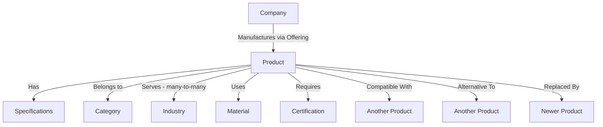
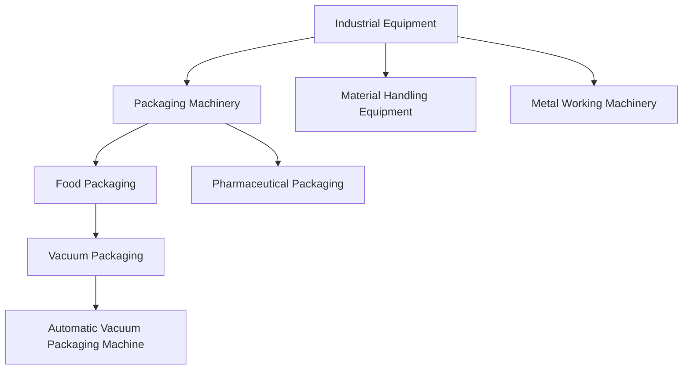
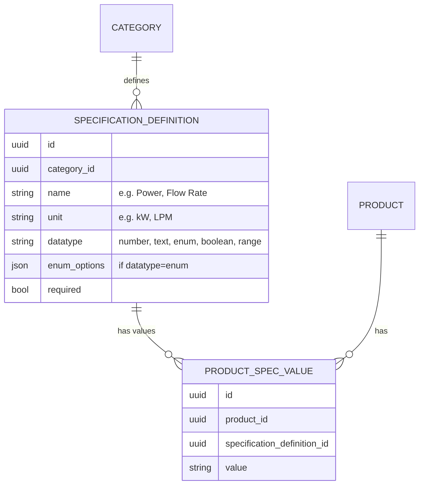
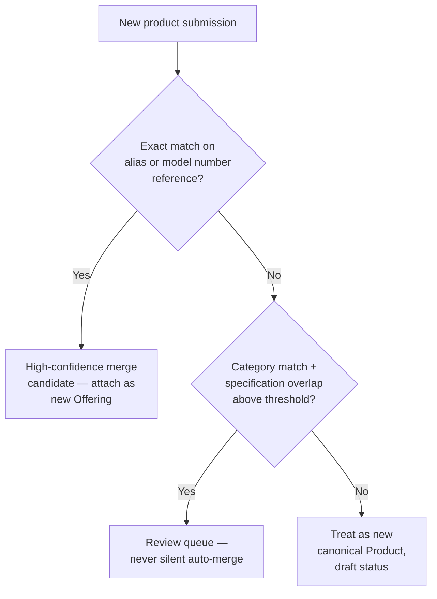
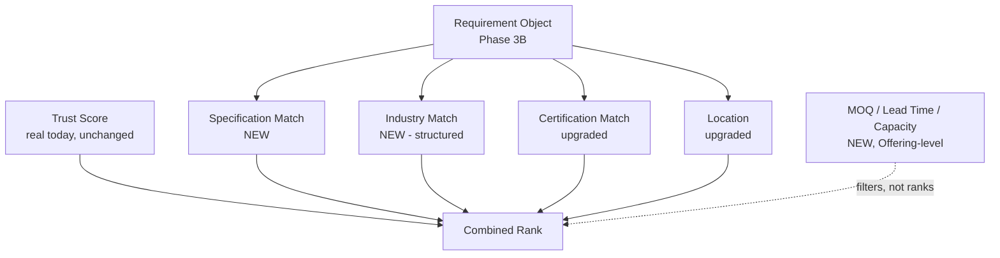
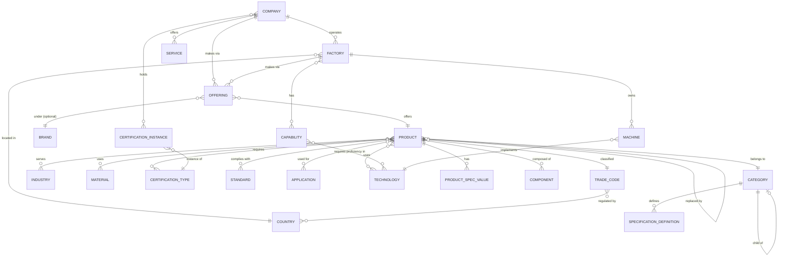

# ForgeX — Phase 4A: Industrial Product Graph Architecture

**Status:** Architecture only. Nothing in this document is implemented.
No backend, database, or frontend code was written or modified. Every
"current status" claim below was checked directly against the real
codebase, exactly as in Phase 3A. This document extends, and does not
contradict, `docs/product/phase-3a-ai-conversation-architecture.md`
Section 10 (which sketched a preliminary future knowledge graph) — this
is that sketch's detailed design.

**Governing principle, from the brief:** *products are knowledge, not
listings.* Every design decision in this document is checked against
that sentence. The single most consequential consequence of taking it
seriously is introduced in Section 2 and referenced throughout: **a
Product is not owned by the company that makes it** — many companies
can supply the same canonical product, and what's company-specific
(price, lead time, MOQ) is modeled separately from what's true of the
product itself. Get this wrong, and ForgeX becomes exactly the
"ecommerce catalog" the brief explicitly rejects.

---

## Table of Contents

1. [Defining Product](#1-defining-product)
2. [Core Entities](#2-core-entities)
3. [Relationships](#3-relationships)
4. [Industrial Taxonomy](#4-industrial-taxonomy)
5. [Specification System](#5-specification-system)
6. [Product Identity](#6-product-identity)
7. [Product Matching](#7-product-matching)
8. [Recommendation Inputs](#8-recommendation-inputs)
9. [Future AI](#9-future-ai)
10. [Future Knowledge Graph](#10-future-knowledge-graph)
11. [Roadmap](#11-roadmap)
12. [Self-Review: Trade-offs, Risks, Scalability](#12-self-review-trade-offs-risks-scalability)

---

## 1. Defining Product

### What is a Product?

A Product is a **canonical, reusable representation of a class or
specific variant of industrial good** — defined by what it *is*
(category, specifications, materials, standards it meets), not by who
sells it or for how much. It exists once in the graph regardless of
how many companies can supply it.

This is deliberately the opposite of an ecommerce SKU. A SKU exists to
be bought — it's owned by one seller, has one price, one stock count.
A Product in this architecture exists to be **understood** — it's a
node of industrial knowledge that many companies can attach themselves
to as suppliers, manufacturers, or distributors (formalized in Section
2 as the **Offering** entity — the actual answer to "how do listings
work without Products becoming listings").

### What is NOT a Product?

- **A company.** That's `Company` (real today, Module 3A).
- **A category or industry by itself**, with no specific identifiable
  good. "Packaging machinery" is a `Category` (Section 4); "an
  automatic vacuum packaging machine" is a `Product`.
- **A service with no physical specification**, like "CNC machining as
  a contract service" or "electroplating service." These map to
  Phase 3A's "Find Industrial Service" intent, which is real but
  distinct — see Section 2's `Service` entity. Forcing a service into
  Product's shape (which assumes specifications like voltage or flow
  rate) would misrepresent it.
- **A raw, unstructured listing with no structured specification data.**
  A company's free-text product description, before it's been
  classified into a Category and given at least minimal specification
  values, is a draft/unclassified submission — not yet a graph node.
  This matters for Section 6 (identity) and Section 11 (roadmap): the
  graph should never silently promote unstructured text into a
  first-class Product without going through classification.
- **A one-off custom fabrication with no reusable identity** (e.g. "a
  custom bracket built to one customer's exact one-time drawing").
  These are real, but they're **Capability** demonstrations (Section 2)
  — "this factory can fabricate custom metal brackets" — not a
  reusable Product node, because there's nothing canonical to
  reuse.

---

## 2. Core Entities

Every entity below states its purpose and, critically, how it relates
to what's real today (Company, VerificationDocument, and the free-text
fields Phase 3A's Section 12 already catalogued). None of these
entities exist in the current database.

### The pivotal design decision: Offering

Before the requested entity list, one entity the brief didn't name but
that this analysis concludes is unavoidable:

> **Offering** — the relationship between a **Company** (or, more
> precisely, a **Factory**) and a **Product**, representing "this
> company can supply this product." This is where company-specific,
> non-canonical facts live: role (manufacturer / supplier /
> distributor / exporter — see below), MOQ, lead time, production
> capacity, and any price-on-request flag. **Never on Product itself.**

Without this separation, every company selling the same off-the-shelf
motor would need its own copy of that motor's specifications —
duplicated, inevitably inconsistent, and exactly the "ecommerce
catalog" pattern the brief rejects. With it, the motor is one Product
node; twelve companies each get one lightweight Offering row pointing
to it.

### Entity catalogue

| Entity | Purpose | Notes |
|---|---|---|
| **Product** | Canonical representation of a class/variant of industrial good (Section 1) | Central node. Has: category, specifications (Section 5), aliases/model numbers (Section 6), status (draft/published) |
| **Offering** | Company/Factory ↔ Product join — supply-side facts | See above. This is the entity that actually gets "created" when a company adds a product to their profile — not a new Product row |
| **Category** | A node in the Industrial Taxonomy (Section 4) | Hierarchical; e.g. "Automatic Vacuum Packaging Machines" |
| **Industry** | A broader end-use vertical (Food & Beverage, Automotive, Pharma) | **Deliberately separate from Category** — see Section 3. `Company.industry` exists today as free text (Phase 3A Section 12); this becomes a real, linked, many-valued entity |
| **Specification** | A named, typed attribute definable per-category (Power, Voltage, Flow Rate) | Dynamic system — see Section 5. Not hardcoded per product type |
| **Manufacturer / Supplier / Distributor / Exporter** | **Not separate entities** — roles a Company/Factory plays *per Offering* | A refinement of today's `Company.business_type` (Module 3B), which is company-wide. A company could manufacture Product A but only distribute Product B — that precision requires the role to live on Offering, not Company |
| **Factory** | A physical production site | Already flagged as a gap in Phase 3A (Section 12) and the original domain model's Weakness #4. A Factory *manufactures* specific Products — refines today's company-wide "Factory Verified" proxy (`docs/adr/0029`) into something location- and product-specific |
| **Certification** | Split into **CertificationType** (the reusable standard/scheme — ISO 9001, CE, BIS) and **CertificationInstance** (a specific company's or product's actual certificate: issuer, number, expiry) | Today, `VerificationDocument.document_type` (Module 3B) only captures type, not a full credential with issuer/expiry — this is the structured version of that gap, already noted in `docs/frontend/backend-enhancements.md` item 7 |
| **Capability** | A process/skill a Company or Factory has (CNC Milling, Injection Molding) | Distinct from Machine (the equipment) and Technology (the underlying method) — Capability is "can do X," which may be implemented via specific Machines using specific Technologies |
| **Material** | A raw or input material (Stainless Steel 304, ABS Plastic) | Products "use" Materials; Materials can themselves be sourced (ties to Phase 3A's "Find Raw Material" intent) |
| **Brand** | A company's named product line/trademark | Distinct from Company (one company can own multiple brands) and from Product (a Brand groups related Products) — central to Section 6's trade-name handling |
| **Machine** | Physical industrial equipment | **Dual role**, explained fully in Section 3: a Machine is often itself a Product (a machine manufacturer's actual product), but can *also* be listed as a Factory's asset (equipment used to make *other* products) |
| **Component** | A sub-part of a Product | Enables bill-of-materials-style relationships; a Component may itself be an independently-suppliable Product (spare parts) — central to Section 7's compatibility matching |
| **Technology** | An underlying method/process (CNC, Laser Cutting, Injection Molding) | Products/Machines "use" Technology; Companies/Factories "have capability in" Technology |
| **Standard** | A formal technical/design standard a Product complies with (e.g. ASME B31.3) | Distinct from Certification: a Standard is a design/engineering document a product is built to; a Certification is a verifiable credential attesting compliance. Not every Standard has a corresponding issuable Certification |
| **Application** | A specific use-case (Meat packaging, Pharmaceutical blister packs) | Finer-grained than Industry — this is what buyers often actually search by ("I need a machine *for* X"), directly matching Phase 3A's "describe your problem" philosophy |
| **Trade Code** | HS Code / customs classification | Prerequisite for real "Find Exporter" fulfillment and for the Country/Port/Trade Route entities Phase 3A Section 10 sketched |
| **Country** | Linked geographic entity | `Company.country` exists today as free text (Phase 3A Section 12) — this becomes a real, aggregatable entity |
| **Service** | *(added — not in the brief's list, but required by Section 1's "what is not a Product")* A company capability offered without physical product specifications | Sibling to Product, not a subtype — forcing "CNC machining service" into Product's spec-shaped fields would be a category error. Serves Phase 3A's "Find Industrial Service" intent |

---

## 3. Relationships

### Walking the brief's example chain

| Relationship | Cardinality | Explanation |
|---|---|---|
| Company/Factory → Product | Many-to-many, **via Offering** | Not a direct edge — see Section 2. A Company can offer many Products; a Product can be offered by many Companies |
| Product → Specification | One-to-many, **via a value join** (Section 5) | A Product has many specification *values*; the Specification *definitions* themselves are shared across all Products in a Category, not duplicated per-product |
| Product → Category | Many-to-one | A Product belongs to exactly one primary Category (Section 4's tree) — kept single-parent deliberately, see Section 4's trade-off discussion |
| Product → Industry | **Many-to-many** | Deliberately separate from Category's strict tree: the same Category ("Vacuum Packaging Machines") can serve Food, Pharma, and Electronics industries simultaneously. Forcing Industry into the Category tree would require duplicating categories per industry — modeled instead as a cross-cutting tag layer |
| Product → Material | Many-to-many | A Product can use multiple Materials; a Material is used by many Products |
| Product → Certification (required) | Many-to-many | A Product may *require* several CertificationTypes; a CertificationType is required by many Products |
| Company/Product → CertificationInstance (held) | One-to-many | A specific, real certificate is issued to one Company or Product, but a Company/Product can hold several |
| Product ↔ Product (compatible) | Many-to-many, **typically directional or paired** | See Section 7 — "compatible with" often has a note (e.g., filter X is compatible with machine Y, not necessarily vice versa in the same sense) |
| Product → Product (alternative) | Many-to-many, symmetric | Same Category, functionally interchangeable — Section 7 |
| Product → Product (replaced_by) | One-to-one or one-to-many, directional | A model succeeded by a newer one — Section 7 |
| Product → Component | One-to-many (BOM) | A Product is composed of Components; a Component may itself be an independently-suppliable Product |
| Factory → Machine | One-to-many | A Factory's equipment inventory — this is Machine in its "Factory asset" role (see below) |
| Company → Factory | One-to-many | A Company can operate multiple Factories (Phase 3A Section 10's already-flagged gap) |
| Factory → Product (manufactures) | Many-to-many | Refines Company → Product: which *specific site* actually makes which products — enables real, location-specific "Factory Verified" |
| Product/Machine → Technology (uses) | Many-to-many | What method/process the product embodies or is made with |
| Company/Factory → Technology (capability in) | Many-to-many, **via Capability** | Not a direct edge — a Company's Capability entity references which Technologies it has proficiency in |
| Product → Standard | Many-to-many | Design/engineering standards complied with |
| Product → Application | Many-to-many | Use-cases served |
| Product/Company → Trade Code | Many-to-one / many-to-many | For export classification |
| Company/Factory → Country | Many-to-one | Location — real today as free text, future as a linked entity |

### The Machine dual-role, explained

Machine appears twice in this design, and that's intentional, not a
mistake:

1. **Machine-as-Product**: when a company's actual business is
   *making* machines (e.g., a CNC machine tool manufacturer), each
   machine model is a `Product` — with its own Category, specs, and
   Offerings from whoever sells it.
2. **Machine-as-Factory-asset**: when a *different* company owns a
   machine to *use* it in making something else (e.g., a metal
   fabricator owns CNC machines to produce custom brackets), that
   machine is listed as equipment on the `Factory` entity — evidence of
   Capability, not a Product being offered for sale.

The same real-world object (a CNC machine) can appear in both roles
simultaneously in the graph: as a Product (sold by its manufacturer)
and, separately, as a Factory asset (owned and used by a buyer of
that Product). This is not a duplication bug — it's the graph
correctly modeling that "the machine" and "the fact that a specific
factory owns one" are different, independently-true statements.

---

## 4. Industrial Taxonomy

### The brief's worked example, as a tree

### Design

- **Single-parent tree, variable depth.** Each `Category` has exactly
  one `parent_category_id` (nullable at the root). Depth is not fixed
  at N levels — "Automatic Vacuum Packaging Machine" is 5 levels deep
  in the brief's own example; a simpler category elsewhere might be 2.
  A fixed-depth schema would force awkward artificial subcategories in
  simple branches, or truncate detail in complex ones.
- **Single-parent is a deliberate trade-off, not an oversight** (see
  Section 12). A strict tree makes breadcrumb navigation, AI graph
  traversal ("everything under Packaging Machinery"), and taxonomy
  maintenance simple. The cost: something that arguably belongs in two
  branches (e.g., a machine that's both "Packaging Machinery" and
  "Food Processing Equipment") must pick one primary Category. This is
  exactly why **Industry** (Section 3) is modeled as a *separate*,
  many-to-many cross-cutting tag layer instead of being folded into the
  tree — it absorbs the genuinely-multi-parent dimension without
  compromising the tree's simplicity for the dimension that *is*
  naturally hierarchical (equipment type).
- **Leaf categories carry the Specification definitions** (Section 5).
  "Automatic Vacuum Packaging Machine" (a leaf) defines what
  specifications are relevant (chamber size, vacuum level, cycle time);
  its ancestor "Packaging Machinery" does not need to.
- **Category is the unit product intelligence hangs off of.** A future
  `GET /categories/{id}/facets` (aggregation — already flagged as
  missing in Phase 3A Section 12) would let a user browse "how many
  vacuum packaging machine suppliers exist" — directly answering
  Phase 3A's currently-unsupported "Market Research" intent, once
  built.

---

## 5. Specification System

### The requirement: dynamic, never hardcoded

A Motor's relevant specs (Power, Voltage, RPM, Efficiency, IP Rating,
Frame Size) share almost nothing with a Pump's (Flow Rate, Pressure,
Material, Temperature). A fixed-column schema (a `motors` table with a
`power_kw` column, a `pumps` table with a `flow_rate_lpm` column, and
so on for every category) would require a schema migration for every
new product category ForgeX ever adds — completely unworkable at
industrial-equipment scale (thousands of categories).

### Design: Entity-Attribute-Value (EAV), scoped by Category

- **`SpecificationDefinition`** is scoped to a `Category` (or inherited
  from an ancestor Category, for specs common to a whole branch, like
  "Country of Origin" being relevant everywhere). Adding "IP Rating" as
  a new spec for Motors means inserting one row here — no migration.
- **`ProductSpecificationValue`** is the actual value for one Product.
  Stored as a string with a declared `datatype` on the definition side,
  so the application layer (not the database schema) enforces type —
  this is the EAV trade-off named explicitly in Section 12.
- **`datatype` supports**: number (with unit), text, enum (fixed
  option list — e.g., IP Rating's valid values), boolean, and range
  (min/max — e.g., "operating temperature range").
- **Range and enum types matter for real matching** (Section 7/8): a
  buyer asking for "at least 5kW" needs numeric comparison, not
  substring matching — this is a genuine advance over today's
  `ILIKE`-only search (Phase 3A Section 8, Phase 3B's implementation).

---

## 6. Product Identity

### The core tension

Many companies will describe "the same" product differently — different
model numbers, different trade names, sometimes genuinely different
products that only look similar in free text. Product Identity is
about answering: **is this a new canonical Product, or an Offering
against an existing one?**

### Model numbers and trade names are Offering/Brand-level, not Product-level

A model number ("XJ-450V") is specific to one manufacturer's naming
convention — it does not identify the canonical Product across
companies (two different manufacturers' "450V"-class machines are not
the same product just because a substring matches). Model numbers and
trade names are stored on the **Offering** (or via **Brand**, Section
2), referencing which canonical Product they claim to be an instance
of — not as an identifying key on Product itself.

### Aliases live on Product

A canonical Product carries an `aliases[]` field — synonyms and
regional naming variants ("vacuum packer" / "vacuum packaging machine"
/ "vacuum sealer machine" for the same canonical entry). This is what
real search and matching key off, not a single rigid name.

### Duplicate detection strategy

- **Exact match** (a stated model number or alias already on file) is
  the only case eligible for automatic linking — and even then, to a
  *candidate*, not a silent merge.
- **Fuzzy match** (same Category, overlapping Specification values
  within tolerance) is a **review queue** case, never automatic. This
  deliberately mirrors Phase 3A's already-identified, still-unbuilt
  gap: a real admin/moderation review workflow (the Verification Agent,
  Phase 3A Section 11) — Product deduplication is exactly the kind of
  judgment call that shouldn't be silently automated, for the same
  reason document verification isn't (`docs/adr/0029`).
- **No match** becomes a new canonical Product in `draft` status,
  pending the same kind of review before being fully "published" and
  eligible for cross-company Offering attachment.

---

## 7. Product Matching

Four distinct relationships, each requiring a different matching
strategy — conflating them would produce wrong, and sometimes
dangerous (e.g., mis-identifying a "compatible" replacement part),
recommendations.

| Relationship | Definition | How it's determined |
|---|---|---|
| **Same Product** | Genuinely the identical canonical item, potentially offered by multiple companies | This *is* the Offering model (Section 2) — multiple companies pointing at one Product node. Determining whether two *submissions* describe the Same Product is Section 6's identity problem |
| **Compatible Product** | A different Product that can be used *with* a given Product (e.g., a specific filter cartridge compatible with a specific machine model) | **Curated, not inferred.** Compatibility is domain knowledge no specification-similarity algorithm can safely guess — modeled as an explicit `compatible_with` edge with a note field, populated by review (manufacturer-confirmed data, ideally), never auto-generated |
| **Alternative Product** | Same functional Category/Application, but a genuinely different product (different brand, different design) that could substitute for the buyer's purpose | **Semi-automatic candidate generation, human-reviewable**: same Category + overlapping key Specification ranges (within a defined tolerance) surfaces *candidates*; whether to actually present them as alternatives in a recommendation is a policy decision (Section 8), not an automatic edge write |
| **Replacement Product** | A newer Product that supersedes an older, often discontinued one | **Curated, directional edge** (`replaced_by`) — this is manufacturer-asserted lineage information, not something inferable from specifications at all. Critical for spare-parts and long-lifecycle industrial buyers |

### Why curation matters here more than almost anywhere else in this design

Getting "Compatible" or "Replacement" wrong isn't a minor relevance
miss the way a bad keyword match is — a buyer acting on a false
compatibility claim could install the wrong part. This is the clearest
case in the entire architecture where **"never fabricate"** (the
standing rule from Phase 3A) has real physical-world consequences, not
just a trust/credibility consequence. These two relationship types
should never be AI-generated or algorithmically inferred without
explicit source data (manufacturer documentation, verified submission)
backing each edge.

---

## 8. Recommendation Inputs

Every signal the brief lists, with its real-vs-future status —
extending Phase 3A Section 8, which only had two real signals (field
match count, verification score) because Product/Offering didn't exist
yet in that phase's scope.

| Signal | Status if this architecture is built | Explanation |
|---|---|---|
| **Specification Match** | New, real once built | Numeric/range/enum comparison (Section 5) — "needs ≥5kW" against a real `ProductSpecificationValue`. A genuine advance over today's substring-only matching |
| **Industry Match** | New, real once built | Product → Industry (Section 3) is a real, structured many-to-many — no longer free-text substring guessing |
| **Certification Match** | Partially real today, fully real once built | Today: a document's `document_type` exists (Module 3B). Once built: `CertificationInstance` (Section 2) gives issuer/expiry, making "has a *currently valid* ISO 9001 certificate" a real, checkable fact rather than "has an ISO-type document on file" |
| **Capability Match** | New, real once built | Company/Factory → Capability → Technology chain (Section 2/3) |
| **Trust Score** | **Already real today** | Module 3B's live verification scoring — unaffected by this architecture, just one more input alongside the new signals |
| **Location** | Partially real today (free text), fully real once built | `Company.country`/`city` exist today; Country as a linked entity (Section 2) enables real distance/region reasoning |
| **MOQ (Minimum Order Quantity)** | New, real once built | Lives on **Offering** (Section 2) — company-specific, not canonical to the Product |
| **Lead Time** | New, real once built | Same — Offering-level |
| **Production Capacity** | New, real once built | Offering or Factory-level (a Factory's real capacity constrains what its Offerings can credibly promise) |

### Combined ranking (conceptual, extending Phase 3A Section 8)

MOQ/Lead Time/Capacity are modeled as **filters** (does this Offering
even qualify, given the buyer's stated quantity/timeline from the
Requirement Object — Phase 3B), not **ranking weights** — a company
that can't meet the timeline shouldn't rank lower, it should be
honestly excluded or flagged, matching Phase 3A's Section 9
"Limitations" principle rather than silently burying a bad match at
the bottom of a list.

---

## 9. Future AI

### How LLMs would use the Product Graph

The graph's job is to be the **grounding layer** a future LLM
retrieves real facts from — never the source of generated facts. Two
distinct uses:

1. **Query translation**: an LLM's job becomes turning a natural-
   language requirement ("I need something that can vacuum-pack meat
   at high throughput") into a structured graph query — Category =
   Vacuum Packaging, Application = Meat Packaging, Specification
   (cycle time) = low — not generating an answer directly. This is a
   direct evolution of Phase 3B's deterministic `RequirementObject`:
   the *object's shape* doesn't need to change, only *how* it gets
   filled in (a real LLM instead of keyword heuristics).
2. **Grounded explanation**: once results come back from the graph
   (real Products, real Specification values, real Offering terms), an
   LLM can be used to *phrase* the explanation more naturally — but the
   underlying facts must come from the graph query result, never from
   the model's own generated claim. This is the same "never fabricate"
   principle from Phase 3A Section 9, now extended to cover
   specification-level facts, not just company-verification facts.

### How Agents would use it

Phase 3A Section 11 named nine future agents; this graph is what makes
several of them concretely buildable for the first time:

- **Product Intelligence Agent** (previously blocked entirely, per
  Phase 3A Section 11's "would need: Product entity — doesn't exist"):
  now has a real graph to populate, classify against the Taxonomy
  (Section 4), and extract Specification values into.
- **Comparison Agent**: extends from "compare companies" (Phase 3A) to
  real product-level comparison — same Category, side-by-side
  Specification values.
- **Procurement/RFQ Agent**: Offering's MOQ/lead time/capacity fields
  (Section 2, Section 8) are exactly the structured data an RFQ needs
  to route a request to qualified suppliers — this graph is the
  prerequisite Phase 3A Section 11 flagged but couldn't detail without
  Product/Offering existing.

---

## 10. Future Knowledge Graph

Extends Phase 3A Section 10's preliminary sketch with this phase's
detail:

*(Patents, Ports, and Trade Routes from Phase 3A Section 10 remain
future entities not detailed further here — they depend on Trade Code
and Country being real first, per that section's own dependency
ordering, which this document doesn't revise.)*

---

## 11. Roadmap

```mermaid
gantt
    dateFormat X
    axisFormat %s
    section Phase 4B
    Category taxonomy (tree, single-parent)        :4b1, 0, 1
    Product + SpecificationDefinition + values      :4b2, after 4b1, 1
    Offering (Company/Factory to Product)           :4b3, after 4b2, 1
    Basic product search (Category + Spec filters)  :4b4, after 4b3, 1
    section Phase 5
    CertificationType + CertificationInstance        :5a, after 4b3, 1
    Material, Standard, Application entities          :5b, after 4b4, 1
    Real recommendation engine (Section 8 signals)     :5c, after 4b4, 1
    Industry as linked, many-valued entity              :5d, after 4b1, 1
    section Phase 6
    Factory entity + factory-level manufacturing        :6a, after 5a, 1
    Component/BOM + Product matching (Section 7)          :6b, after 5b, 1
    Brand + trade name handling (Section 6)                 :6c, after 5b, 1
    Trade Code + Country as linked entities                   :6d, after 5d, 1
    Product Intelligence + Comparison Agents (Section 9)        :6e, after 6b, 1
```

### Phase 4B — The minimum real graph
Category tree, Product with dynamic specifications, and Offering —
the three entities without which nothing else in this document can be
built. Ends Phase 3A/3B's "Products don't exist" limitation for the
first time. Deliberately excludes Certification/Material/Standard
(Phase 5) and Factory/Component/Brand (Phase 6) — those add richness,
not the core capability.

### Phase 5 — Trust and richness
Real certification instances (closing the Section 2 gap between "has a
document" and "holds a currently-valid credential"), Material/
Standard/Application entities, and the first real, multi-signal
recommendation engine (Section 8) — all depend on Phase 4B's Product/
Offering existing first.

### Phase 6 — Full graph maturity
Factory-level precision, Component/BOM relationships enabling real
Product Matching (Section 7), Brand-based identity handling (Section
6), and the Trade Code/Country entities that unlock real export
reasoning — plus the Product Intelligence and Comparison Agents
(Section 9) that depend on all of the above.

**Each phase builds only on entities the previous phase actually
delivers** — matching Phase 3A's own roadmap discipline (Section 14).

---

## 12. Self-Review: Trade-offs, Risks, Scalability

### Trade-offs made explicitly (not accidentally)

1. **EAV specifications (Section 5) trade query performance and
   type-safety for schema flexibility.** A fixed-column schema per
   category would be faster to query and easier to validate at the
   database level, but would require a migration for every new spec
   on every category — completely unworkable given the brief's own
   scale ambition ("world's first AI Industrial Intelligence
   Platform," not a handful of product types). This is the correct
   trade-off for this domain, but it means numeric range queries
   ("Power between 3kW and 5kW") must be implemented carefully at the
   application layer, not left to simple SQL comparisons on a
   generic `value` string column.
2. **Single-parent Category tree (Section 4) trades some real-world
   multi-category accuracy for traversal and maintenance simplicity.**
   Absorbed by making Industry a separate cross-cutting layer — but
   any *other* genuinely multi-parent dimension that emerges later
   (there could be more than just Industry) would need the same
   treatment, not a hierarchy change.
3. **Curation over inference for Compatible/Replacement Product edges
   (Section 7).** Slower to populate at scale than an algorithmic
   approach, but the physical-world stakes of a wrong compatibility
   claim (Section 7's own reasoning) make this the only defensible
   choice.

### Risks

1. **Product deduplication (Section 6) is the highest-risk operational
   process in this entire design.** Get it too aggressive (auto-
   merging fuzzy matches) and genuinely different products get
   silently conflated — a buyer could end up looking at the wrong
   specifications entirely. Get it too conservative (never merging)
   and the graph fills with near-duplicate Products, undermining the
   entire "products are knowledge, not listings" premise by
   accumulating exactly the kind of redundant, per-seller-duplicated
   data this architecture exists to avoid. This needs real operational
   tooling (a review queue, at minimum) before Phase 4B ships anything
   user-facing built on it — flagged here so it isn't discovered as a
   surprise mid-implementation.
2. **Offering-level MOQ/lead time/capacity data will be
   self-reported, with no verification mechanism designed yet.**
   Phase 8's "filter, don't rank" design (Section 8) reduces the
   damage of a false claim (a bad-faith "1-day lead time" doesn't get
   algorithmically rewarded), but doesn't prevent the claim from being
   made. This mirrors exactly the still-unresolved gap Phase 3A/ADR-
   0029 already flagged for document verification — worth solving
   once, generally, rather than twice.
3. **Category taxonomy design (Section 4) is a one-time-hard,
   ongoing-maintenance-forever problem.** Getting the initial tree
   structurally right matters far more than most schema decisions,
   because every Product, every SpecificationDefinition, and every
   piece of downstream search/recommendation logic depends on it.
   Reorganizing a mature taxonomy later (splitting or merging
   categories) is a real migration with real Product-reassignment
   costs — this document doesn't attempt to design that migration
   tooling, and should not be read as implying it will be easy.

### Future scalability issues

1. **EAV query performance at real scale.** With potentially thousands
   of categories and tens of specification definitions each, a query
   like "Power > 5kW AND Category = Motors AND Country = India" against
   a generic `ProductSpecificationValue` table will need real indexing
   strategy work (likely a dedicated search/indexing layer, not raw
   relational queries) well before this reaches meaningful product
   volume — flagged as an implementation concern for whichever phase
   actually builds Section 5, not solved here.
2. **The Same-Product matching problem (Section 6/7) gets harder, not
   easier, as the graph grows.** More companies submitting more
   products increases both the *value* of correct deduplication and
   the *volume* of fuzzy-match review-queue work — this is a genuine
   operational scaling concern, not just a data-modeling one, and this
   architecture does not propose a solution beyond "start with a
   review queue" (Section 6).
3. **Cross-cutting Industry and Application tagging (Sections 2–3) can
   accumulate inconsistent tagging over time** without a governance
   process (who can add a new Industry or Application value, and
   when) — this document defines the *entities* but deliberately does
   not design that governance process, which is a real gap a future
   phase needs to close before these entities are opened to
   uncontrolled growth.

### What this document is confident about vs. what it's guessing

**Confident:** the Offering/Product separation (Section 2), the
EAV specification system (Section 5), and the Category/Industry split
(Section 3/4) are well-established patterns for exactly this kind of
domain — these aren't novel risks, they're known-good approaches this
document is applying, not inventing.

**Guessing:** the exact matching *thresholds* for fuzzy duplicate
detection (Section 6) and alternative-product candidate generation
(Section 7) — "overlapping specification values within tolerance" is
described conceptually here because no real product data exists yet to
calibrate an actual threshold against. This should be treated as a
Phase 4B/5 implementation-time decision informed by real submitted
data, not something this architecture document can responsibly pin
down in the abstract.
