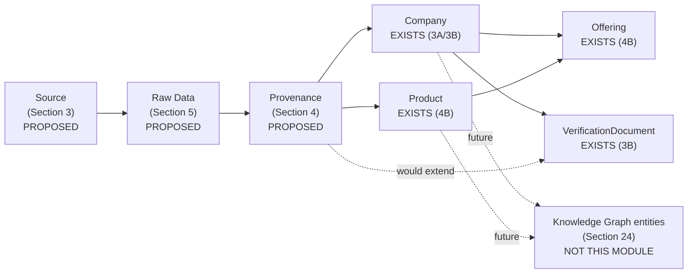
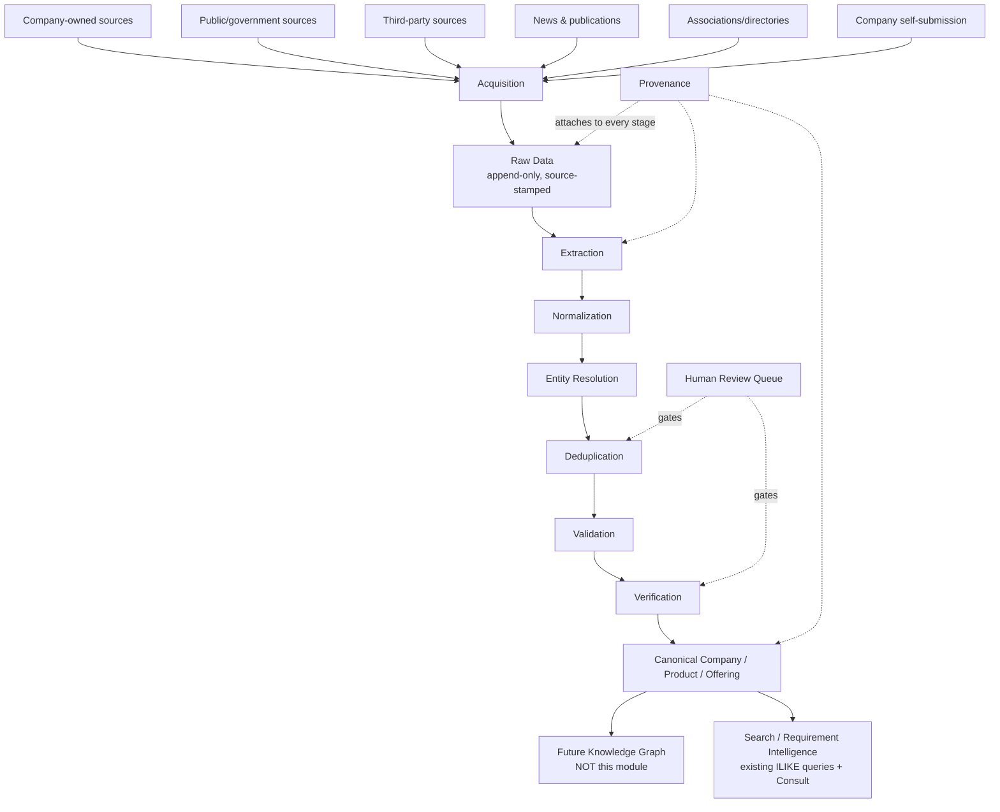

# ForgeX — Module 5: Industrial Data Acquisition & Data Quality Architecture

**Status:** Architecture only. Nothing in this document is implemented.
No code was written, no migration was created, no endpoint was added,
no file other than this one was touched. Every "currently exists"
claim below was checked directly against the real codebase — models,
services, routers — at the time of writing, not assumed or carried
over from a prior document's summary. Every "proposed" item is
explicitly labeled as such at the point it's introduced, not just in
a single ground-truth section.

**Relationship to prior architecture:** This document extends, and
does not contradict, `docs/product/phase-4a-industrial-product-graph-architecture.md`
(Product/Offering separation) and the Company Verification system
(Module 3B). Section 1 is the ground truth the rest of this document
is checked against.

---

## Table of Contents

1. [Current System Ground Truth](#1-current-system-ground-truth)
2. [Data Acquisition Principles](#2-data-acquisition-principles)
3. [Data Source Taxonomy](#3-data-source-taxonomy)
4. [Source Provenance](#4-source-provenance)
5. [Raw Data vs. Canonical Data](#5-raw-data-vs-canonical-data)
6. [Company Acquisition Pipeline](#6-company-acquisition-pipeline)
7. [Product Acquisition Pipeline](#7-product-acquisition-pipeline)
8. [Entity Resolution & Deduplication](#8-entity-resolution--deduplication)
9. [Data Normalization](#9-data-normalization)
10. [Data Quality Model](#10-data-quality-model)
11. [Verification Pipeline](#11-verification-pipeline)
12. [Company Claim / Self-Service](#12-company-claim--self-service)
13. [Continuous Data Refresh](#13-continuous-data-refresh)
14. [Data Conflicts](#14-data-conflicts)
15. [AI in the Data Pipeline](#15-ai-in-the-data-pipeline)
16. [Human Review System](#16-human-review-system)
17. [India-First MVP](#17-india-first-mvp)
18. [Scaling Strategy](#18-scaling-strategy)
19. [Data Storage Architecture](#19-data-storage-architecture)
20. [Security & Privacy](#20-security--privacy)
21. [Legal / Compliance Boundaries](#21-legal--compliance-boundaries)
22. [Data Pipeline Observability](#22-data-pipeline-observability)
23. [Failure & Recovery](#23-failure--recovery)
24. [Future Knowledge Graph Compatibility](#24-future-knowledge-graph-compatibility)
25. [MVP Implementation Plan](#25-mvp-implementation-plan)
26. [What We Should Not Build Yet](#26-what-we-should-not-build-yet)
27. [Risks](#27-risks)
28. [Final Architecture Diagram](#28-final-architecture-diagram)
29. [Self-Review](#29-self-review)

---

## 1. Current System Ground Truth

Checked directly against the running codebase — models, services,
routers — not carried over from a prior document's summary.

### Company (Module 3A/3B) — `app/models/company.py`

Real fields today: `name`, `legal_name`, `slug`, `description`,
`industry` (free text), `website`, `email`, `phone`,
`year_established`, `company_size`, `gst_number`, `country`, `state`,
`city`, `status`, `verification_status`, plus Module 3B additions
(`legal_entity_type`, `business_type`, `export_capable`, `pan`, `cin`,
`msme_number`, `iec_number`, `tax_registration`,
`business_registration_date`, branding fields, `short_description`,
`mission`, `vision`, `core_values[]`, `capabilities[]`,
`manufacturing_expertise[]`, `secondary_industries[]`,
`product_categories[]`, `manufacturing_categories[]`,
`export_categories[]`, `naics_sic_code`, `ai_tags[]`).

**Not present on Company today, confirmed by direct field inspection:**
no `source`, `source_url`, `collected_at`, `last_verified_at` (a
`verified_at` exists only on `VerificationDocument`, not on Company
itself), `extraction_method`, or `confidence` field of any kind. Every
Company row today is implicitly "however it was entered" — there is no
column recording *how* a given field's value got there.

### VerificationDocument (Module 3B) — `app/models/verification_document.py`

Real fields: `company_id`, `document_type`, `file_type`, `file_url`,
`status` (`pending`/`verified`/`rejected`/`expired`), `uploaded_by`,
`uploaded_at`, `verified_at`, `verified_by`, `expiry_date`, `version`,
`superseded_by_id`, soft-delete fields. `verified_by`/`verified_at`
exist as columns but — confirmed directly, not assumed — nothing in
the codebase ever sets them; no admin-review workflow exists yet
(already flagged in `docs/adr/0029` and Phase 3A/4A's own self-reviews).
This is the *closest existing analog* to a provenance record ForgeX
has today, and Section 4 builds on it rather than replacing it.

### VerificationScoreService (Module 3B) — `app/core/verification_rules.py`

Real, live-computed scoring across weighted requirements (document
uploads, business-info completeness, branding, social links) producing
a 0–100% score across 5 levels
(`unverified`→`email_verified`→`business_verified`→`factory_verified`→`premium_verified`).
This is entirely **self-reported-data completeness scoring** — it has
no concept of external-source corroboration, because no external
source has ever fed this system. Module 5 must not silently conflate
"this company filled out their profile" with "this company's data was
independently confirmed" — Section 11 makes this distinction explicit.

### Product Graph (Phase 4B) — `app/models/product*.py`, `offering.py`

`ProductCategory` (single-parent tree), `Product` (canonical,
`status`: `draft`/`published`/`archived`), `ProductSpecification`
(category-scoped EAV definitions), `ProductAttribute` (EAV values),
`Offering` (Company↔Product bridge: `role`, `moq`, `lead_time`,
`capacity`, `country`, `verification_status`
(`unverified`/`verified` — a placeholder flag with no scoring logic
behind it yet, per that module's own docstring), `status`).
**Confirmed: no source/provenance field exists on any Product-graph
model either.** Any authenticated user can create a `Product` today
(Phase 4B's own documented limitation) — there is no acquisition
pipeline, automated or manual, populating this data beyond direct API
calls.

### Search / Discovery — `search_companies()`, `search_products()`

Both are real, deterministic `ILIKE` substring queries
(`app/services/company_service.py`, `app/services/product_service.py`)
against `name`/`industry`/`country`/`city` (companies) or
`name`/`category_id`/`industry` (products). No full-text search, no
ranking beyond match-count, no external index. This is the **entire**
current search layer — there is no separate "search index" Module 5
would feed; it would feed the same Postgres tables these queries
already read.

### Consult / RequirementObject — `apps/web/src/lib/requirement.ts`

A client-side, deterministic (keyword-rule-based, explicitly **not**
an LLM — Phase 3B's own governing constraint) requirement-extraction
object with `intent`, `productOrCategory`, `country`, `city`,
`certifications`, `quantity`, `budget`, `timeline` fields, each
carrying an `explicit`/`inferred`/`missing` confidence tag. It
currently drives `search_companies()`/`search_products()` with the
extracted structured fields. It has no awareness of provenance,
source-observed-vs-verified distinctions, or any concept this module
introduces — Module 5's canonical data is what it would eventually
search against, unchanged in shape from what it searches today.

### Full current API surface (companies + products + auth)

Confirmed via direct router inspection: standard CRUD + search on
`/companies`, `/companies/{id}/verification|business-info|branding|documents|social-links|members`,
`/products`, `/products/search`, `/products/{id}/offerings|specifications`,
`/companies/{id}/offerings`, plus the full auth surface (Module 2/2.5).
**No ingestion, collector, source-registry, or review-queue endpoint
exists anywhere.** Every row in every table today was created by a
direct, authenticated API call — there is no other path data has ever
entered this system through.

### Summary table

| Concept this module needs | Exists today? |
|---|---|
| Company entity | Yes (Module 3A) |
| Company verification (self-reported completeness) | Yes (Module 3B) |
| Product/Offering separation | Yes (Phase 4B) |
| Any source/provenance field, anywhere | **No** |
| Any collector, scraper, or ingestion pipeline | **No** |
| Any raw-data staging table | **No** |
| Any entity-resolution/deduplication logic | **No** — today's uniqueness is only a `slug` collision check |
| Any human-review queue | **No** — the closest analog (`verified_by` on documents) is an unused placeholder column |
| Any external API integration | **No** |
| Search / query layer Module 5 would feed | Yes — the same `ILIKE` queries above, unchanged |

---

## 2. Data Acquisition Principles

Each principle is stated with *why it matters for ForgeX specifically*,
not as a generic data-engineering checklist.

- **Source-first architecture.** Every fact must be attributable to a
  specific source before it's treated as fact. ForgeX's entire premise
  (Phase 3A's own philosophy: "never fabricate") collapses the moment
  a fact with no traceable origin enters the system indistinguishably
  from one that does.
- **Provenance.** See Section 4 in full — this is the mechanism that
  makes "source-first" checkable rather than aspirational.
- **Freshness.** Industrial data decays at different rates (Section
  13) — a stale "verified" badge is worse than an honest "last
  confirmed 8 months ago," because it actively misleads a buyer making
  a sourcing decision.
- **Reliability.** Sources vary wildly in trustworthiness (a
  government registry vs. an unverified directory listing). Treating
  them identically would let the weakest source silently degrade data
  that came from the strongest.
- **Reproducibility.** Given the same source snapshot, re-running
  extraction should produce the same candidate data. Without this,
  debugging a bad extraction is guesswork, and the same bug can
  silently recur.
- **Legal/permission awareness.** Section 21 details this — but the
  principle itself is that *no collector is source-agnostic by
  default*. Each source class needs its own explicit collection policy
  before ingestion starts, not a blanket "scrape everything" default.
- **Rate limiting.** Protects both the external source (avoiding
  abuse-pattern traffic that gets ForgeX blocked) and ForgeX's own
  infrastructure from an unbounded collection job.
- **Respect for robots.txt and applicable policies.** A minimum, not a
  sufficient, legal safeguard — Section 21 is explicit that robots.txt
  compliance alone does not clear all legal risk (e.g., a site can be
  robots.txt-permissive while its Terms of Service still prohibit
  scraping).
- **No fabricated data.** The single most important principle in this
  entire document. An extraction pipeline that can't find a value must
  leave it null — never infer a plausible-sounding value and store it
  as if observed.
- **No unsupported inference presented as fact.** Distinct from
  fabrication: this covers *real* AI-assisted inference (e.g.,
  classifying an industry from a description) that must be labeled as
  inferred, with a confidence score, never silently promoted to the
  same status as an extracted fact.
- **Human review for high-risk claims.** Certain claims (certification
  status, manufacturing capability, financial figures) have outsized
  real-world consequences if wrong — Section 16 defines exactly which
  claims require a human before publication.
- **Idempotent ingestion.** Re-running a collector on the same source
  content must not create duplicate raw records or duplicate
  downstream entities — essential for retry-safety (Section 23) and
  for scheduled re-collection (Section 13) to not multiply data over
  time.
- **Auditability.** Every canonical fact must be traceable back through
  its full pipeline history — which raw record, which source, which
  extraction run, which human (if any) reviewed it.
- **Conflict handling.** See Section 14 — sources will disagree; ForgeX
  must have a designed, non-silent answer for what happens next.

---

## 3. Data Source Taxonomy

For each class: reliability, freshness, cost, structure, geographic
coverage, legal/permission considerations, expected fields, ingestion
method, verification requirements. **None of these sources are
integrated today** — this section designs the classification system
they would be sorted into, not a specific vendor list.

### 1. Company-owned sources (official website, catalogues, brochures, datasheets, company-submitted information)

| Dimension | Assessment |
|---|---|
| Reliability | High for *self-description* (a company knows its own name, address, products), inherently biased for anything comparative or reputational — a company's own marketing copy is not neutral evidence of quality |
| Freshness | Variable — an actively maintained site is fresh; many SME sites go stale for years |
| Cost | Low (collection effort only) to zero (company-submitted, Section 12) |
| Structure | Mostly unstructured HTML/PDF — requires real extraction, not just parsing |
| Geographic coverage | Universal in principle, wildly uneven in practice (large exporters have strong web presence; many SMEs don't) |
| Legal/permission | Source-specific — see Section 21; a company's own public website is generally the lowest-risk source class, but datasheets/brochures may carry their own copyright notices restricting redistribution |
| Expected fields | Name, description, product catalog, contact info, certifications *claimed* (not verified by virtue of being claimed) |
| Ingestion method | Targeted collection (Section 6), not broad crawling |
| Verification requirement | Self-reported until independently corroborated — never auto-promoted to "verified" (Section 11) |

### 2. Public/government sources (company registries, public filings, government datasets, public procurement information)

| Dimension | Assessment |
|---|---|
| Reliability | Highest of any source class for the specific facts they attest (legal name, registration number, incorporation date) — but narrow in scope, not a source of product/capability data |
| Freshness | Slow-changing by nature (registration facts), typically batch-published |
| Cost | Often free (public registries) to moderate (some government data requires paid access) |
| Structure | Frequently structured (APIs, bulk datasets) — the best candidate for reliable automated ingestion |
| Geographic coverage | Per-jurisdiction — India's MCA/GST registries are the India-first MVP's natural anchor (Section 17); this does not generalize automatically to other countries |
| Legal/permission | Usually the most explicitly permitted class (public-interest data), but redistribution terms still vary — must be checked per registry, not assumed |
| Expected fields | Legal name, registration number, incorporation date, registered address, status (active/dissolved) |
| Ingestion method | Structured API/bulk-file ingestion where available |
| Verification requirement | Can reasonably anchor a "government-attested" tier distinct from self-reported — but still requires entity resolution (Section 8) to link a registry record to the right ForgeX Company |

### 3. Structured third-party sources (licensed APIs, public datasets, industry databases)

| Dimension | Assessment |
|---|---|
| Reliability | Depends entirely on the specific vendor — must be assessed case by case, never assumed uniformly high just because it's "structured" |
| Freshness | Vendor-dependent, often contractually specified |
| Cost | Typically paid, sometimes usage-metered — a real, ongoing operational cost (Section 22) |
| Structure | High — the easiest class to ingest technically |
| Geographic coverage | Vendor-dependent |
| Legal/permission | Licensing terms must be read before any integration — redistribution and caching rights vary enormously and must gate whether ForgeX can even store the data, not just display it |
| Expected fields | Vendor-specific |
| Ingestion method | API integration, with the vendor's own rate limits respected |
| Verification requirement | Treated as a real, checkable source with its own reliability weight (Section 4) — not automatically higher-trust than company-owned sources just because it's paid |

### 4. News and publications

| Dimension | Assessment |
|---|---|
| Reliability | Highly variable by publication; strong for *events* (an acquisition, a plant opening), weak for structured facts |
| Freshness | Fast-changing, time-stamped by nature |
| Cost | Free (public articles) to paid (licensed news APIs) |
| Structure | Unstructured — requires NLP-assisted extraction (Section 15), always with human review for anything beyond a confirmed named-entity match |
| Geographic coverage | Uneven, English-language sources overrepresented globally |
| Legal/permission | Copyright applies to article text; excerpting facts (not reproducing text) is the intended use, matching this project's own established copyright discipline |
| Expected fields | Event mentions (mergers, new facilities, leadership changes) — not baseline company facts |
| Ingestion method | Targeted monitoring for named entities already in ForgeX, not broad news crawling |
| Verification requirement | Always human-reviewed before affecting a canonical record (Section 16) — news-derived claims are exactly the "high-risk" category Section 2 flags |

### 5. Industry associations / directories

| Dimension | Assessment |
|---|---|
| Reliability | Medium — membership implies some vetting by the association, but standards vary enormously by association |
| Freshness | Often stale (member directories are notoriously under-maintained) |
| Cost | Usually free to browse, sometimes membership-gated |
| Structure | Semi-structured (directory listings) |
| Geographic coverage | Strong within an association's own industry/region, absent elsewhere |
| Legal/permission | Directory terms of service must be checked; many explicitly prohibit bulk scraping even of public listings |
| Expected fields | Company name, membership status, broad category, contact info |
| Ingestion method | Targeted collection, association-by-association, never generic |
| Verification requirement | Membership is a weak signal, not verification — must not be conflated with ForgeX's own verification levels |

### 6. User/company contributions

Covered in depth in Section 12. Reliability is inherently
self-interested (a company describing itself favorably), but this is
also the **only** source class where ForgeX has an explicit,
consensual relationship with the data's subject — which changes the
legal and trust calculus entirely (no scraping questions, but also no
independent corroboration by default).

---

## 4. Source Provenance

**Fully conceptual — no schema is proposed here as final; Section 19
maps how this would eventually attach to real tables, but this section
answers the *questions* a provenance model must answer, not the DDL.**

Every important fact must be able to answer:

| Question | What it captures |
|---|---|
| Where did this data come from? | The specific source instance (a URL, a registry record ID, a document, a user submission) — not just "website" as a category, but *which* website, *which* page |
| When was it collected? | Timestamp of the raw collection event |
| When was it last observed? | Distinct from collected — a re-collection that finds the *same* value should update "last observed," not create a new fact |
| When was it last verified? | Distinct again — verification (Section 11) is a separate act from observation, potentially by a human or a higher-trust corroborating source |
| Who verified it? | A person (human review, Section 16) or a system (an automated corroboration rule) — always attributable, never anonymous |
| What extraction method produced it? | Manual entry, rule-based parsing, AI-assisted extraction (Section 15) — this matters directly for confidence scoring (Section 10) |
| What confidence does it have? | A score reflecting extraction method reliability and source reliability combined — never a bare "true/false" |
| What happens if two sources disagree? | Section 14 in full — provenance is the mechanism that makes conflict detection possible in the first place, since without per-source records there is nothing to compare |

**Why this doesn't exist today and must be designed carefully:**
Section 1 confirmed zero provenance fields exist anywhere in the
current schema. Every fact in the system today is, in effect,
provenance-free — which was an acceptable simplification when all data
was self-reported by an authenticated company representative (the
"source" was trivially "this logged-in user," an implicit provenance
of exactly one kind). Module 5 introduces multiple source *kinds* for
the first time, which is precisely why explicit provenance stops being
optional.

---

## 5. Raw Data vs. Canonical Data

**Proposed, not implemented.** A strict separation:

```
Official company website
        ↓
Raw captured content        ← PROPOSED: immutable, source-stamped snapshot
        ↓
Parser
        ↓
Structured candidate data   ← PROPOSED: parsed, not yet validated
        ↓
Validation
        ↓
Canonical Company           ← EXISTS TODAY: app/models/company.py
```

**Why raw source data must never be overwritten when canonical data
changes:**

1. **Auditability** (Section 2) is impossible without it — if a
   canonical field is ever challenged (a company disputes a value, a
   conflict is discovered, a legal question arises), the original raw
   capture is the only way to answer "what did the source actually
   say, at the time it was collected."
2. **Re-processing.** If the extraction or normalization logic
   improves later, the *raw* data is what gets re-run through the
   improved pipeline — canonical data alone can't be "re-extracted"
   because the original source text is already gone from it by
   design.
3. **Conflict resolution** (Section 14) requires comparing what
   multiple sources actually said, not just their aggregated
   canonical result — the canonical record intentionally discards the
   per-source detail that a conflict investigation needs back.
4. **Legal defensibility.** If a source's terms are later found to
   restrict use in a way not initially caught, having the exact raw
   capture (with its collection timestamp) is what allows a precise,
   scoped removal — rather than an uncertain guess at what needs to be
   unwound from canonical data alone.

This means raw data is **append-only** by design — a new collection
event creates a new raw record, it never mutates a prior one.

---

## 6. Company Acquisition Pipeline

**Fully proposed — no stage of this pipeline exists today.** Section 1
confirmed the only way a Company row is created today is a direct,
authenticated `POST /companies` call.

```
DISCOVERY → SOURCE IDENTIFICATION → COLLECTION → EXTRACTION →
NORMALIZATION → ENTITY RESOLUTION → DEDUPLICATION → VALIDATION →
VERIFICATION → PUBLICATION → CONTINUOUS MONITORING
```

| Stage | What happens |
|---|---|
| **Discovery** | Identifying that a candidate company exists at all — from a registry listing, a directory entry, a news mention, or a company's own submission (Section 12). Discovery does not yet create any ForgeX record — it creates a discovery lead. |
| **Source identification** | Determining which source class(es) (Section 3) can plausibly provide data for this lead, and whether ForgeX's current legal/collection policy for those sources (Section 21) permits proceeding |
| **Collection** | The actual fetch — respecting rate limits, robots.txt, and the source's own terms (Section 2). Produces raw data (Section 5) |
| **Extraction** | Turning raw content into structured candidate fields — rule-based where possible, AI-assisted where necessary (Section 15), always confidence-scored |
| **Normalization** | Section 9 — canonicalizing formats (country names, phone numbers, etc.) on the *candidate* data, before it's compared against existing entities |
| **Entity resolution** | Section 8 — is this the same company as one already in ForgeX? |
| **Deduplication** | If entity resolution finds a match, merge candidate data into the existing record's pending-review queue rather than creating a duplicate |
| **Validation** | Structural/plausibility checks (a phone number that's actually phone-number-shaped, a country that's a real country) — not truth-verification, just sanity-checking |
| **Verification** | Section 11 — the distinct step of confirming a claim is actually true, not just well-formed |
| **Publication** | Only verified (or explicitly-labeled-unverified-but-published, per Section 11's state model) data becomes visible in ForgeX's canonical, searchable Company record |
| **Continuous monitoring** | Section 13 — scheduled re-collection to catch changes, at a frequency matched to how fast each field type actually changes |

### Handling specific real-world cases

| Case | Handling |
|---|---|
| New company | Full pipeline, ending in a new Company row (status starts unverified, matching today's `verification_status` model) |
| Existing company update | Entity resolution matches an existing Company; new candidate data enters that company's pending-review state, canonical data is not silently overwritten (Section 14) |
| Duplicate company | Entity resolution (Section 8) catches this before a second Company row is ever created — this is the pipeline's core defense against the "20 duplicate companies" failure mode |
| Conflicting information | Section 14 — held in a conflict state, never silently resolved by "last write wins" |
| Defunct company | A registry status change (Section 3, public sources) or a monitoring pass finding no signs of activity — proposed: a `dormant`/`inactive` company status distinct from deletion, since "we haven't found evidence recently" is not the same claim as "we've confirmed this company closed" |
| Company changing name | Treated as an update to an existing entity (via entity resolution on registration ID / domain, not name) — never a new entity, and the old name is retained in history, not discarded |
| Company changing website | Same principle — domain changes are common (rebrand, acquisition) and must not break entity resolution's ability to recognize the same underlying company |
| Company acquisition/merger | The highest-ambiguity case — proposed as **always mandatory human review** (Section 8/16), never automatic, since merging two real companies' histories incorrectly is far more damaging than leaving them temporarily separate |

---

## 7. Product Acquisition Pipeline

**Fully proposed.** Must respect Phase 4A's Product/Offering
separation exactly as it exists today (Section 1 confirmed this is
real, working code, not just architecture).

```
Source → Product candidate → Product normalization → Product matching
→ Deduplication → Product verification → Offering association
```

| Stage | What happens |
|---|---|
| **Product candidate** | Extracted from a source (company catalogue, datasheet) — a *description* of a product, not yet a canonical `Product` row |
| **Product normalization** | Section 9 — units, spec value formats — applied before matching, so equivalent products described differently don't fail to match on formatting alone |
| **Product matching** | The critical step: does this candidate describe a product that already exists as a canonical `Product`? Uses the same category-scoped `ProductSpecification` structure Phase 4B already built — comparing candidate spec values against existing Products in the same `ProductCategory` |
| **Deduplication** | Per Phase 4A Section 6/7's own already-designed identity model: exact match on alias/model-number reference → high-confidence merge candidate; fuzzy category+spec-overlap match → **review queue, never silent auto-merge** (this document does not relax that constraint) |
| **Product verification** | Section 11 — is this a real, correctly-specified product, independent of who's claiming to offer it |
| **Offering association** | Only *after* the Product is resolved to a canonical entity does an `Offering` row get created/updated linking the company to it — this is the exact mechanism that prevents the failure mode below |

### How this prevents 20 duplicate Products for 20 companies selling the same item

This is the single most important guarantee this section makes, and it
follows directly from Phase 4A's own design (Section 2's "Offering is
the pivotal decision"), extended into the acquisition context:

1. **Product matching runs before any new Product is created**, not
   after. A candidate is only allowed to become a *new* Product row if
   matching against existing Products in its resolved `ProductCategory`
   finds no acceptable match (exact or high-confidence fuzzy).
2. **Company-specific facts never influence Product identity.** MOQ,
   lead time, capacity, price — none of these are part of what
   "matching" compares, because none of them are part of what makes a
   product *the same product* (this is exactly Phase 4A Section 2's
   Offering/Product boundary, applied to acquisition instead of manual
   entry).
3. **The failure mode this replaces** — 20 companies' catalogue data
   each independently creating "their own" Product row for what's
   actually the same industrial item — is structurally the same
   mistake this document's whole design exists to prevent product-side
   the way Section 8 prevents it company-side. If matching is skipped
   or done carelessly, this guarantee breaks; it is not automatic
   without the matching step being taken seriously, which is why
   Section 8 treats product matching as equally high-risk to company
   matching, not a lesser concern.

---

## 8. Entity Resolution & Deduplication

**The highest-risk part of this entire system, per the brief's own
framing — treated with matching weight here.**

### "Is this the same company?"

| Signal | Strength | Notes |
|---|---|---|
| Registration identifier (CIN, GST, tax ID) | Strongest — near-exact match | Government-issued, low false-positive rate — but requires the identifier to actually be present and correctly extracted on both sides |
| Domain / website | Strong | Company websites rarely collide, but company *rebrands* can change domains — must combine with other signals, not used alone |
| Normalized legal name | Medium | Legal names are precise but companies are often referred to by trade names that differ — normalization (Section 9) helps, but this alone produces real false positives (e.g. common holding-company name patterns) |
| Normalized address | Medium | Useful corroboration, weak alone — many companies share business-park addresses |
| Phone number | Weak-medium | Shared numbers across group companies are common in India specifically (relevant to Section 17) |
| Semantic similarity (description, product overlap) | Weakest, AI-assisted only | Never sufficient alone — always a corroborating signal at most, per Section 15's AI boundary |

### "Is this the same product?"

| Signal | Strength | Notes |
|---|---|---|
| Manufacturer part number / model number, same manufacturer | Strongest | Still requires manufacturer identity to be resolved first — a model number alone, without a resolved manufacturer, is not unique |
| Exact specification match within the same `ProductCategory` | Strong | Uses Phase 4B's real, structured `ProductSpecification`/`ProductAttribute` data — a genuine advantage over free-text matching |
| Normalized product name | Medium | Same caveat as company names — trade names, translations, and marketing variations all reduce reliability |
| Category + partial specification overlap | Weak-medium | A real signal, never sufficient alone — this is exactly the "fuzzy match" tier Phase 4A Section 6 already scoped as review-queue-only |
| Semantic/description similarity | Weakest, AI-assisted only | Same boundary as company semantic matching |

### When automatic merging is allowed

**Only** when the strongest-tier signal is present and unambiguous:
an exact registration-identifier match (companies) or an exact
manufacturer+model-number match against an already-verified Product
(products). Even then, "automatic merge" means *auto-attaching new
candidate data to the existing entity's pending-review queue*, not
silently overwriting canonical fields — Section 14 still governs what
happens to the actual field values.

### When human review is mandatory

- Any match relying only on medium- or weak-tier signals, alone or in
  combination, without a strong-tier signal present.
- Any company acquisition/merger scenario (Section 6).
- Any product match that would merge specifications differing beyond a
  defined tolerance (the same "no unsafe automatic merging" constraint
  Phase 4A Section 6 already established, restated here as
  non-negotiable for the acquisition context specifically, since
  acquisition introduces far more candidate volume than manual entry
  ever did).
- Any case where two candidate matches are close in confidence (an
  ambiguous "could be A or B" result) — resolved by a human, never by
  picking the higher-scoring option silently.

**Never allow unsafe automatic merging of potentially different
industrial products** — restated here exactly as instructed, because
the consequence (a buyer sourcing the wrong part based on a false
"same product" claim) is a physical-world failure, not just a data
error, echoing Phase 4A Section 7's identical reasoning for manual
product-matching.

---

## 9. Data Normalization

**Proposed, extensible — not a giant global taxonomy built up front.**

| Field type | Normalization approach |
|---|---|
| Company names | Case/whitespace/punctuation normalization + a small, extensible legal-suffix table (Pvt Ltd, LLC, GmbH, ...) for fuzzy matching — never used to *change* the stored display name, only to aid matching |
| Addresses | Component parsing (street/city/state/postal/country) where extractable; stored both as structured components and original raw string, since perfect parsing isn't achievable and the raw form remains the fallback |
| Countries | ISO 3166 codes as the canonical normalized form, with a mapping table from common variants — extensible by adding table rows, not code changes |
| Cities | Normalized against country + state context (a bare city name is ambiguous without it) — no attempt at a global exhaustive city gazetteer at MVP scope |
| Industries | Kept as free text today (matching Section 1's confirmed current model) — normalization here means *tagging* candidate industry text against a growing controlled vocabulary over time, not forcing early categorization that would need later rework |
| Product names | Normalized for matching (Section 8) via the same case/whitespace approach as company names, plus category-aware synonym handling (Phase 4A Section 6's `aliases[]` concept) |
| Units | A small, explicit unit-conversion table scoped to what `ProductSpecification.unit` actually needs (Phase 4B's real field) — extensible per new unit encountered, not a physics-library-scale system |
| Specifications | Normalized against the specific `ProductSpecification.datatype` (number/text/enum/boolean/range) already defined per category — reusing Phase 4B's real schema rather than inventing a parallel one |
| Certifications | Normalized against `VerificationDocument.document_type`'s real, existing enum values (Section 1) where applicable, extensible for new certification types as they're encountered |
| Phone numbers | E.164 normalization where a country context is available; retained in original form when it isn't |
| Websites | URL normalization (scheme, trailing slash, www prefix) for matching purposes; original form retained for display |
| Currencies | ISO 4217 codes as canonical form — relevant primarily for any future pricing data (explicitly out of scope per Section 26 today, but the normalization approach is designed to not need rework if pricing arrives later) |
| Languages | ISO 639-1 codes, relevant for source-language tracking (a Hindi-language source vs. an English one) rather than any translation function this module does not propose |

**Extensibility principle governing all of the above:** every
normalization table is a data table (country codes, unit conversions,
legal suffixes), not hardcoded logic — adding a new value is a data
change, not a code change, avoiding the "giant global taxonomy built
prematurely" failure mode the brief explicitly warns against.

---

## 10. Data Quality Model

**Proposed — a framework, not a claim of objective truth.**

| Dimension | What it measures |
|---|---|
| Completeness | How many of a Company/Product's expected fields have any value at all (a real, computable metric, analogous in spirit to Module 3B's existing verification-completeness scoring — but *not* the same score, since this one applies to acquisition-sourced data quality, not self-reported-profile completeness) |
| Source reliability | Weighted per Section 3's source-class assessments |
| Freshness | Time since last observation vs. that field type's expected change rate (Section 13) |
| Verification | Whether the fact has passed Section 11's verification pipeline, and at what level |
| Consistency | Whether multiple sources agree, disagree, or only one source has ever reported this fact |
| Extraction confidence | The confidence score from Section 4's provenance model, reflecting extraction method reliability |
| Conflict status | Whether the field currently has an open, unresolved conflict (Section 14) |

### Data Quality Score — designed carefully, not overclaimed

A composite score combining the dimensions above is a reasonable,
useful *summary statistic* for prioritizing review queues (Section 16)
and for signaling to a user how much confidence a given fact deserves.
**It must never be presented as, or internally treated as, "objective
truth."** Concretely:

- It is a function of *process* (how well-sourced, how fresh, how
  corroborated) — not a function of the actual real-world accuracy of
  the fact, which ForgeX cannot know with certainty for any field it
  didn't independently, physically verify.
- A high score means "ForgeX has strong reason to believe this," not
  "this is definitely true." UI copy and any future documentation must
  preserve this distinction explicitly — echoing Phase 3A Section 9's
  identical discipline around verification-score language.
- The score's *inputs* must always remain individually inspectable
  (which source, what confidence, when) — never collapsed into an
  opaque single number with no way to see what produced it, which
  would make the "not objective truth" caveat unfalsifiable in
  practice.

---

## 11. Verification Pipeline

**Proposed — integrates with, and is careful not to break, the real
Module 3B Company Verification system confirmed in Section 1.**

```
DISCOVERED → UNVERIFIED → CANDIDATE → REVIEW → VERIFIED → PUBLISHED
```

| State | Meaning |
|---|---|
| Discovered | A lead exists (Section 6) — no ForgeX-visible record yet |
| Unverified | Candidate data has entered the pipeline; extracted but not yet checked for plausibility |
| Candidate | Passed validation (structurally sound), awaiting either automated corroboration or human review |
| Review | In the human review queue (Section 16) — required for anything not eligible for automatic processing |
| Verified | Confirmed true by the verification pipeline's own standards for that claim type — **distinct** from Module 3B's existing `VerificationStatus`/verification-score system, which this document does not modify |
| Published | Visible in ForgeX's canonical, searchable data |

### The critical distinction this section exists to enforce

Four genuinely different claims must never be collapsed into one:

1. **Information observed** — a source said X. This alone proves
   nothing except that the source said it.
2. **Information extracted** — a parser or AI system produced a
   structured value from what was observed, with some confidence.
   Extraction can be wrong even when observation was accurate (a
   misread date, a misattributed value).
3. **Information verified** — an independent process (human review, a
   corroborating strong-tier source, or a defined automated rule)
   confirmed the extracted value is actually correct.
4. **Information claimed by the company** — the company itself asserts
   this is true about them. Self-interested by nature (Section 3), and
   — per Module 3B's real, existing model — this is most of what
   ForgeX has today.

**The concrete example the brief gives is exactly right and is
restated as a hard rule:** "ISO certificate document uploaded" (a real
fact — `VerificationDocument.document_type == 'iso'`, Section 1) must
**never** automatically become "ISO certified" (a claim about the
company's actual compliance status) unless the verification process
specifically supports that claim — i.e., unless a human or an
authoritative corroborating source has actually confirmed the
document's authenticity and validity, which — confirmed in Section
1 — nothing in the current system does today. This is not a new
constraint invented for this document; it is `docs/adr/0029`'s already
-identified gap, restated here because Module 5 is precisely where
getting this distinction right or wrong has the most leverage.

---

## 12. Company Claim / Self-Service

**Proposed.** A company should be able to:

1. **Discover its profile** — find that ForgeX has (or is proposing to
   publish) a profile referencing them, before or after publication.
2. **Claim its profile** — assert "this is us."
3. **Prove ownership** — a verification step distinct from claiming
   (e.g., a domain-based email confirmation, matching Module 2's
   existing email-verification pattern; or a document-based proof,
   matching Module 3B's existing document-upload mechanism) — claiming
   alone is not proof, exactly mirroring why "information claimed"
   (Section 11) is its own distinct tier.
4. **Update information** — once ownership is proven, edit their own
   profile — this is exactly what Module 3A/3B's existing
   `CompanyMember`/RBAC system already supports for *manually created*
   companies; claiming an *acquisition-sourced* company should route
   into that same real, existing membership system rather than a new
   parallel one.
5. **Submit products / offerings** — using the real, existing Phase
   4B `Product`/`Offering` creation flow.
6. **Upload documents** — using the real, existing Module 3B document
   upload flow.
7. **Request verification** — entering the review queue (Section 16)
   explicitly, at the company's own initiative.

### How company-submitted information interacts with independently collected information

**The company must not automatically overwrite trusted source data** —
stated as a hard rule, per the brief. Concretely:

- A claimed company's self-submitted edits enter the same
  candidate/review pipeline (Section 6) as any other source's data —
  they do not get a privileged "write directly to canonical" path
  merely because the submitter is the subject of the record.
- **Exception, matching real precedent already in this codebase:**
  fields that only ever come from company self-report today (Module
  3B's `mission`, `vision`, `core_values`, branding, social links —
  confirmed in Section 1 as company-authored-only fields with no
  external source class in Section 3 that would ever compete for
  them) can reasonably continue to update directly, exactly as they do
  today, since there is no "trusted source data" for them to conflict
  with in the first place.
- Fields with independently-collected data (a registry-confirmed legal
  name, a corroborated address) go through Section 14's conflict
  handling if the company's self-submission disagrees — a company
  cannot silently overwrite a government-registry-sourced fact just by
  editing their own profile.

---

## 13. Continuous Data Refresh

**Proposed — a refresh strategy, not one universal schedule, per the
brief's explicit instruction.**

| Field category | Change rate | Proposed refresh cadence | Why |
|---|---|---|---|
| Legal/registration facts (legal name, registration ID) | Slow | Quarterly, or event-triggered by a registry update feed where available | Rarely changes; frequent re-checking wastes collection budget |
| Company name (trade name), leadership | Medium | Monthly | Changes occasionally, matters when it does (entity-resolution-relevant) |
| Products, specifications | Medium | Monthly, or triggered by a detected catalogue/website change | Catalogues update periodically, not continuously |
| Certifications | Medium, but high-stakes | Monthly, plus expiry-date-triggered re-checks (`VerificationDocument.expiry_date` already exists, Section 1 — a real, reusable trigger point) | A certification can lapse; stale "verified" status here is actively misleading |
| Contact info (phone, email, address) | Medium | Monthly | Moderate change rate, low risk if briefly stale |
| Pricing (if ever ingested — see Section 26, currently out of scope) | Fast | Not designed here — explicitly deferred | Pricing volatility would need a fundamentally different refresh model this module does not propose |
| News/event mentions | Very fast | Near-real-time monitoring for already-resolved entities only, never broad crawling | Time-sensitive by nature, but monitoring only known entities keeps this bounded (Section 18) |

**Design principle:** refresh cadence is a property of the *field
category*, stored as configuration, not hardcoded per source — so
adding a new field category's refresh policy is a configuration
change, matching Section 9's same extensibility principle.

---

## 14. Data Conflicts

**Proposed.** The brief's own example — a website says Revenue=X, a
filing says Revenue=Y, a company submission says Revenue=Z — is
handled as follows:

1. **Source precedence** — not a fixed global ranking, but a
   per-field-type precedence policy (e.g., for legal facts, a
   government filing outranks a website; for a company's own
   mission statement, self-submission is definitionally authoritative
   since there is no competing source class, per Section 12).
2. **Conflict state** — the field enters an explicit `conflicted`
   state, visible in the data quality model (Section 10), rather than
   any single value being silently chosen.
3. **Timestamps** — every conflicting value retains its own
   observation timestamp (Section 4), so a human reviewer can see not
   just *what* each source said but *when*.
4. **Human review** — conflicts above a defined risk threshold
   (financial figures, certifications, ownership — the same "high-risk
   claims" category from Section 2) are routed to mandatory review
   (Section 16), never auto-resolved.
5. **Display rules** — while unresolved, ForgeX's canonical record
   either shows the highest-precedence value with an explicit
   "disputed" indicator, or withholds the field entirely if precedence
   is genuinely ambiguous — but **never silently picks one value and
   presents it as uncontested**, per the brief's explicit instruction.

**Never silently overwrite conflicting information** — restated as a
hard rule governing every part of this section.

---

## 15. AI in the Data Pipeline

**Proposed — exact boundaries, matching Phase 3A's identical discipline
around "never fabricate."**

### AI may assist with

- **Extraction** — turning unstructured source content into structured
  candidate fields (always confidence-scored, Section 4).
- **Classification** — e.g., suggesting an industry tag or
  `ProductCategory` for a candidate.
- **Normalization** — assisting with the harder cases in Section 9
  (address parsing, unit recognition) where rule-based approaches are
  insufficient alone.
- **Entity matching** — the "semantic similarity" weak signal in
  Section 8, always a corroborating signal, never sufficient alone.
- **Summarization** — condensing long source documents for a human
  reviewer's benefit (Section 16) — the summary itself is never stored
  as a canonical fact.
- **Anomaly detection** — flagging candidate data that looks
  implausible (a company "founded" in a future year, a specification
  value wildly outside its category's normal range) for review
  priority.
- **Prioritization** — helping rank the human review queue (Section
  16) by estimated risk/impact, not making the review decision itself.

### AI must NOT silently fabricate

Certifications, revenue, manufacturing capabilities, product
specifications, ownership, compliance, relationships — restated
verbatim from the brief because this list is exactly the set of claims
Section 11's "information verified" tier exists to gate. An AI
extraction producing a *candidate* value for any of these is
acceptable (labeled as AI-extracted, low-to-medium confidence,
Section 4); an AI system asserting any of these as verified fact,
ever, is not — this is a hard boundary, not a tuning parameter.

### Human-in-the-loop boundaries

AI output at any confidence level remains a **candidate**, subject to
the same pipeline (Section 6/7) as any other source's candidate data —
AI is a source-processing tool within the pipeline, not a shortcut
around it. The one boundary this section adds beyond the general
pipeline: any AI-extracted value feeding a high-risk claim category
(Section 2/11) is routed to mandatory human review regardless of the
AI's own reported confidence score, since an overconfident wrong
extraction is exactly the failure mode this whole section exists to
prevent.

---

## 16. Human Review System

**Proposed — the future review queue's design, not its admin UI.**

```
High confidence         → automatic processing
Medium confidence       → review queue
High-risk / conflicting → mandatory human review
```

"High confidence" here is deliberately narrow: only strong-tier entity
resolution (Section 8) combined with a high-reliability source class
(Section 3) and no open conflict (Section 14) qualifies — matching
this document's repeated insistence that automatic processing is the
exception, not the default.

### Reviewer actions

| Action | Effect |
|---|---|
| Approve | Candidate data is promoted toward canonical (subject to Section 11's verification-state progression) |
| Reject | Candidate data is discarded — the raw source record (Section 5) is retained regardless, for auditability |
| Merge | Two candidate or existing entities are confirmed as the same — the highest-consequence action, always logged with the reviewer's identity (Section 4) |
| Split | A previously merged or incorrectly-matched entity is separated back into two — the necessary counterpart to Merge, since Section 8's caution about merging implies mistakes will occasionally happen and must be reversible |
| Request evidence | Returns the item to a pending state, optionally notifying the company (Section 12) if self-submitted, requesting clarifying documentation |
| Escalate | Routes to a more senior/specialized reviewer — proposed for the highest-risk categories (mergers, certification claims) where a first-line reviewer may not have sufficient context |

No admin UI is designed here, per the brief's explicit instruction —
this section defines the queue's logical states and reviewer actions
only.

---

## 17. India-First MVP

**Proposed strategy**, not a global rollout plan.

- **Initial industries:** a small number of well-bounded, high-signal
  industrial categories where structured data is realistically
  obtainable (e.g., industrial machinery/equipment manufacturing —
  matching the seed data categories Phase 4B's own
  `scripts/seed_product_graph.py` already used: motors, pumps,
  packaging machines, CNC machines, valves, bearings — a natural,
  already-established starting taxonomy rather than an invented one).
- **Initial company types:** manufacturers and exporters specifically
  (matching `Company.business_type`/`export_capable`, real fields
  today) — narrower than "all companies," to keep initial data quality
  achievable.
- **Initial data sources:** India's public company registry (MCA) and
  GST-related public data as the government-source anchor (Section
  3's Class 2 — India's clearest high-reliability, structured source);
  company-owned websites for the manufacturer set identified through
  those registries; explicitly deferring any paid third-party data
  vendor integration (Class 3) until the free/public-source pipeline
  is proven.
- **Initial collection volume:** proposed in the low hundreds to
  low thousands of companies, deliberately small enough that Section
  16's human review queue can plausibly keep pace with candidate
  volume — matching Section 18's scaling philosophy of proving the
  pipeline correct before proving it fast.
- **Quality targets:** every published company record has at minimum
  a strong-tier-verified legal identity (registration number match)
  before being marked above `unverified` — a narrower, harder bar than
  Module 3B's existing self-reported completeness score, on purpose,
  since this data arrives without the implicit trust of a
  self-registered account holder.
- **Verification strategy:** government-registry corroboration as the
  primary automated verification signal (Section 3's Class 2 reliability
  assessment), human review for everything else, matching Section 16's
  general design applied at India-first scale.

**Why India-first and not global immediately:** a single jurisdiction's
registry and regulatory landscape can be understood deeply enough to
build correct source-class assessments (Section 3) and legal review
(Section 21) for it specifically — attempting this simultaneously
across many jurisdictions' different registries, languages, and legal
regimes would dilute that rigor exactly where Section 2's "no
fabricated data" principle needs it most.

**Global extensibility, preserved by design:** every mechanism above
(source taxonomy, provenance, entity resolution, normalization,
verification pipeline) is designed generically in this document —
India-first is a *scope* decision (which sources, which industries,
first), not an architectural one. Section 3's source classes, Section
8's resolution signals, and Section 9's normalization tables all
already anticipate non-Indian instances (a different country's
registry is still "Class 2, public/government source," using the same
assessment dimensions).

---

## 18. Scaling Strategy

**Proposed — conceptual, not a distributed-infrastructure design.**

Progression: 100 → 1,000 → 10,000 → 100,000 → 1M → global scale.

| Concern | Approach |
|---|---|
| Queues | A durable job queue for collection/extraction tasks — at low volume (Section 17's target), a single queue and worker pool is sufficient; no premature multi-queue architecture |
| Workers | Horizontally scalable collection/extraction workers, stateless by design (all state lives in the raw-data/candidate tables, Section 5/19) — scaling is adding workers, not redesigning the pipeline |
| Rate limits | Per-source rate limit configuration (Section 3), enforced centrally so no individual worker can accidentally exceed a source's limit even under high parallelism |
| Retries | Idempotent by design (Section 2/23) — a retried job re-collects or re-processes without creating duplicate raw or candidate records, using source+timestamp+content-hash as the natural idempotency key |
| Partitioning | By source class first (Section 3), then by geography (supporting India-first without blocking future geographic partitioning) — not partitioned by company name or arbitrary shard key, since source-class partitioning aligns naturally with legal/collection-policy boundaries (Section 21) that genuinely differ per partition |
| Scheduling | Refresh cadence (Section 13) drives scheduling, not a single global cron — each field category's own cadence determines when its owning entities are re-queued |
| Monitoring | Section 22 in full |
| Cost control | Structured/free sources (Section 3 Classes 1–2) prioritized at India-first scale specifically because they carry minimal marginal cost; paid sources (Class 3) held back (Section 17) until volume justifies the cost, and even then, per-record cost (Section 22) is a tracked metric from day one, not an afterthought |

**Explicitly not designed here, per the brief:** the actual distributed
infrastructure implementation (which queue technology, which worker
orchestration) — that is an implementation decision for Section 25's
sequence, not an architectural commitment this document makes now.

---

## 19. Data Storage Architecture

**Conceptual mapping only — no migrations, no schema changes proposed
as final here.**



| Concept | Status |
|---|---|
| Company | **Exists** (Module 3A/3B) — Module 5's canonical output target, unchanged in shape |
| Product / Offering | **Exists** (Phase 4B) — same |
| VerificationDocument | **Exists** (Module 3B) — the closest current analog to a provenance record; Section 4's provenance model would need its own new storage, not a repurposing of this table, since documents specifically represent uploaded files, not arbitrary source facts |
| Raw data | **Would require new storage** — an append-only table (or object storage for large captures, e.g., full page snapshots) — not designed as final schema here |
| Source (registry of known sources) | **Would require new storage** — a source-registry table capturing each source instance's class (Section 3), reliability weight, and collection policy |
| Provenance | **Would require new storage** — most naturally modeled as a table linking a canonical field/entity to its supporting raw-data record(s), not as columns bolted onto `Company`/`Product` directly, since a single canonical field may have multiple corroborating (or conflicting) source records over time |
| Future Knowledge Graph entities (Factory, Industry-as-entity, Technology, Material, etc.) | **Explicitly not this module** (Section 24) — this section only confirms Module 5's design doesn't foreclose them |

---

## 20. Security & Privacy

- **Credentials, API keys, secrets** for any future third-party source
  integration (Section 3 Class 3) must follow this codebase's existing
  pattern: environment-variable-based configuration, never hardcoded,
  never logged — matching the discipline already established
  throughout every prior module's `.env.example` conventions.
- **Personal information / contact information** encountered during
  collection (an individual's name and email on a company's "contact
  us" page) must be scoped narrowly to business-contact purposes only
  — this module does not propose building any capability to collect
  or store personal information beyond what's directly relevant to
  verifying a *business* entity, and any such data collected inherits
  the same access-control model as the rest of this codebase's
  personal-data handling.
- **Access control** for the review queue (Section 16) and any future
  source-management interface would need its own RBAC scoping — the
  existing platform-level `Role` enum (Module 2) is the natural
  extension point, not a new parallel permission system.
- **Source restrictions** — Section 3's per-source collection policy is
  itself a security/compliance control surface: a source can be marked
  ineligible for collection entirely, independent of any code change,
  if its terms are found to prohibit it.
- **Deletion requests** — if a company requests removal of
  independently-collected (not self-submitted) data about them, this
  intersects directly with Section 21's legal-review boundary; this
  document does not resolve that tension, only flags that raw-data
  retention (Section 5's append-only design) and any deletion-request
  obligation are in genuine tension that needs its own review before
  implementation.
- **Audit logs** — this codebase already has a real, working
  `AuditLog` mechanism (Module 2's auth hardening); Section 16's
  reviewer actions and Section 4's provenance events are natural
  candidates to extend that existing mechanism into, rather than
  building a separate audit system.
- **Data retention** — raw data's append-only nature (Section 5) means
  a retention *policy* (how long raw captures are kept before
  archival/deletion) is a necessary, distinct design question this
  document flags but does not resolve — it depends on legal review
  (Section 21) per source class, since different sources' terms may
  impose different retention constraints.

---

## 21. Legal / Compliance Boundaries

**Not legal advice. Areas flagged as requiring legal review before
implementation, per the brief's explicit instruction.**

- **Web scraping** — legality varies by jurisdiction and by the
  specific site's terms; requires case-by-case legal review, not a
  blanket policy.
- **Terms of service** — must be read for each source before
  collection begins; robots.txt compliance (below) is necessary but
  explicitly not sufficient on its own.
- **robots.txt** — a technical signal of crawl permission, not a legal
  clearance; a site can be robots.txt-permissive while its ToS still
  prohibits automated collection or redistribution.
- **Copyrighted documents** — datasheets, brochures, and catalogues
  collected as raw data (Section 5) may be independently copyrighted;
  this module's own extraction/normalization discipline (Sections 5,
  9) — storing structured *facts* extracted from a document, not
  redistributing the document's original expression — mirrors this
  project's own established copyright-compliance discipline (fact
  extraction and paraphrase, never reproduction), but does not by
  itself resolve whether *storing the raw captured document* (Section
  5) is permissible for a given source — that remains source-specific
  legal review.
- **Personal data** — any personal information incidentally collected
  (Section 20) may trigger data-protection obligations (India's DPDP
  Act and any other applicable regime) requiring dedicated legal
  review before this module handles it at any real scale.
- **Database rights** — some jurisdictions grant specific legal
  protection to compiled databases independent of copyright in their
  contents; a source that is itself a compiled database (an industry
  directory, Section 3 Class 5) may carry this protection even if
  individual facts within it are not independently copyrightable.
- **Commercial datasets / API licensing** — Section 3 Class 3's
  licensing terms must be reviewed per vendor before integration,
  specifically for redistribution and caching rights, not just access
  rights.
- **Redistribution rights** — ForgeX's own downstream use (search,
  AI-assisted intelligence, Section 15) constitutes a form of
  redistribution/derivation from source data; this is a distinct legal
  question from collection permission itself and needs its own review
  per source class.

**Architecture must allow source-specific collection policies** — this
is already reflected structurally in Section 3's per-class assessment
and Section 6's "source identification" pipeline stage explicitly
checking collection policy before proceeding — legal review outcomes
plug into that existing checkpoint rather than requiring new
architecture.

---

## 22. Data Pipeline Observability

**Proposed metrics** — none exist today, since no pipeline exists
today (Section 1).

- Records discovered (Section 6's discovery stage)
- Records processed (successfully reaching candidate state)
- Records rejected (failed validation, Section 6)
- Duplicates detected (Section 8 — a healthy pipeline should show this
  number, not zero; zero duplicates detected across real-world data
  volume would itself be a signal something's wrong with entity
  resolution, not that data happens to be clean)
- Conflicts detected (Section 14)
- Verification rate (proportion of published records reaching each
  Section 11 state)
- Extraction confidence (distribution, not just average — a bimodal
  distribution reveals something an average hides)
- Source freshness (per Section 13's cadence — how many entities are
  currently overdue for refresh)
- Pipeline failures (Section 23)
- Cost per record (per source class, Section 3 — the concrete number
  Section 18's cost-control strategy needs to actually govern
  anything)

---

## 23. Failure & Recovery

**Proposed — the pipeline must be idempotent, per the brief's explicit
instruction, restated as the section's governing constraint.**

| Failure mode | Behavior |
|---|---|
| Source unavailable | Collection job fails cleanly, retried on a backoff schedule (Section 18), never silently skipped without being recorded as a failure (Section 22) |
| API rate limit (from a third-party source) | Job pauses and reschedules respecting the source's own limit (Section 3) — never retried aggressively in a way that could get ForgeX's access revoked |
| Malformed data | Rejected at validation (Section 6), logged with enough detail to diagnose the extraction issue, never silently coerced into a plausible-looking but fabricated value (Section 2's core principle, restated at the failure-handling level) |
| Duplicate records | Caught by idempotent collection keys (source + timestamp + content hash) before ever reaching entity resolution — a duplicate *raw* record is prevented structurally, distinct from Section 8's duplicate *entity* handling |
| AI extraction failure | Falls back to leaving the field null/unextracted, never to a lower-quality guess presented with the same confidence as a successful extraction |
| Database failure | Standard transactional guarantees apply to the canonical-data write step; the raw-data/candidate pipeline stages are designed to be safely re-run from the last successful stage, since raw data (Section 5) is retained regardless of what happens downstream |
| Partial ingestion | A collection job that fails partway through a multi-record source (e.g., a paginated directory) resumes from its last confirmed-complete point, not from the beginning — requires the job's own progress to be checkpointed, not just the data it produced |
| Worker crash | Stateless workers (Section 18) mean a crashed worker's in-flight job is simply picked up by another worker on retry — no worker-local state is ever the only copy of anything |
| Retry | Governed by idempotency (above) at every stage — a retry must be safe to run any number of times without creating duplicate raw records, duplicate candidates, or duplicate canonical entities |
| Rollback | Because raw data is append-only and canonical changes go through the review pipeline (Section 6/16) rather than being applied directly, a bad canonical change can be identified via its provenance trail (Section 4) and reverted by a reviewer action (Section 16's Reject/Split), without needing a database-level rollback mechanism |

---

## 24. Future Knowledge Graph Compatibility

**Not implemented here — this section only confirms Module 5 doesn't
foreclose it**, per the brief's explicit scope limit.

Phase 4A Section 10 already sketched the future knowledge graph
(Company, Product, Factory, Industry, Technology, Certification,
Material, Location, Person, Document, Relationship, and more). Module
5's acquisition pipeline is designed to feed exactly this future
structure without requiring rework:

- **Provenance (Section 4)** is inherently entity-agnostic — it
  answers "where did this fact come from" regardless of whether the
  fact is about a Company, a future Factory, or a future Technology
  entity. Building it now, scoped to Company/Product, does not need
  redesigning when Factory/Technology/etc. arrive.
- **Source taxonomy (Section 3)** and **entity resolution (Section
  8)**'s signal-strength framework generalize directly — a Factory's
  entity resolution would use the same strong/medium/weak signal
  tiering (a registered facility ID as strong-tier, a physical address
  as medium-tier), not a redesigned framework.
- **The raw-vs-canonical separation (Section 5)** applies identically
  to any future entity type — nothing about it is Company/Product
  -specific in its design, only in today's scope of *application*.
- **Human review (Section 16)**'s state machine and reviewer actions
  are entity-agnostic by design — a future Factory or Certification
  candidate would flow through the identical Approve/Reject/Merge/
  Split/Request-evidence/Escalate action set.

This module's Company/Product/Offering scope is a deliberate first
application of a generically-designed system, not a Company/Product
-specific one that would need to be rebuilt when the Knowledge Graph
work begins.

---

## 25. MVP Implementation Plan

**Proposed sequence** — adjusted from the brief's example based on
what Section 1 actually found in the repository (specifically: Product
matching depends on Phase 4B's real `ProductSpecification` structure
already existing, which changes product-collector sequencing relative
to a generic template; and human review depends on provenance existing
first, which the brief's own example already implies but is made
explicit here).

| Step | Scope |
|---|---|
| 5.1 Source Registry | The source-class taxonomy (Section 3) made concrete: a registry of known source instances, each with its class, reliability weight, and collection policy (Section 21 outcomes recorded here). Nothing else in this plan can safely proceed without this existing first. |
| 5.2 Provenance Model | Section 4, built early (ahead of the brief's own example ordering) — because Section 5's raw/canonical separation and every later stage assume provenance exists to attach to; sequencing it after raw ingestion would mean re-processing already-collected data to backfill it. |
| 5.3 Raw Ingestion | Section 5 — the append-only raw-data store and the first real collector(s), scoped to Section 17's India-first, highest-reliability source classes (Class 1 company-owned, Class 2 government) first, deliberately deferring Class 3/4/5 sources until the pipeline is proven on the strongest-signal sources. |
| 5.4 Company Collector + Normalization | Sections 6 and 9 combined — the first end-to-end company candidate pipeline, ending in the review queue rather than direct publication, so no automatic-processing shortcut is even possible until Section 8's resolution logic is trustworthy. |
| 5.5 Entity Resolution & Deduplication | Section 8 — company-side first (narrower signal set than products), proven before product matching is attempted, since Section 7's product pipeline explicitly depends on this being correct. |
| 5.6 Human Review Queue | Section 16 — must exist before any candidate data is allowed to reach canonical `Company`/`Product` tables, given this document's repeated insistence that automatic processing is the narrow exception. |
| 5.7 Verification Pipeline Integration | Section 11 — connecting the review queue's Approve action to real state transitions, carefully distinguishing this from (and not modifying) Module 3B's existing self-reported verification score. |
| 5.8 Product Collector + Matching | Section 7 — sequenced after company resolution is proven, since every Offering requires a resolved Company; reuses Phase 4B's real `ProductSpecification`/`ProductAttribute` structure directly rather than inventing a parallel product-description format. |
| 5.9 Continuous Refresh | Section 13 — only meaningful once there's a real, non-trivial volume of published entities (Section 17's target) to refresh; sequenced last among the core pipeline stages. |
| 5.10 Observability | Section 22 — proposed last in sequence but not lowest priority; realistically needs to be built incrementally alongside 5.3–5.9, not bolted on after, but is listed last here because its *usefulness* peaks once there's real pipeline activity to observe. |

---

## 26. What We Should Not Build Yet

| Deferred item | Why |
|---|---|
| Knowledge Graph | Section 24 — Module 5 must not foreclose it, but building it now would mean designing entity types (Factory, Technology, Material...) with zero real acquisition data to validate the design against |
| AI Agents | Phase 3A Section 11 already scoped future agents (Product Intelligence, Verification, etc.) as depending on real data existing first — Module 5 is precisely the prerequisite those agents need, not something to build alongside them |
| Global crawling | Section 17 — India-first is a deliberate scope constraint; global crawling before the pipeline is *proven correct* at small scale would multiply every design mistake globally before it's caught |
| Massive distributed infrastructure | Section 18 — premature at the proposed MVP volume (low hundreds to low thousands of companies); adds operational complexity with no corresponding benefit until real volume demands it |
| Real-time universal web crawling | Distinct from targeted collection (Section 6) — universal crawling has no natural connection to "is this a real lead worth pursuing," and would produce enormous volumes of low-signal raw data with no entity to attach it to |
| Automatic unsafe merging | Section 8 — explicitly, permanently out of scope, not just "not yet"; this is a hard boundary, not a future roadmap item |
| Automatic certification claims | Section 11 — same category as above; "ISO document uploaded" → "ISO certified" auto-promotion is never acceptable at any future stage without a real verification process behind it |
| User-facing intelligence reports | Depends on Section 24's Knowledge Graph and Phase 3A's future agents — Module 5 produces the data those would consume, not the reports themselves |
| Billing | Entirely outside this module's scope — no monetization mechanism is touched or implied anywhere in this document |
| Enterprise features | Same — no multi-tenancy, SSO, or enterprise-specific capability is proposed here |

---

## 27. Risks

| Risk | Level |
|---|---|
| Data legality (scraping/ToS/database rights violations) | **CRITICAL** — the one category of risk that isn't just a data-quality problem but a real legal exposure for ForgeX as a company |
| Hallucinated extraction (AI fabricating a value presented as observed fact) | **CRITICAL** — directly undermines Phase 3A's foundational "never fabricate" principle; a single well-publicized instance would damage trust disproportionately to its frequency |
| Duplicate entities (companies or products) | **HIGH** — directly undermines the "canonical, not listings" premise this whole platform (Phase 4A Section 1) is built on |
| Company impersonation (a bad-faith claim of a company profile, Section 12) | **HIGH** — a successful impersonation could let a malicious actor edit a real company's public data |
| Poor source quality feeding downstream errors | **HIGH** — Section 3's reliability assessments are the primary mitigation; getting a source class's reliability wrong propagates errors across every entity it touches |
| Conflicting sources left unresolved at scale | **MEDIUM** — a real UX/trust cost if the review queue (Section 16) can't keep pace with conflict volume, though the failure mode (visible "disputed" state) is honest rather than silently wrong |
| Stale data presented as current | **MEDIUM** — mitigated by Section 13's field-specific refresh cadence and Section 10's freshness dimension, but a real risk if refresh scheduling falls behind actual collection volume |
| Malicious submissions (Section 12's self-service path abused) | **MEDIUM** — bounded by the same review pipeline every other candidate data goes through; the ownership-proof step (Section 12) is the primary mitigation |
| Operational cost (Section 18/22) | **MEDIUM** — real but boundable; India-first scope (Section 17) and free/public-source prioritization (Section 3) are deliberate cost-control choices |
| Incorrect industrial specifications (a wrong spec value on a published Product) | **MEDIUM–HIGH** depending on the field — a wrong safety-relevant specification (e.g., a pressure rating) has real physical-world consequence for a buyer relying on it, which is why Section 8's product-matching caution treats this with the same weight as company-merge risk |

---

## 28. Final Architecture Diagram



---

## 29. Self-Review

- ✓ No existing code was modified — confirmed, this document is the
  only file created this phase.
- ✓ No database migrations were created.
- ✓ No API endpoints were created.
- ✓ No frontend components were created.
- ✓ No external services were connected.
- ✓ Architecture references actual current code — every "currently
  exists" claim in Section 1 was checked directly against real model
  files, service functions, and router definitions, not carried over
  from a prior document's summary.
- ✓ Product/Offering separation is preserved — Section 7 explicitly
  builds on, and does not weaken, Phase 4A/4B's real Offering-as-bridge
  design; company-specific facts (MOQ, price, lead time) are never
  part of product matching.
- ✓ Existing Company Verification is respected — Section 11 explicitly
  distinguishes this module's proposed verification-pipeline states
  from Module 3B's real, existing `VerificationStatus`/score system,
  rather than silently overloading or replacing it.
- ✓ No unsupported claims were introduced — every "proposed" item is
  labeled as such at first mention, not just in Section 1's summary
  table.
- ✓ India-first strategy is defined (Section 17), with explicit
  reasoning for why it's scoped this way and how it remains globally
  extensible by design, not by accident.
- ✓ Global scalability is considered (Section 18) without prematurely
  committing to specific distributed infrastructure.
- ✓ Legal/source restrictions are explicitly identified (Section 21)
  as requiring dedicated legal review, with no legal advice given.
- ✓ AI is treated as an extraction/assistance layer (Section 15), never
  an unquestioned source of truth — matching Phase 3A's identical
  discipline.

### 1. Files created
`docs/product/phase-5-industrial-data-acquisition-architecture.md`
(this document) — the only file created.

### 2. Files modified
None.

### 3. Current capabilities discovered (Section 1 summary)
Company (3A/3B) and Product/Offering (4B) are real, functional, and
independent. Verification (3B) is real but is self-reported-completeness
scoring, not external corroboration. Search (Discover/Consult) is real
but is deterministic substring matching, not a separate index Module 5
would need to feed differently. **Zero** provenance, source-registry,
raw-data-staging, entity-resolution, or human-review infrastructure
exists anywhere in the codebase today — every current row in every
table was created by a direct, authenticated API call.

### 4. Architecture decisions
Raw/canonical separation (Section 5) as a hard rule; provenance
(Section 4) built generically enough to serve a future Knowledge Graph
without rework (Section 24); entity resolution (Section 8) with an
explicit strong/medium/weak signal tiering and a hard "no unsafe
automatic merging" boundary carried through from Phase 4A; a four-way
distinction between observed/extracted/verified/claimed information
(Section 11) as this module's single most load-bearing design
decision; India-first scope (Section 17) justified by depth-over-
breadth reasoning, not treated as an arbitrary starting point.

### 5. Risks
Full ranked list in Section 27 — two CRITICAL risks (data legality,
hallucinated extraction), both with concrete mitigations already
designed into this architecture (Section 21's legal-review gating,
Section 15's hard AI boundaries) rather than left as open questions.

### 6. Deferred work
Full list in Section 26 — Knowledge Graph, AI Agents, global crawling,
distributed infrastructure, automatic unsafe merging, automatic
certification claims, user-facing intelligence reports, billing,
enterprise features. Each with an explicit reason, not a bare list.

### 7. Proposed Module 5 implementation sequence
Section 25's 5.1–5.10 sequence, adjusted from the brief's own example
ordering specifically to build Provenance (5.2) earlier than raw
ingestion's own example position, since every later stage in this
document assumes provenance already exists to attach to.

**Stop. Awaiting explicit approval before any Module 5 implementation
work begins.**
