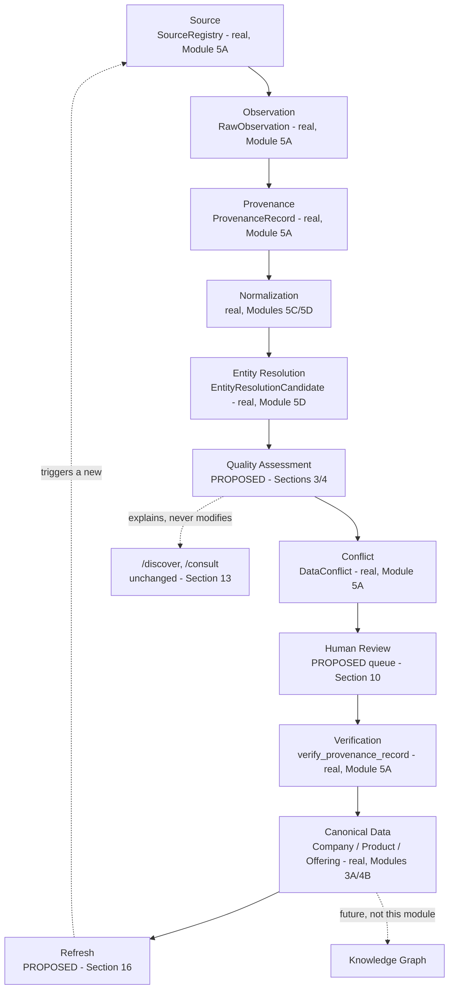

# ForgeX — Module 5E: Data Quality & Verification Operations Architecture

**Status:** Architecture only. Nothing in this document is implemented.
No code was written, no migration was created, no existing file was
modified, no file other than this one was created. Modules 5A
(`80f4335c`), 5B (`bb0d3771`), 5C (`82dca0f`/`8db7fc4`), and 5D
(`aaa4e5f`) are all frozen and unmodified — every claim below about
their current behavior was checked directly against the real code at
the time of writing, not carried forward from a prior document's
summary.

---

## Table of Contents

1. [Inspect Current System](#1-inspect-current-system)
2. [Core Trust Model](#2-core-trust-model)
3. [Field-Level Data Quality](#3-field-level-data-quality)
4. [Data Quality Dimensions](#4-data-quality-dimensions)
5. [Freshness](#5-freshness)
6. [Source Reliability](#6-source-reliability)
7. [Conflict Management](#7-conflict-management)
8. [Verification States](#8-verification-states)
9. [Document Evidence](#9-document-evidence)
10. [Human Review Operations](#10-human-review-operations)
11. [Risk-Based Verification](#11-risk-based-verification)
12. [Industrial Product Data](#12-industrial-product-data)
13. [Data Quality for Company Search](#13-data-quality-for-company-search)
14. [Data Display Rules](#14-data-display-rules)
15. [Data Quality Score](#15-data-quality-score)
16. [Refresh & Revalidation](#16-refresh--revalidation)
17. [Verification Priority](#17-verification-priority)
18. [Auditability](#18-auditability)
19. [Security / Abuse](#19-security--abuse)
20. [India-First Operations](#20-india-first-operations)
21. [Knowledge Graph Compatibility](#21-knowledge-graph-compatibility)
22. [Data Quality Pipeline](#22-data-quality-pipeline)
23. [Implementation Plan (Not Built Yet)](#23-implementation-plan-not-built-yet)
24. [What We Should Not Build Yet](#24-what-we-should-not-build-yet)
25. [Risks](#25-risks)
26. [Final Architecture Diagram](#26-final-architecture-diagram)
27. [Self-Review](#27-self-review)

---

## 1. Inspect Current System

Every claim below was checked directly against the real, frozen
codebase — not assumed.

### The most important finding in this entire document

**`Company.verification_status` (Module 3A's field) is already, today,
set automatically — not by independent verification, but by
self-reported profile *completeness*.** Confirmed directly in
`app/services/verification_score_service.py`'s
`sync_legacy_verification_status`:

```
target = VERIFIED if score.level >= BUSINESS_VERIFIED else UNVERIFIED
```

`score.level` is `VerificationScoreService`'s own live-computed
5-level score (`unverified` → `email_verified` → `business_verified` →
`factory_verified` → `premium_verified`), itself derived from whether
a company has filled in business info, uploaded documents, added
branding, and added social links — **completeness of self-reported
profile fields, not corroboration by any external source.** The
function's own docstring calls this a "best-effort compatibility
shim." This means: **a Company can show `verification_status:
"verified"` today having never been independently checked by anyone
or anything outside the company's own account.** This is not a defect
in Module 3B — it was built and documented as exactly this, on
purpose, as a placeholder (`docs/adr/0029`) — but it is precisely the
category of risk (Section 25's "false verification," Section 14's
"do not display 'Verified Manufacturer' unless the underlying
verification actually supports that claim") this module exists to
prevent from recurring at the field level, and it must be named
explicitly rather than left as an implicit trap for Module 5E's design
to accidentally reproduce.

`OfferingVerificationStatus` (Module 4B) already, independently,
documents this exact same caution in its own source: *"NOT the same
thing as Company's real, live-computed Module 3B verification
score... a simple, honest status flag with no scoring logic behind
it."* Module 5E is not the first place in this codebase to have
noticed this distinction matters — it is the first place asked to
build a systematic answer to it.

### Company (Module 3A/3B)
Real fields confirmed: `name`, `legal_name`, `slug`, `industry` (free
text), `website`, `country`, `state`, `city`, `status`,
`verification_status` (the field described above), plus Module 3B's
`cin`, `gst_number`, `pan`, `msme_number`, `iec_number`,
`legal_entity_type`, `business_type`, `export_capable`,
`business_registration_date`, branding fields, capability/category
array fields.

### Company Verification (Module 3B)
`VerificationScoreService` computes a real, live 0–100% completeness
score across weighted requirements, mapped to the 5 levels above. This
is the **only** verification-adjacent system that exists today besides
Module 5A's provenance-level `verified` status — and, per the finding
above, it measures self-reported completeness, not external
corroboration. `VerificationDocument` (also Module 3B) has real
`verified_by`/`verified_at` columns — confirmed, again, that **nothing
in the codebase ever sets them**; no admin document-review workflow
exists (a real, still-open gap, first flagged in `docs/adr/0029`, still
unresolved as of this document).

### Product / Offering (Phase 4B)
`Product.status`: `draft`/`published`/`archived` — a publication
lifecycle, not a quality/verification signal at all.
`OfferingVerificationStatus`: `unverified`/`verified` — confirmed as a
placeholder flag with, per its own source comment, no scoring logic
behind it; nothing sets it to `verified` today.
`ProductSpecification`/`ProductAttribute` (the EAV structure) have
**no quality, confidence, or verification field of any kind** —
confirmed directly; a specification value is either present or absent,
with no notion of how well-evidenced it is.

### Source Registry, RawObservation, ProvenanceRecord, DataConflict (Module 5A — frozen)
`SourceRegistry.reliability_weight` (0.0–1.0, per-instance) and
`source_class` (6 classes) already exist. `RawObservation` is
append-only, source-scoped, no entity link. **`ProvenanceRecord.status`
already implements exactly the OBSERVED/EXTRACTED/VERIFIED/CLAIMED
four-way distinction this module's Section 2 is asked to preserve** —
confirmed as real, enforced code (`verify_provenance_record` is the
only function able to set `VERIFIED`, always requiring a real
`verified_by`). `ProvenanceRecord.confidence` (0.0–1.0) exists as a
per-record float, set once at creation, never recomputed. `DataConflict`
(detection/flagging only, `open`/`resolved`) exists and is real,
proven working end-to-end in Module 5D.

### AcquisitionJob, EntityResolutionCandidate, Company promotion (Module 5B/5C/5D)
All confirmed real and frozen. `EntityResolutionCandidate.resolution_state`
(`new`/`auto_match`/`review_required`/`no_match`) and `.decision`
(`confirm_match`/`reject_match`/`create_new`) are a **separate**
state machine from `ProvenanceRecord.status` — the former is about
*which company* an observation refers to; the latter is about *how
trustworthy one field's value* is. `company_promotion_service` never
touches `Company.verification_status` — confirmed directly; a promoted
company is exactly as "verified" as any other, i.e. subject to the
same completeness-based auto-sync described above, nothing more.

### Existing RBAC and audit mechanisms
`Role` (platform-wide: viewer/analyst/admin, confirmed via Module 2)
and `CompanyRole` (owner/admin/editor/viewer, per-company) both exist
and are real. `require_role`/`require_company_role` dependencies exist
and are used throughout Modules 5B–5D for admin-gated acquisition/
review routes. `AuditLog` (Module 2) exists: `user_id`, `event` (free
string), `ip_address`, `user_agent`, `event_metadata` (JSONB) — a real,
generic event log, currently used for auth events; **not yet wired to
any Module 5A–5D action** (provenance verification, conflict
resolution, entity-resolution decisions) — confirmed directly, a real
gap this module's Section 18 must design against.

### Summary: what exists vs. what Module 5E would add

| Concept this module needs | Exists today? |
|---|---|
| Field-level observed/extracted/verified/claimed distinction | **Yes** — `ProvenanceRecord.status` (Module 5A), real and enforced |
| Per-record confidence | **Yes**, but static (set once, never recomputed) — `ProvenanceRecord.confidence` |
| Source reliability tiering | **Yes** — `SourceRegistry.reliability_weight`/`source_class` |
| Conflict detection | **Yes** — `DataConflict` (Module 5A), proven working |
| A composite, cross-field "how good is this company's data" view | **No** |
| Freshness/staleness tracking beyond raw timestamps | **No** — timestamps exist (`last_observed_at`, `collected_at`) but no policy layer interprets them |
| A review queue beyond entity-resolution candidates | **No** — Module 5D's queue is specifically "which company," not "is this field's value trustworthy" |
| Risk classification of fields | **No** |
| Quality/verification signals on Product/ProductSpecification/Offering | **No** — confirmed, zero such fields exist |
| Audit trail for verification/quality decisions specifically | **Partially** — `AuditLog` exists generically, unused for this purpose so far |
| Any connection between data quality and search/ranking | **No** — `/discover`/`/consult` are untouched, deterministic substring search (confirmed unchanged since the original Phase 5 architecture document) |

---

## 2. Core Trust Model

The four states, exactly as Module 5A already implements them for
`ProvenanceRecord.status`, restated here as this module's own
foundational vocabulary rather than a competing definition:

| State | Meaning | Example (this module's own) |
|---|---|---|
| **OBSERVED** | A source said X. Proves only that the source said it — nothing about whether X is true. | The official company website states "Manufacturer of hydraulic cylinders." |
| **EXTRACTED** | A parser or AI system produced a structured value from what was observed, with some confidence. Can be wrong even when observation was accurate. | ForgeX's extraction pipeline structures that sentence into `capability = "hydraulic cylinder manufacturing"`. |
| **VERIFIED** | An independent process — a human reviewer or a defined, documented automated rule — confirmed the value is actually correct. | An authorized reviewer, per Section 10's workflow, confirms the capability against supporting evidence and marks it verified. |
| **CLAIMED** | The company itself asserts this is true about them. Self-interested by nature; a real, useful signal, but not independent evidence. | The company's own account holder edits their profile to state the same capability. |

**A company claiming something does not automatically make it
independently verified** — restated as a hard rule, and directly
relevant given Section 1's finding: this is exactly the distinction
`Company.verification_status`'s current auto-sync behavior does *not*
make (it treats "profile is complete" as license to display
"verified"). Module 5E's field-level model must never repeat that
conflation — a `CLAIMED` value stays `CLAIMED` until a real,
attributable `VERIFIED` transition happens, exactly as
`provenance_service.verify_provenance_record` already enforces for
OBSERVED/EXTRACTED today.

---

## 3. Field-Level Data Quality

**"Company ABC = 90% trustworthy" is explicitly rejected as a design**,
per this module's own instruction, because it would erase real,
already-representable distinctions:

| Field | Realistic evidence state | Why it differs from the others |
|---|---|---|
| Company name | High confidence | Usually corroborated across multiple sources (registry + website + self-report), low ambiguity |
| Registered address | High confidence | Often government-registry-sourced (Module 5C), a strong-tier signal per Phase 5's own entity-resolution priority (Module 5D) |
| Website | Medium confidence | Self-reported or lightly corroborated, but not independently confirmed as *the company's own* site by any current mechanism |
| Manufacturing capability | Observed but unverified | Exactly the OBSERVED/EXTRACTED tier — a real claim, no independent confirmation |
| ISO certification | Document uploaded, not independently verified | Section 9's central distinction: `VerificationDocument` existing ≠ the claim it supports being true |
| Revenue | Source-specific, potentially stale | Fast-changing (Section 5), and if sourced from a single filing, has no cross-source corroboration at all |

**How ForgeX represents this distinction:** each of the fields above
already has (or, for Product/Offering, would have — Section 12) its
own `ProvenanceRecord` row, with its own independent `status` and
`confidence`. There is no proposal here to add a per-Company or
per-Product blended number. Any UI or API surface (Section 14) that
wants to describe "how good is this company's data" must do so by
*listing* the field-level states, not compressing them into one
figure — the same principle Phase 5's own general architecture
document (Section 10) already established, restated here as
specifically binding for Module 5E.

---

## 4. Data Quality Dimensions

Per-field dimensions, each independently meaningful — never
auto-combined into one opaque score without explicit justification
(Section 15 addresses the one narrow, clearly-scoped case where a
composite number is proposed at all):

| Dimension | What it measures | Existing data it would draw from |
|---|---|---|
| Completeness | Whether a field has any value at all | Direct column presence (Company/Product) — real today |
| Source reliability | The weight of the source(s) backing this value | `SourceRegistry.reliability_weight`/`source_class` — real today |
| Freshness | Time since last observation vs. expected change rate for that field type | `RawObservation.collected_at`, `ProvenanceRecord.last_observed_at` — real today; Section 5 proposes the *policy* layer, which doesn't exist yet |
| Provenance coverage | Whether the field has *any* traceable source at all, vs. being blank/unexplained | `ProvenanceRecord` existing for that (entity, field_name) — real today |
| Consistency | Whether multiple sources agree | `DataConflict` presence/absence — real today |
| Verification status | Where the field sits in Section 2's four-state model | `ProvenanceRecord.status` — real today |
| Claim status | Whether the company itself has claimed this field | `ProvenanceRecord.status == claimed` — the enum value exists (Module 5A), but nothing in this codebase creates a `CLAIMED` record yet (Phase 5's own general architecture document, Section 12, self-service claim flow, is not built) |
| Conflict status | Whether an open, unresolved conflict exists for this field | `DataConflict.status == open` — real today |
| Extraction confidence | The confidence recorded at extraction time | `ProvenanceRecord.confidence` — real today, but static (Section 5's freshness policy and this dimension both currently lack any *recomputation* mechanism — proposed, not built, in Section 16) |

None of these dimensions requires new storage to *represent* — Module
5A's existing schema already carries the raw material for all nine.
What's missing (per Section 1's summary table) is the *policy layer*
that interprets them consistently (freshness thresholds, risk
classification, review triggers) — that policy layer is what Sections
5–17 design.

---

## 5. Freshness

**No single universal threshold**, per this module's explicit
instruction. Proposed field-category cadences, extending (not
duplicating) Phase 5's own general architecture document's Section 13,
now made concrete per the fields this codebase actually has:

| Field category | Change rate | Example fields | Proposed stale threshold |
|---|---|---|---|
| Legal identity | Slow | `name`, `legal_name`, `cin`, `business_registration_date` | Months — a registry re-check cadence, not a UI concern |
| Registered address | Slow–medium | `country`, `state`, `city` | Weeks–months |
| Manufacturing capability | Medium | free-text capability/category fields | Weeks |
| Product availability | Medium–fast | `Offering.status`, `capacity` | Days–weeks |
| Pricing | Fast | (not currently a modeled field anywhere — flagged, not designed, matching Phase 5's own explicit "pricing is out of scope" stance) | N/A today |
| News/events | Very fast | (no modeled field today) | N/A today |
| Certifications | Expiration-sensitive, not calendar-sensitive | `VerificationDocument.expiry_date` — a real, already-existing column | The document's own `expiry_date`, not a generic staleness clock |

**Proposed fields, not built:**
- `observed_at` — already effectively `RawObservation.collected_at` /
  `ProvenanceRecord.last_observed_at`; no new field needed, just
  consistent *use* of what exists.
- `verified_at` — already exists on `ProvenanceRecord`.
- `expires_at` where applicable — already exists as
  `VerificationDocument.expiry_date` for documents; **would be a new,
  proposed field on `ProvenanceRecord` itself** for non-document
  claims with a natural expiry (e.g., a certification claim tied to a
  document's own expiry should inherit it, rather than needing a
  second, disconnected expiry value) — not built in this phase.
- **Stale threshold**: proposed as a per-field-category configuration
  value (a lookup table, not hardcoded per field), matching Phase 5
  Section 9's established "configuration, not code" extensibility
  principle.
- **Refresh priority**: derived from category (above) combined with
  Section 17's broader prioritization factors — not a separate,
  standalone concept.

---

## 6. Source Reliability

Five tiers, mapped onto — not replacing — Module 5A's real
`SourceRegistry.source_class` (6 classes, confirmed in Section 1):

| Proposed tier | Maps to existing `source_class` | Example |
|---|---|---|
| Tier 1 — Official/government/primary | `public_government` | MCA Company Master Data (Module 5C) |
| Tier 2 — Company-owned | `company_owned` | The company's own website |
| Tier 3 — Licensed/structured third-party | `third_party_structured` | A paid data vendor (not yet integrated, per Phase 5's own architecture document) |
| Tier 4 — Industry directory | `association_directory` | A trade association listing |
| Tier 5 — Secondary/unverified | `news_publication`, `user_contribution` | A news mention; an unauthenticated tip |

**Source reliability and claim verification remain separate**,
restated as a hard rule: a Tier 1 source's `reliability_weight` (e.g.
0.9) describes how much *general* trust ForgeX places in that source
*as a source* — it does not itself make any specific claim
`VERIFIED`. A Tier-1-sourced `ProvenanceRecord` still starts at
`OBSERVED`/`EXTRACTED`, exactly as Module 5A already enforces; only
`verify_provenance_record`'s own explicit action can change that,
regardless of which tier supplied the value. This is precisely the
distinction Section 1's central finding shows the existing
`Company.verification_status` field fails to make — Module 5E's
design must not reproduce that failure at the source-tier level
either.

---

## 7. Conflict Management

**Integrates with Module 5A's real, existing `DataConflict` mechanism
— proven working end-to-end in Module 5D — rather than proposing a
second one.**

The brief's own example, made concrete against real fields:

```
Source A (MCA registry):        registered address = X
Source B (company website):     address = Y
Company submission (future):    address = Z
```

- **Conflict detection**: already real (Module 5A's
  `_detect_and_flag_conflict`, confirmed working via Module 5D's
  `CONFIRM_MATCH` flow) — fires automatically whenever two
  `ProvenanceRecord`s for the same (entity, field_name) disagree.
- **Conflict visibility**: `GET /provenance/conflicts` already exists
  and is real (Module 5A's API). Proposed, not built: a richer,
  side-by-side "source comparison" view (which source said what, with
  what reliability tier and timestamp) — the *data* for this already
  exists (every conflicting `ProvenanceRecord` carries its own
  `raw_observation_id`, `extraction_method`, `confidence`); this is a
  presentation/aggregation layer, not new storage.
- **Source comparison**: proposed as a read-only aggregation over
  existing `ProvenanceRecord`/`RawObservation`/`SourceRegistry` rows
  for a conflicted field — no new table.
- **Reviewer queue**: Module 5A's `DataConflict.status == open` already
  *is* a queryable queue; Section 10 proposes broadening the review
  queue concept to also surface conflicts by risk (Section 11), not
  building a second, separate conflict-specific queue.
- **Resolution**: Module 5A's `resolve_conflict` already exists and is
  real — deliberately does not mutate any `ProvenanceRecord`'s value
  (confirmed unchanged in Module 5D), matching "never silently
  overwrite conflicting information."
- **Audit trail**: `DataConflict.resolved_by`/`resolved_at`/
  `resolution_note` already exist and are real, populated fields.

**Never silently overwrite conflicting information** — restated,
matching what the existing, frozen implementation already guarantees;
this module's job is to make conflicts more *visible* and better
*prioritized* (Sections 10, 17), not to change how they're detected or
resolved.

---

## 8. Verification States

**Module 5E must not create a second, competing verification system —
restated as the single most important design constraint in this
section, directly motivated by Section 1's central finding.**

Proposed reconciliation, not replacement:

| Layer | Scope | Status |
|---|---|---|
| `Company.verification_status` (Module 3A) | Coarse, company-wide, auto-synced from profile *completeness* | **Existing, unchanged.** Kept exactly as-is — a legitimate, honestly-labeled "has this company filled out their profile" signal, as long as it is never *displayed* as more than that (Section 14). |
| `VerificationScoreService`'s 5-level score (Module 3B) | Company-wide completeness detail | **Existing, unchanged.** The detailed view behind the coarse flag above. |
| `OfferingVerificationStatus` (Module 4B) | Offering-level placeholder | **Existing, unchanged** — already a real, honest placeholder per its own docstring. |
| `ProvenanceRecord.status` (Module 5A) | **Field-level**, per (entity, field_name) | **Existing, unchanged** — already implements OBSERVED/EXTRACTED/VERIFIED/CLAIMED exactly. **This is the layer Module 5E's proposed new states extend, not replace.** |

Proposed **new** states, layered onto `ProvenanceRecord.status`
specifically (a proposed schema extension for a future implementation
phase, not built here):

| Proposed new state | Where it fits | Why it's needed |
|---|---|---|
| `UNDER_REVIEW` | Between `OBSERVED`/`EXTRACTED`/`CLAIMED` and `VERIFIED` | Today, a record sits at `OBSERVED`/`EXTRACTED` right up until `verify_provenance_record` fires — there's no way to represent "a reviewer has picked this up but hasn't decided yet," which Section 10's review-queue operations need to distinguish "unassigned" from "in progress" |
| `REJECTED` | A terminal state, reachable from `UNDER_REVIEW` | Today there is no way to record "a reviewer looked at this and determined it's false" — an absent state is not the same claim as an explicitly rejected one, and losing that distinction loses real information |
| `EXPIRED` | Reachable from `VERIFIED`, time- or event-triggered | A previously-verified claim (e.g., a certification) can become stale without anyone having *disproven* it — `EXPIRED` is a distinct, honest state from both `VERIFIED` and `REJECTED` |

`UNVERIFIED` (the brief's own suggested state) is **not** proposed as
a new `ProvenanceRecord.status` value — `OBSERVED`/`EXTRACTED` already
jointly cover exactly that meaning ("we have a value, nothing has
confirmed it"), and adding a fifth, overlapping value would blur
rather than sharpen the model. `CLAIMED` (already a real enum value,
confirmed unused by any current code path) is exactly the state a
future company self-service claim flow (Phase 5's general architecture
document, Section 12, still not built) would populate.

---

## 9. Document Evidence

**"Document uploaded" does NOT mean "claim verified"** — restated as
the section's governing rule, and already, honestly, true of the
existing system (Section 1: `VerificationDocument.verified_by`/
`verified_at` exist but nothing sets them).

Proposed pipeline:

```
Certification document uploaded (VerificationDocument, Module 3B, real today)
        ↓
Evidence — the document itself, linked to a specific claim
        ↓
Review — a human reviewer inspects the document against the claim it's meant to support
        ↓
Verification decision — provenance_service.verify_provenance_record (Module 5A, real today) on the specific ProvenanceRecord this evidence supports
```

**Proposed, not built:** a link between a `VerificationDocument` row
and the specific `ProvenanceRecord`(s) it's meant to substantiate — no
such link exists today (confirmed: `VerificationDocument` has no
`provenance_record_id` or equivalent). Without this link, a reviewer
verifying a claim has no structured way to say *which* uploaded
document was the evidence — this is a genuine, currently-open gap this
module's future implementation phase would need to close, most
naturally as a new join table or a nullable FK, not a change to either
Module 3B's or Module 5A's existing tables (Section 23's sequencing
addresses this as a distinct, careful step, not an assumed given).

Documents alone are never automatically interpreted as proof — a
document existing only ever creates *evidence available for review*
(Section 10), never a verification outcome by itself.

---

## 10. Human Review Operations

Extends Module 5D's review-queue pattern (candidate generation → human
decision, never automatic) to data-quality/verification decisions
specifically — a **conceptually related but distinct** queue, since
Module 5D's queue answers "which company," while this one answers "is
this specific field's value trustworthy."

**Proposed queue reasons:**

- Conflicting sources (`DataConflict.status == open`, real today)
- Uncertain entity match (Module 5D's own `REVIEW_REQUIRED` — already
  real; cross-referenced, not duplicated, here)
- Important unverified claim (a high-risk field, Section 11, still at
  `OBSERVED`/`EXTRACTED`/`CLAIMED`)
- Expired evidence (`VerificationDocument.expiry_date` passed, or a
  proposed `ProvenanceRecord.expires_at`, Section 5, passed)
- Suspicious submission (Section 19)
- Low-quality source (a low `reliability_weight` source backing an
  important claim)
- High-risk industrial specification (Section 11/12)
- Certification verification (Section 9's evidence pipeline)
- Company claim requiring review (once the future self-service claim
  flow exists)

**Proposed reviewer actions**, extending Module 5D's
Approve/Reject/Merge/Split action set (Phase 5's general architecture
document, Section 16) to this queue's specific object (a
`ProvenanceRecord`, or a `DataConflict`, rather than an
`EntityResolutionCandidate`):

| Action | Effect |
|---|---|
| APPROVE | Transitions to `VERIFIED` (via the existing, unmodified `verify_provenance_record`) |
| REJECT | Transitions to the proposed `REJECTED` state (Section 8) |
| REQUEST EVIDENCE | Returns the item to a pending state, optionally with a note requesting specific documentation — mirrors Phase 5's general architecture document's own Section 16 |
| MERGE | For a conflict specifically: not a `ProvenanceRecord` merge (values are never combined) — refers to `DataConflict.resolve_conflict`'s existing resolution act |
| SPLIT | The counterpart to Module 5D's own entity-resolution merge/split concept — not newly invented here, cross-referenced |
| MARK STALE | A new, proposed action transitioning a `VERIFIED` record toward `EXPIRED` ahead of its natural threshold, for a reviewer who has reason to doubt current accuracy without evidence of it being actively false |
| ESCALATE | Routes to a more senior/specialized reviewer — mirrors Phase 5's general architecture document's Section 16 exactly |

Every decision must be auditable — Section 18 defines exactly how,
extending the existing, real `AuditLog` mechanism rather than
proposing a new one.

---

## 11. Risk-Based Verification

Not every field warrants the same effort, per this module's own
instruction. Proposed categories, mapped to real, existing fields:

| Risk category | Example fields (real, existing) | Why |
|---|---|---|
| LOW | `Company.name` display formatting, `industry` free text | Wrong is embarrassing, not harmful — low real-world consequence |
| MEDIUM | Manufacturing capability free-text fields, `website` | Meaningfully misleading if wrong, but not physically dangerous |
| HIGH | Certifications (`VerificationDocument.document_type`), any future safety-relevant `ProductSpecification` value (e.g. a pressure rating), compliance-adjacent claims (`export_capable`, `msme_number`) | A wrong safety-relevant specification (Phase 5's general architecture document, Section 27, already flagged this) has real, physical-world consequence for a buyer relying on it; a false certification claim has real legal/reputational consequence for ForgeX |

**Why high-risk claims require stronger evidence:** the cost of being
wrong scales with real-world consequence, not with how easy the claim
is to check. A buyer sourcing a component based on a fabricated
pressure rating faces physical risk; a buyer reading a slightly
outdated city name does not. Verification effort (mandatory human
review, multiple corroborating sources, document evidence — Section 9)
should scale accordingly, matching Phase 5's general architecture
document's own Section 2 "human review for high-risk claims"
principle, now made field-specific rather than category-general.

---

## 12. Industrial Product Data

The same quality architecture, applied to Product/ProductSpecification/
Offering — **with Product/Offering's separation preserved exactly**,
per this module's explicit instruction and Phase 4A's own foundational
design (unmodified since).

| Concept | Belongs to | Quality treatment |
|---|---|---|
| `Product.name`, `Product.status` | Product (canonical) | Same field-level provenance model as Company fields — a `ProvenanceRecord` with `entity_type=product` already works today (proven in Module 5C's own cross-cutting test) |
| `ProductSpecification` values (e.g. "Maximum pressure: 250 bar") | Product (canonical) — a spec is a property of the *product*, not of any one company's offering of it | **High-risk by default** for any specification with real-world safety/compliance implications (Section 11) — proposed: category-level risk tagging on `ProductSpecification` itself (a new, proposed field — not built), so every value entered against that specification inherits the category's risk tier automatically, rather than each value needing individual risk classification |
| MOQ, lead time, capacity, price, availability | **Offering** (company-specific) — never Product | These are never quality-scored the same way as a Product specification, because they are not claims about physical reality the way a pressure rating is — they're business terms specific to one company's offer. Quality treatment here is closer to freshness (Section 5: "Product availability → medium/fast") than to verification. |

**When human review is required for critical industrial specifications:**
any `ProductSpecification` tagged high-risk (proposed field, Section
11) reaching `VERIFIED` status must go through Section 10's mandatory
human review — never auto-verified regardless of source reliability
tier, mirroring Phase 5's general architecture document's own Section
8 "never allow unsafe automatic merging" principle, applied here to
verification rather than entity resolution, but with the identical
underlying reasoning: the consequence of being wrong is a real-world,
physical failure, not just a data error.

---

## 13. Data Quality for Company Search

**Explanation only — `/discover` and `/consult` are not modified in
this phase or by this document,** confirmed unchanged (Section 1).

How quality metadata would **eventually** matter: a company with
strong identity evidence (Tier 1/2 sources, no open conflicts,
verified capabilities) should eventually be distinguishable from one
built entirely from a single, low-tier, unverified source — a real,
legitimate signal for search relevance and for how a result is
*labeled* (Section 14), not for whether it appears at all.

**Explicitly not designed as a black-box ranking system**, per this
module's own instruction: any future ranking influence must be
traceable to specific, named signals (the same dimensions from Section
4 — completeness, source reliability, verification status, conflict
status), never an opaque learned score. A future implementation would
need its own dedicated design pass (Section 23's sequencing places this
last, appropriately, since it depends on everything else in this
document existing first) — not designed further here.

---

## 14. Data Display Rules

Proposed user-facing labels, each tied to a specific, checkable
underlying condition — **never a label the data doesn't actually
support**, directly enforcing Section 1's central finding from
recurring in the UI layer:

| Label | Underlying condition (proposed) |
|---|---|
| Verified | The specific field/claim has a real `ProvenanceRecord.status == VERIFIED`, with a real `verified_by` — never shown company-wide based on `Company.verification_status` alone |
| Source-backed | At least one `ProvenanceRecord` exists for this field, regardless of status — distinct from "verified" |
| Company claimed | The field's most recent `ProvenanceRecord.status == CLAIMED` |
| Recently observed | Within the field category's freshness threshold (Section 5) |
| Needs verification | `OBSERVED`/`EXTRACTED`/`CLAIMED`, no open conflict, but the field is high-risk (Section 11) |
| Conflicting information | `DataConflict.status == open` exists for this field |
| Stale information | Past the field category's freshness threshold, no recent re-observation |

**"Do NOT display 'Verified Manufacturer' unless the underlying
verification actually supports that claim"** — restated as the
concrete instance of this rule most directly implicated by Section 1's
finding: today, nothing in this codebase computes "verified
manufacturer" as a claim at all, but if it were built naively on top
of `Company.verification_status`, it would be **factually
unsupported** — that field means "profile complete," not "we confirmed
this company manufactures anything." Any future "Verified
Manufacturer"-style label must be built on a real,
field-level-VERIFIED manufacturing-capability `ProvenanceRecord`,
never on the coarse company-wide flag.

---

## 15. Data Quality Score

**If** a composite score is ever built (not proposed as required by
this document), it must mean something narrow and stated exactly, per
this module's own instruction:

> "X% of this company's relevant fields have recent, traceable
> evidence" — **never** "X% true."

**Exact inputs, if built:** the count of a defined set of "relevant
fields" (proposed: the same fields `VerificationScoreService` already
weights, Section 1, extended to include field-level provenance
coverage) that currently have (a) at least one `ProvenanceRecord`
(provenance coverage), (b) no open conflict, and (c) freshness within
threshold — divided by the total relevant-field count.

**Weighting:** proposed as equal-weighted per field by default, with
high-risk fields (Section 11) counting double — a documented,
inspectable rule, not a tuned/learned weighting.

**Limitations, stated explicitly:** measures *process* (is there
evidence, is it fresh, is it uncontested) — never measures whether the
underlying real-world fact is actually true, which ForgeX cannot know
with certainty for anything it didn't physically verify itself. A
company could score highly with entirely self-claimed, unverified
data, as long as it's fresh and uncontested — the score does not
distinguish `CLAIMED` from `VERIFIED` unless explicitly designed to
weight them differently (proposed: `VERIFIED` fields count fully,
`CLAIMED`/`OBSERVED`/`EXTRACTED` count partially, `REJECTED`/no-evidence
count zero — a specific, stateable rule, not left ambiguous).

**Interpretation guidance for any future UI:** always paired with the
field-level breakdown (Section 3/14) it's summarizing — never shown as
a bare, unexplained number, matching Phase 5's general architecture
document's own Section 10 caution, restated here as binding
specifically for this score if it is ever built.

---

## 16. Refresh & Revalidation

```
Source observation
      ↓
Fresh (within Section 5's category threshold)
      ↓
Approaching stale (a proposed warning zone, e.g. 80% of threshold elapsed)
      ↓
Stale (threshold passed)
      ↓
Refresh requested (a proposed new AcquisitionJob, reusing Module 5B's
                    existing job model completely unchanged — no new
                    job type needed, just a new trigger reason)
      ↓
New observation (a new RawObservation, Module 5A, unchanged)
      ↓
Compare (against the existing ProvenanceRecord's value)
      ↓
Conflict (if disagreeing — Module 5A's existing mechanism, unchanged)
  / update (if agreeing — last_observed_at refreshed, Module 5A's
            existing column, unchanged — value itself is a new
            ProvenanceRecord, per Module 5A's append-only-style design,
            not an overwrite)
  / confirmation (agreeing AND already verified — the verification
                  itself could reasonably extend its own freshness
                  window without a full re-review, a proposed
                  optimization, not built)
```

**Different refresh priorities**, extending Section 5's categories
with explicit priority ordering:

| Category | Proposed priority | Why |
|---|---|---|
| Company identity | High priority, low frequency | Rarely changes, but when it does (a merger, a name change) the consequence of missing it is severe (Phase 5's general architecture document, Section 6, already covers this case) |
| Company capabilities | Medium | Genuinely useful to keep current, moderate consequence of staleness |
| Certifications | High priority, expiry-triggered (not calendar-triggered) | A lapsed certification silently treated as current is actively misleading (Section 5) |
| Products | Medium | Catalogue changes happen, but rarely urgently |
| Offerings | Medium-high | MOQ/lead-time/capacity are the fields buyers act on most directly |
| Pricing | N/A today | Not a modeled field (Section 5) |
| Documents | Expiry-triggered | Mirrors certifications |

---

## 17. Verification Priority

**Deterministic, explainable rules — not an ML model**, per this
module's explicit instruction.

Proposed factors, each independently inspectable (never blended into
one opaque priority number without the individual factors remaining
visible):

- **Risk** (Section 11) — high-risk fields queue ahead of low-risk ones
- **Business importance** — proposed proxy: whether the field is one
  of the "relevant fields" Section 15's score already tracks
- **User demand** — proposed proxy: how often the owning Company/
  Product appears in `/discover` or `/consult` results (read-only
  signal into this queue; explicitly does not modify those systems,
  per Section 13)
- **Conflict severity** — an open conflict on a high-risk field
  outranks one on a low-risk field
- **Source quality** — a claim backed only by a Tier 5 source queues
  ahead of one already partially corroborated by Tier 1/2
- **Staleness** — how far past its freshness threshold (Section 5) a
  field is
- **Number of dependent search results** — same proxy as "user demand"
  above, stated as its own factor since it specifically reflects
  *how many* results would be affected, not just whether the record
  itself is popular

**Combination rule, proposed:** a fixed priority tier system (e.g.
P0/P1/P2/P3), where risk and conflict-on-high-risk-field are the only
factors that can place an item in P0, and the remaining factors break
ties within a tier — deterministic, inspectable, and consistent with
Phase 5's general architecture document's own repeated rejection of
blended numeric scoring wherever a simpler, ruled system suffices.

---

## 18. Auditability

Every quality/verification decision must answer WHO/WHAT/WHEN/WHY/
WHICH EVIDENCE — extending the existing, real `AuditLog` (Module 2,
Section 1) rather than proposing a new mechanism.

**Proposed event types** (new `AuditLog.event` string values — no
schema change, since `event` is already free text and `event_metadata`
is already a flexible JSONB column):

- `provenance_verified` / `provenance_rejected` — WHO: `verified_by`
  (already real); WHAT: the field; WHEN: `verified_at` (already real);
  WHY: a proposed new `review_note` field on `ProvenanceRecord`
  (not built); EVIDENCE: linked `VerificationDocument` (Section 9's
  proposed link) and/or the `raw_observation_id` already present
- `conflict_resolved` — already has WHO/WHEN/WHY via
  `DataConflict.resolved_by`/`resolved_at`/`resolution_note` (real
  today); this event type would just mirror that existing data into
  the audit log for a unified activity view
- `entity_resolution_decided` — mirrors Module 5D's existing
  `EntityResolutionCandidate.decided_by`/`decided_at` (real today)

The worked example from the brief maps directly onto real, existing
columns:

| Brief's example | Real column it already maps to |
|---|---|
| Reviewer: Admin X | `ProvenanceRecord.verified_by` (real) |
| Decision: Verified manufacturing capability | The transition itself, via `verify_provenance_record` (real) |
| Evidence: Official company document + company website | Section 9's proposed document link + the record's own `raw_observation_id` (real) |
| Timestamp | `ProvenanceRecord.verified_at` (real) |
| Previous state: Observed | Derivable from the `ProvenanceRecord`'s own history — proposed: the audit log entry itself is what preserves "previous state," since `ProvenanceRecord` doesn't retain its own history after a status transition (a real, current limitation worth naming, not hidden) |

---

## 19. Security / Abuse

Controls identified, **not built**, per this section's own instruction:

| Threat | Consideration |
|---|---|
| Malicious company submissions | A future self-service claim flow (Phase 5's general architecture document, Section 12, not built) would need the same review-queue gating as any other source — `CLAIMED` status alone, per Section 2, is never sufficient for display as verified |
| Forged documents | Section 9's evidence-review step is the control point; document authenticity is a reviewer judgment call this architecture supports but cannot automate |
| Fake certifications | Same as above — high-risk (Section 11), mandatory human review |
| Manipulated source data | Source reliability tiering (Section 6) plus conflict detection (Section 7) are the structural defenses; neither prevents a single compromised Tier-1-labeled source from misleading the system, which is why verification remains a distinct act from source trust |
| Reviewer abuse | Requires reviewer-action auditability (Section 18) and, at minimum, RBAC scoping (already real, Section 1) — a future need for reviewer-specific rate limits or dual-review-for-high-risk is flagged, not designed |
| Unauthorized verification | Already structurally prevented today — `verify_provenance_record` requires `Role.ADMIN`-gated access at the API layer, matching Module 5B/5C/5D's own established pattern |
| Account takeover | Out of this module's scope — Module 2's existing auth/session hardening is the relevant control surface, unmodified |
| Spam submissions | Rate limiting (already real, Module 2/dev-workflow ADRs) plus the same review-queue gating as malicious submissions |

---

## 20. India-First Operations

Extends Phase 5's general architecture document's own Section 17
(India-first MVP) and Module 5C's real, implemented pilot scope —
**not a new geographic strategy, an operational plan for the same
scope.**

- **Likely company volume**: matches Module 5C's own approved pilot
  ceiling (25–50 companies, enforced in that module's real, frozen
  code) — this module's review operations should be sized for that
  same small number first, not designed against a larger hypothetical.
- **Review capacity**: at pilot scale, a single reviewer (or a small
  team) manually working the queue is realistic — no throughput
  optimization is proposed at this phase.
- **High-priority industries**: matches Phase 5's general architecture
  document's own Section 17 industrial-machinery scope (motors, pumps,
  packaging machines, CNC machines, valves, bearings — the same seed
  categories Module 4B's own seed data already used).
- **High-risk claims for this specific pilot scope**: certifications
  and any manufacturing-capability claim tied to a safety-relevant
  product category, per Section 11.
- **Initial verification targets**: the fields Module 5C's real field
  mapping actually populates (`name`, `cin`, `state`,
  `business_registration_date`, `industry`) — legal-identity fields
  are the natural first verification target, both because they're
  lower-risk to review (Section 11) and because Module 5C's CIN-based
  entity resolution (Module 5D) already gives them the strongest
  existing corroboration path.

**Architecture remains globally extensible** — every mechanism in this
document (freshness categories, source tiers, risk categories, review
queue) is defined generically; India-first is a *scope* choice for
initial rollout, not a structural constraint baked into any of the
proposed mechanisms.

---

## 21. Knowledge Graph Compatibility

**Not implemented — this section only confirms Module 5E's design
doesn't foreclose it**, matching Phase 5's general architecture
document's own Section 24 treatment of the same question.

```
Company
  └── evidence (ProvenanceRecord, real today)
  └── verification (ProvenanceRecord.status, real today; proposed
                     UNDER_REVIEW/REJECTED/EXPIRED extensions)
  └── source (SourceRegistry, real today)
  └── freshness (proposed policy layer, Section 5, over real timestamps)

Product
  └── specification (ProductSpecification/ProductAttribute, real today)
  └── source (ProvenanceRecord linkage, real today — proven in Module 5C)
  └── verification (same ProvenanceRecord.status mechanism)

Offering
  └── company (real FK, Module 4B)
  └── product (real FK, Module 4B)
  └── source (would use the same ProvenanceRecord mechanism, not yet
              exercised for Offering fields specifically but
              architecturally identical)
  └── freshness (same proposed policy layer)
```

Every quality/verification/freshness concept in this document is
entity-agnostic in its *design* (it already works for both Company and
Product today, per Module 5A's `EntityType` enum) — a future Factory,
Technology, or Certification-as-entity (Phase 5's general architecture
document's own future Knowledge Graph sketch) would plug into the
identical `ProvenanceRecord`/`DataConflict`/review-queue mechanisms,
not a redesigned one.

---

## 22. Data Quality Pipeline

```
Source (SourceRegistry, real — Module 5A)
 ↓
Observation (RawObservation, real — Module 5A)
 ↓
Extraction (a future adapter's field mapping, real for Module 5C's
            specific fields — Module 5C)
 ↓
Normalization (app.entity_resolution.normalization, real — Module 5D;
               also app.collectors.normalization for source-field
               parsing, Module 5C)
 ↓
Entity Resolution (EntityResolutionCandidate, real — Module 5D)
 ↓
Quality Assessment (PROPOSED — Sections 3/4 of this document; reads
                     existing ProvenanceRecord/SourceRegistry/
                     DataConflict data, computes no new storage by
                     itself in the simplest form)
 ↓
Conflict Detection (DataConflict, real — Module 5A, already runs
                     earlier in practice, during ProvenanceRecord
                     creation — shown here in pipeline-narrative order
                     per the brief's own diagram, not as a claim that
                     it's a separate later stage in the real
                     implementation)
 ↓
Risk Classification (PROPOSED — Section 11; a field-category-level
                      tag, not computed per-record)
 ↓
Human Review (PROPOSED queue — Section 10; extends Module 5D's real
              review-queue pattern to ProvenanceRecord/DataConflict
              objects)
 ↓
Verification (verify_provenance_record, real — Module 5A)
 ↓
Canonical Data (Company/Product/Offering, real — Modules 3A/4B,
                 unchanged)
 ↓
Refresh (PROPOSED — Section 16; a new AcquisitionJob trigger reason,
         reusing Module 5B's real job model unchanged)
```

Each stage's status (real vs. proposed) is stated explicitly above,
not left implicit — matching this document's own Section 1 discipline
throughout.

---

## 23. Implementation Plan (Not Built Yet)

Proposed sequence for a **future, separately-approved** implementation
phase:

| Step | Scope |
|---|---|
| 5E.1 Quality metadata | The read-only aggregation layer (Section 4) over existing `ProvenanceRecord`/`SourceRegistry`/`DataConflict` data — no schema change, a pure service-layer addition, the safest and most immediately valuable first step |
| 5E.2 Freshness | The category-configuration table (Section 5) plus the proposed `expires_at` field — the first genuine schema addition |
| 5E.3 Conflict operations | The source-comparison view (Section 7) — read-only, built on 5E.1 |
| 5E.4 Review queue | Extending Module 5D's queue pattern to `ProvenanceRecord`/`DataConflict` objects (Section 10) — depends on 5E.1–5E.3 existing to have anything meaningful to queue |
| 5E.5 Evidence workflow | The `VerificationDocument`↔`ProvenanceRecord` link (Section 9) — a schema addition, sequenced after 5E.4 since it's meaningless without a review queue to consume it |
| 5E.6 Risk-based verification | The field/specification-category risk tagging (Sections 11/12) — sequenced after 5E.4/5E.5 since risk classification's whole purpose is to route items into that review workflow with appropriate urgency |
| 5E.7 Quality reporting | Section 15's score, if built at all — sequenced deliberately last among the "quality" steps, since it's a summary *of* everything above, not a prerequisite for any of it |
| 5E.8 Refresh/revalidation | Section 16 — depends on freshness (5E.2) and reuses Module 5B's job model; naturally last, since it's the pipeline's own feedback loop back to acquisition |

---

## 24. What We Should Not Build Yet

| Deferred item | Why |
|---|---|
| Knowledge Graph | Section 21 — this module must not foreclose it, but has zero real data yet to validate entity-type-specific design decisions against |
| AI Agents | Same reasoning as Phase 5's general architecture document's own Section 26 — agents need real, quality-assessed data to act on; this module is a prerequisite, not a companion |
| Autonomous verification | Directly contradicts Section 2's core rule — `VERIFIED` must always trace to a real, attributable human or an explicitly-documented deterministic rule, never an unsupervised process |
| Black-box quality scoring | Section 15 explicitly designs against this — any score built must remain inspectable |
| Global verification | Section 20 — India-first scope remains deliberate, matching Module 5C's own real, approved pilot boundary |
| Mass ingestion | Out of scope for the identical reason Module 5B/5C were kept small — quality/verification operations need to be proven correct at small scale before the volume they'd need to handle grows |
| Automated certification verification | Section 9's whole point — a document existing is never, by itself, proof |
| Automatic high-risk industrial specification verification | Section 12's explicit rule — always human-reviewed, regardless of source tier |
| Real-time universal crawling | Same reasoning as Phase 5's general architecture document's own Section 26 |
| Enterprise workflow/billing | Entirely outside this module's scope, as with every prior Module 5 phase |

---

## 25. Risks

| Risk | Level |
|---|---|
| False verification (a claim marked VERIFIED that isn't true) | **CRITICAL** — directly undermines the entire trust model; Section 1's own finding shows this risk is not hypothetical — it already exists in a related form (`Company.verification_status`) and must not be reproduced at the field level |
| Over-trust in quality scores (Section 15) | **CRITICAL** — a composite number, however carefully caveated, risks being read as "truth" by users who never see the caveat; this is why Section 15 insists any score always ships paired with its field-level breakdown |
| Forged evidence (Section 9/19) | **HIGH** — a reviewer without strong document-authenticity tools can be misled; no automated defense is proposed, only mandatory human review for high-risk claims |
| Stale data silently presented as current | **HIGH** — Section 5's whole purpose; mitigated by freshness policy, but only once actually built (not yet) |
| Conflicting sources left unresolved at scale | **MEDIUM** — Module 5A's mechanism is real and working, but review capacity (Section 20) is realistically small at pilot scale |
| Reviewer error | **MEDIUM** — mitigated by auditability (Section 18) and escalation (Section 10), not eliminated |
| Malicious submissions (Section 19) | **MEDIUM** — bounded by the same review-queue gating as any other source, once a self-service claim flow exists (not yet) |
| Source degradation (a previously-reliable source starts producing bad data) | **MEDIUM** — `SourceRegistry.reliability_weight` is set once, per Module 5A's current design; no proposed mechanism here re-evaluates it based on outcomes, a real, named gap |
| Incorrect industrial specifications reaching VERIFIED | **HIGH** — Section 11/12's entire justification; mitigated by mandatory human review for high-risk specifications, never automatic regardless of source |
| Legal/source restrictions | **MEDIUM** — inherited unchanged from Phase 5's general architecture document's own Section 21; this module doesn't introduce new sources, so doesn't introduce new legal exposure by itself |

---

## 26. Final Architecture Diagram



---

## 27. Self-Review

- Confirmed: no implementation code written — this document is the
  only file created this phase.
- Confirmed: no migrations.
- Confirmed: no existing modules modified — verified via direct
  inspection throughout Section 1, not assumed.
- Confirmed: Module 5A preserved — every real mechanism cited
  (`ProvenanceRecord`, `DataConflict`, `SourceRegistry`,
  `RawObservation`) is reused exactly as it exists.
- Confirmed: Module 5B preserved — `AcquisitionJob`'s model is reused
  unchanged for the proposed refresh trigger (Section 16).
- Confirmed: Module 5C preserved — its real field mapping and pilot
  scope are the concrete basis for Section 20's operational plan, not
  modified.
- Confirmed: Module 5D preserved — its real review-queue pattern is
  extended conceptually (Section 10), not altered.
- Confirmed: Observed/Extracted/Verified/Claimed remain distinct —
  Section 2 restates them exactly as Module 5A already enforces, and
  Section 1's central finding exists specifically to prevent this
  distinction from being blurred elsewhere in the system.
- Confirmed: Product and Offering remain separate — Section 12
  explicitly preserves Phase 4A's boundary (a specification is a
  Product fact; MOQ/price/lead-time are Offering facts) throughout.
- Confirmed: Existing Company Verification is respected — Section 8
  explicitly keeps `Company.verification_status`/
  `VerificationScoreService` unchanged, proposing extension at the
  `ProvenanceRecord` layer instead of replacement.
- Confirmed: High-risk claims receive stronger verification — Section
  11/12's central rule.
- Confirmed: Provenance remains mandatory — nothing in this document
  proposes a path to `VERIFIED` (or the proposed `UNDER_REVIEW`)
  without a real `ProvenanceRecord` already existing.
- Confirmed: Conflicts are never silently overwritten — Section 7
  explicitly confirms Module 5A's real, unmodified behavior already
  guarantees this.
- Confirmed: Human review remains available — Section 10, and
  explicitly the only path to `VERIFIED`/`REJECTED` throughout.
- Confirmed: India-first strategy exists — Section 20, scoped to
  Module 5C's own real pilot size.
- Confirmed: Future Knowledge Graph compatibility exists — Section 21.
- Confirmed: AI is not treated as unquestioned truth — no AI mechanism
  is proposed anywhere in this document at all; Section 24 explicitly
  defers AI agents, and Section 11/12's mandatory-human-review rule
  for high-risk claims would apply regardless of whether a future
  extraction step used AI.
- Confirmed: ForgeX branding used throughout — no prior naming appears
  anywhere in this document.

### 1. File created
`docs/product/phase-5e-data-quality-verification-architecture.md`
(this document) — the only file created this phase.

### 2. Files modified
None.

### 3. Current capabilities discovered
The single most important finding: `Company.verification_status` is
already auto-synced from self-reported profile *completeness*
(`sync_legacy_verification_status`), not independent verification —
confirmed directly in `app/services/verification_score_service.py`.
Module 5A's `ProvenanceRecord.status` already implements the full
OBSERVED/EXTRACTED/VERIFIED/CLAIMED model this module was asked to
preserve. `DataConflict` is real and proven working. Product/Offering/
ProductSpecification have zero quality or verification fields today.
`AuditLog` exists generically but is unused for any Module 5A–5D
action so far.

### 4. Architecture decisions
Extend `ProvenanceRecord.status` (three new proposed values:
`UNDER_REVIEW`, `REJECTED`, `EXPIRED`) rather than building a second,
competing verification system; keep `Company.verification_status` and
`VerificationScoreService` completely unchanged, explicitly
re-labeling what they actually mean rather than repurposing them; no
composite quality score is required, and if one is ever built it must
ship permanently paired with its field-level breakdown; risk
classification lives at the field/specification-category level, not
per-record; refresh reuses Module 5B's `AcquisitionJob` model
unchanged via a new trigger reason, not a new job type.

### 5. Verification model
Section 8 — `Company`/`Offering`'s existing coarse flags are preserved
and re-scoped honestly; `ProvenanceRecord.status` (real today, three
new proposed values) is the true, field-level mechanism this module
builds on.

### 6. Quality model
Section 3/4 — field-level, multi-dimensional, never collapsed into one
number without the individual dimensions remaining visible; the one
narrowly-scoped composite score proposal (Section 15) is explicit about
exactly what it would and wouldn't mean.

### 7. Review workflow
Section 10 — extends Module 5D's real, proven human-decision pattern
to `ProvenanceRecord`/`DataConflict` objects; APPROVE/REJECT/REQUEST
EVIDENCE/MERGE/SPLIT/MARK STALE/ESCALATE, every action auditable via
the existing `AuditLog`.

### 8. Conflict workflow
Section 7 — Module 5A's real, unmodified `DataConflict` mechanism,
with a proposed read-only source-comparison presentation layer on top;
resolution never overwrites a value.

### 9. Refresh strategy
Section 16 — category-specific priorities (Section 5), reusing Module
5B's real `AcquisitionJob` model via a new trigger reason.

### 10. Risks
Full ranked list in Section 25 — two CRITICAL risks (false
verification, over-trust in quality scores), both directly motivated
by this document's own Section 1 finding and both with concrete,
already-designed mitigations (never auto-verify; never ship a bare
score).

### 11. Deferred features
Full list in Section 24, each with an explicit reason — Knowledge
Graph, AI agents, autonomous verification, black-box scoring, global
verification, mass ingestion, automated certification/specification
verification, real-time crawling, enterprise features.

### 12. Proposed implementation sequence
Section 23's 5E.1–5E.8, sequenced deliberately: read-only quality
aggregation first (lowest risk, no schema change), freshness and
conflict presentation next, review queue and evidence workflow after
(since they need something real to queue), risk-based verification
once the queue exists to route into, quality reporting last (a summary
of everything above, not a prerequisite for it), refresh last of all
(the pipeline's own feedback loop).

**Stop. Awaiting explicit approval before implementing Module 5E.**
