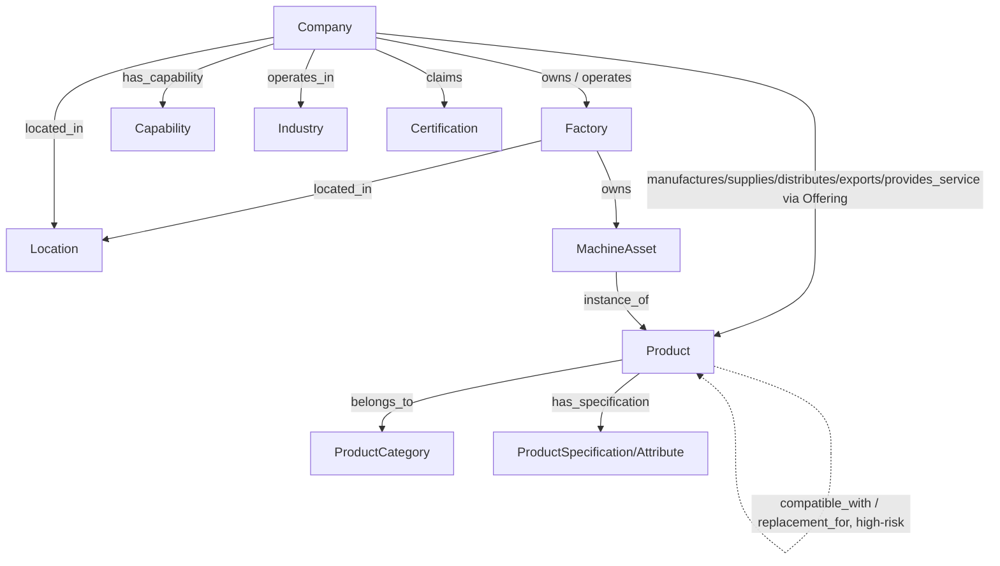
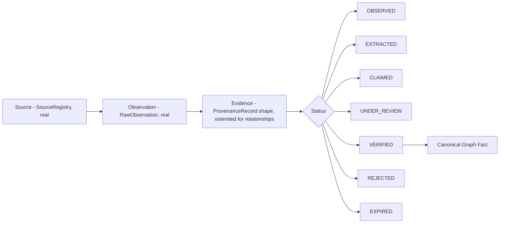
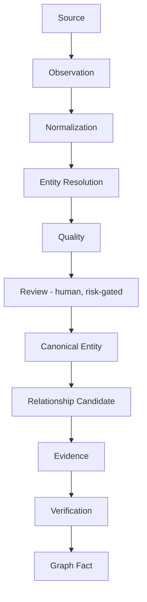

# ForgeX — Module 5F: Industrial Knowledge Graph Architecture

**Status:** Architecture only. No code was written, no migration was
created, no existing file was modified, no file other than this one
was created. Modules 5A (`80f4335c`), 5B (`bb0d3771`), 5C
(`82dca0f`/`8db7fc4`), 5D (`aaa4e5f`), and 5E (`49ded9a`) are all
frozen and unmodified — every "currently exists" claim below was
checked directly against the current codebase at the time of writing.
Module 5C remains **implemented, live validation pending** — this
document does not claim or imply a live data.gov.in acquisition
occurred; every 5C-derived example below is explicitly a
fixture-tested pipeline, not a live pull.

---

## Table of Contents

1. Inspect the Real Codebase First
2. Graph Principle
3. Product / Offering Boundary
4. Company Relationships
5. Product Relationships
6. Factory / Machine Model
7. Capabilities
8. Industries
9. Locations
10. Certifications / Compliance
11. Provenance as a Graph Foundation
12. Temporal Data
13. Graph Fact vs. Source Claim
14. Multiple Sources
15. Conflicts
16. Graph Entity Identity
17. Graph Relationship Types
18. Trust / Verification
19. Graph Queries
20. Requirement Intelligence Connection
21. Search / Discovery Connection
22. AI Boundary
23. Graph Technology Decision
24. MVP Graph Boundary
25. Graph Ingestion Pipeline
26. Graph Maintenance
27. Safety
28. Implementation Roadmap
29. Risks
30. Final Architecture Diagrams
31. Self-Review

---

## 1. Inspect the Real Codebase First

Checked directly against the real, frozen implementation.

| Current Entity | Current Relationship | Current Limitation | Proposed Graph Representation |
|---|---|---|---|
| `Company` (3A/3B) | `CompanyMember` (owner/admin/editor/viewer, real, unchanged) | `industry`, `secondary_industries`, `capabilities`, `manufacturing_expertise`, `product_categories`, `manufacturing_categories`, `export_categories` are all **free-text string arrays** — no structured entity, no relationship table, no evidence link | Company remains the canonical node (Section 16); its free-text arrays become the *source material* candidate edges (`has_capability`, `operates_in Industry`) are extracted from, not the edges themselves |
| `Offering` (4B) | `Company` ↔ `Product`, real FK both ways, `role` (manufacturer/supplier/distributor/exporter/service_provider — confirmed, exactly 5 values), `moq`/`lead_time`/`capacity`/`country` as free strings | No evidence/provenance link at all today — confirmed: `ProvenanceRecord` only supports `company_id` XOR `product_id`, no offering-scoped path (Module 5E's own completion report confirmed this same gap directly) | `Offering` already *is* the graph edge for `manufactures`/`supplies`/`distributes`/`exports`/`provides_service` (Section 4) — no new table needed for the relationship itself, only for its evidence (Section 11) |
| `ProductCategory` (4B) | Self-referential `parent_id`, single-parent tree, real | None relevant here | Maps directly to `belongs_to` (Section 5) |
| `Product` (4B) | `belongs_to` → `ProductCategory` (real FK) | `status`: draft/published/archived — a publication lifecycle, not a graph-fact confidence signal | Canonical node (Section 16) |
| `ProductSpecification`/`ProductAttribute` (4B, extended 5E) | Category-scoped EAV; `ProductSpecification.risk_tier` (5E addition: low/medium/high) real | No `compatible_with`/`replacement_for` relationship of any kind exists between Products today | `has_specification` maps directly; `compatible_with`/`replacement_for` are wholly new, proposed (Section 5), gated by the same evidence discipline as everything else |
| **Factory** | **Does not exist** — confirmed by direct search: no model file, no table, no reference anywhere in the codebase | N/A | Wholly new, proposed (Section 6) |
| `SourceRegistry`/`RawObservation`/`ProvenanceRecord`/`DataConflict` (5A, extended 5E) | `ProvenanceRecord.status`: observed/extracted/verified/claimed/under_review/rejected/expired (7 values, confirmed real); `company_id` XOR `product_id` only — **no offering_id path** (confirmed, unchanged since 5E's own explicit finding) | The exact limitation Module 5E named directly: Offering-level evidence cannot be tracked without a further, separately-approved schema change | This is the graph's entire evidence/provenance foundation (Section 11) — reused, never duplicated |
| `EntityResolutionCandidate` (5D) | `resolution_state` (new/auto_match/review_required/no_match), `decision` (confirm_match/reject_match/create_new) — real, Company-only in practice today (Module 5C is its only real producer) | Only resolves *Company* identity from *raw observations* — no resolution mechanism exists for Product, and none at all for the wholly-new entities this document proposes (Factory, Location, Industry, Capability) | The identity layer this graph must consume, not duplicate (Section 16) — new entity types need their own, much simpler resolution, not a copy of this mechanism |
| `AcquisitionJob`/`AcquisitionJobEvent` (5B) | Real, `collector_type`-based, `mca_data_gov_in` and `mock` registered | Confirmed: `mca_data_gov_in` has never completed a live run against the real data.gov.in API in this environment (network egress blocked, confirmed empirically in Module 5C) — every test uses a mocked HTTP boundary with a realistic, documented fixture | The graph's only real ingestion entry point today remains this exact pipeline — Section 25 extends it, does not replace it |
| Company Verification: `Company.verification_status` (3A, auto-synced by `VerificationScoreService`, 3B) vs. `ProvenanceRecord.status` (5A/5E, field-level) | Two deliberately separate systems, confirmed unconflated as of 5E's own completion report | `Company.verification_status` measures self-reported profile *completeness*, not independent truth (5E's own central finding) | The graph must use `ProvenanceRecord`/relationship-level status (Section 18), never `Company.verification_status`, for any graph-fact trust signal |
| Data Quality (5E): `app/data_quality/risk_classification.py`, `freshness.py`, `data_quality_service.py` | Field-level, Company/Product only, static Python risk mapping (not DB-driven) | No Offering-level or relationship-level quality view exists yet | Section 18's relationship trust model extends this exact pattern, not a new one |
| `AuditLog` (Module 2) | Generic `event`/`event_metadata` JSONB, real, used by 5E's review actions | Not yet used for any graph-specific event type | Reused unchanged for graph fact creation/merge/split events (Section 26) |

**Summary: what this document can build on vs. must propose from
scratch.** Company, Product, Offering, ProductCategory,
Specification/Attribute, the full provenance/quality/verification
stack, and entity resolution (for Company) are all real and reusable
without modification. Factory, Location (as a structured entity),
Industry (as a structured entity), Capability (as a structured
entity), Machine-as-asset, and every cross-Product relationship
(`compatible_with`, `replacement_for`) are entirely new proposals with
zero existing code to build on.

---

## 2. Graph Principle

ForgeX's graph represents six things together, never fewer:
**entities + relationships + evidence + time + source + verification
state.** A graph edge with no evidence is not a graph fact — it is,
at most, a candidate (Section 13). This is not a new principle
invented for this document; it is Module 5A's OBSERVED/EXTRACTED/
VERIFIED/CLAIMED distinction and Module 5E's field-level quality model,
restated at the relationship level rather than the field level. The
graph adds *structure* (typed entities, typed relationships) on top of
a trust model that already exists and is already proven in production
code (257+ passing tests across Modules 5A–5E) — it does not invent a
new trust model.

---

## 3. Product / Offering Boundary

**Preserved exactly, per Phase 4A's original decision, unmodified
since.** Confirmed directly: `Offering.product_id` and
`Offering.company_id` are both real, required foreign keys; nothing in
Modules 4B–5E has ever merged them.

```
Product: Hydraulic Cylinder (one canonical node)
    │
    ├── Offering A → Company X, role=MANUFACTURER, MOQ=100, lead_time=30d
    └── Offering B → Company Y, role=DISTRIBUTOR, MOQ=10, lead_time=7d
```

**How the graph represents this correctly:** `Product` is a single
node. Each `Offering` is a **typed edge** from a `Company` node to
that same `Product` node, carrying its own attributes (`role`, `moq`,
`lead_time`, `capacity`) as edge properties, not node properties. Two
companies offering the same product never produce two Product nodes —
this is already true today (Offering already works exactly this way;
the graph changes nothing about it, only names it explicitly as an
edge type in the controlled vocabulary, Section 17).

---

## 4. Company Relationships

Only relationships justified by real, existing data or a concretely
named future need — nothing added because it "sounds useful."

| Relationship | Source → Target | Basis |
|---|---|---|
| `manufactures` / `supplies` / `distributes` / `exports` / `provides_service` | Company → Product | **Already real** — directly derived from `Offering.role`'s 5 existing enum values; the graph names these as distinct relationship *types* sharing the same underlying `Offering` edge, rather than inventing new storage |
| `owns` / `operates` | Company → Factory | **Proposed** — Factory doesn't exist (Section 1); this relationship is new in both directions |
| `located_in` | Company → Location | **Proposed, extraction target** — today `Company.country`/`state`/`city` are free strings, not FKs to a Location entity; the relationship is real information, the structured target is new |
| `has_capability` | Company → Capability | **Proposed, extraction target** — today `Company.capabilities`/`manufacturing_expertise` are free-text string arrays; same pattern as above |
| `operates_in` | Company → Industry | **Proposed, extraction target** — today `Company.industry`/`secondary_industries` are free text |

**No `belongs_to` for Company→Industry** (only `operates_in`) —
deliberately: "belongs to" implies a taxonomic membership a company
doesn't really have (a company isn't *part of* an industry the way a
Product is *part of* a ProductCategory); "operates in" is the more
accurate relationship semantically, and this distinction is itself an
example of not creating a relationship merely because a template
suggests it.

---

## 5. Product Relationships

| Relationship | Source → Target | Basis |
|---|---|---|
| `belongs_to` | Product → ProductCategory | **Already real** — `Product.category_id`, unchanged |
| `has_specification` | Product → ProductSpecification/ProductAttribute | **Already real** — the existing EAV structure, unchanged |
| `compatible_with` | Product → Product | **Proposed, high-risk** (Section 27) |
| `replacement_for` | Product → Product | **Proposed, high-risk** (Section 27) |

**CRITICAL, restated as this section's governing rule:**
`compatible_with`/`replacement_for` must **never** be automatically
inferred — this is a direct extension of Phase 5's original
architecture document's own Section 8 rule ("never allow unsafe
automatic merging of potentially different industrial products"),
applied here to a different but equally dangerous failure mode: two
genuinely different products being wrongly declared interchangeable.
**How such relationships become trusted:** identical evidence
discipline to any other high-risk claim (Section 27) — a candidate
edge (Section 25) requires (a) a real source claiming the
compatibility (e.g. a manufacturer's own cross-reference documentation,
a Tier 1/2 source per Module 5E's reliability tiers), (b) mandatory
human review regardless of source reliability, and (c) the resulting
edge starts at `CLAIMED`/`UNDER_REVIEW`, never `VERIFIED`, until a
reviewer explicitly confirms it — exactly Module 5A's
`verify_provenance_record` pattern, applied to a relationship instead
of a field.

---

## 6. Factory / Machine Model

**Wholly proposed — Factory does not exist today (Section 1).**

The brief's own distinction is exactly right and is preserved as the
section's central rule: a CNC machine can simultaneously be **(1) a
Product** a manufacturer sells, and **(2) a Machine Asset** a
different company owns and operates in their own factory. These are
different graph contexts and must never be merged into one node.

```
Company X (a machine tool manufacturer)
    │
    └── manufactures ──> Product: "CNC Machine Model X" (a Product node, sold by X)

Company Y (a job-shop, unrelated to X except as a customer)
    │
    └── owns ──> MachineAsset A (a Factory-scoped node, owned by Y)
                     │
                     └── instance_of ──> Product: "CNC Machine Model X"
```

**How the graph prevents incorrect merging:** `MachineAsset` is
proposed as its own node type, distinct from `Product`, linked to a
specific `Product` only via an explicit `instance_of` relationship —
never sharing a primary identity with the Product it's an instance of.
A `MachineAsset` is owned by exactly one Company (via `Factory`, which
is owned/operated by a Company per Section 4); a `Product` is owned by
no one — it is canonical, shared knowledge, exactly matching the
Product/Offering boundary's own reasoning (Section 3) extended one
level further: `MachineAsset` is to `Product` roughly as `Offering` is
to `Product` — a company-specific instantiation, never collapsed into
the canonical thing it instantiates.

---

## 7. Capabilities

**Proposed as a controlled entity**, replacing today's free-text
`Company.capabilities`/`manufacturing_expertise` arrays as the
*extraction target*, not as an immediate schema replacement (Section
1's arrays remain the real, current source of truth until a future
implementation phase actually builds this).

**The central rule, restated exactly as the brief states it:** "We
provide CNC machining" is a `CLAIMED` claim (Section 2's trust model,
Module 5A's own enum value, confirmed real and already usable). It
does **not** automatically mean "ForgeX verified CNC machining
capability." The `has_capability` edge (Section 4) carries the exact
same relationship-level status model as any other graph fact (Section
18) — `CLAIMED` the moment a company's own profile or a low-tier
source states it, `VERIFIED` only after the identical human-review
discipline Module 5E already built for fields, applied here to an
edge instead.

---

## 8. Industries

**Proposed: `Industry` as a controlled entity, `IndustryCategory` as a
shallow parent grouping — explicitly NOT a deep `IndustryHierarchy`.**

Why not a deep hierarchy: Phase 5's original architecture document
already established the "no giant taxonomy built prematurely"
principle for exactly this kind of concern, and `ProductCategory`'s
own real, working design (a single-parent tree, not a multi-level
enforced hierarchy) is the existing, proven pattern to mirror — a
shallow, `ProductCategory`-like structure (`Industry` with an optional
`parent_id`) is proposed instead of a dedicated, more elaborate
hierarchy type, avoiding two different taxonomy patterns for
conceptually similar problems.

**Relationship to Company/Product/Capability:** `Company operates_in
Industry` (Section 4); `Product belongs_to ProductCategory`, and
`ProductCategory` may optionally relate to `Industry` (a category like
"CNC Machines" naturally sits within "Industrial Machinery") —
proposed as a simple `ProductCategory → Industry` reference, not a
second parallel hierarchy. `Capability → Industry` is **not** proposed
as a direct edge — a capability like "CNC machining" spans multiple
industries and forcing a single-industry link would misrepresent it;
industry relevance for a capability is better answered by querying
which companies/products *with* that capability *operate_in* which
industries, a derived query (Section 19), not a stored edge.

---

## 9. Locations

**Proposed: `Location` as a controlled entity**, distinguishing
exactly the three concepts the brief names, which are genuinely
different today and must not be confused:

| Concept | Current representation | Proposed graph relationship |
|---|---|---|
| Company registered address | `Company.country`/`state`/`city` (free text, real) | `Company located_in Location` (headquarters/registered) |
| Factory location | Does not exist (Factory doesn't exist, Section 6) | `Factory located_in Location` — a **separate** edge, since a company's factory is very often not at its registered address |
| Offering country / service coverage | `Offering.country` (free text, real) | `Offering serves Location` — a **third**, distinct edge, since "where a company is willing to deliver" is neither its HQ nor necessarily its factory's location |

**Why three separate edges, not one:** conflating these (a real risk
this section exists to prevent) would mean a company registered in
Delhi with a factory in Pune could be wrongly presented as "located in
Delhi" for a search query about Pune-based manufacturing capacity —
exactly the kind of quietly-wrong result this whole project's
provenance discipline exists to prevent. `Location` itself is proposed
as a structured entity (country/state/city/optional industrial-area
name) rather than a free-text field, so all three edge types can point
at the same real place consistently and support the query patterns
Section 19 lists ("Find CNC manufacturers in Pune").

---

## 10. Certifications / Compliance

**Proposed: `Certification` (a controlled entity — "ISO 9001", "CE",
"BIS", etc.) distinct from `VerificationDocument` (Module 3B, real,
unchanged) and from the claim itself.**

```
Company
   │
   └── claims ──> Certification: ISO 9001         (a CLAIMED edge)

VerificationDocument (Module 3B, real — the uploaded PDF/image)
   │
   └── supports ──> the claims edge above          (Section 9's proposed
                                                       evidence link, Module 5E)

A human reviewer's decision (Module 5E's real, existing review action)
   │
   └── transitions the claims edge to VERIFIED      (or REJECTED/EXPIRED)
```

**"Uploaded document ≠ verified certification," restated as this
section's hard rule** — already a real, enforced principle in Module
5E (`link_evidence` never changes `ProvenanceRecord.status`, confirmed
by a passing test in that module's own suite); this section applies
the identical rule at the relationship level: `claims` starts at
`CLAIMED` or `OBSERVED`, and only an explicit review action — never a
document upload by itself — can move it to `VERIFIED`.
`VerificationDocument.expiry_date` (real, Module 3B) is the natural
trigger for the `claims` edge's own `EXPIRED` transition (Section 12),
mirroring exactly how `ProvenanceRecord.expires_at` already syncs from
a linked document's expiry (Module 5E, real, confirmed).

---

## 11. Provenance as a Graph Foundation

**Not duplicated — this is the single most important structural
decision in this document.** `SourceRegistry`, `RawObservation`,
`ProvenanceRecord`, `DataConflict` (Module 5A) and the field-level
quality/review model (Module 5E) are reused *conceptually and
literally* as the graph's evidence layer:

```
Graph Fact (a canonical relationship — e.g. "Company X manufactures Product Y")
      ↓ traceable to
Evidence (one or more ProvenanceRecord-shaped records — reusing that
          exact model's shape, not a new one)
      ↓ traceable to
Source (SourceRegistry, real, unchanged)
      ↓ carries
Status (OBSERVED / EXTRACTED / CLAIMED / VERIFIED — Module 5A's real
        enum, plus 5E's UNDER_REVIEW / REJECTED / EXPIRED — all seven
        values reused unchanged, not reinvented for relationships)
      ↓ stamped with
Timestamp (last_observed_at / verified_at / expires_at — Module 5A/5E's
           real columns, same shape)
```

The one genuine gap (confirmed in Section 1, and already named
directly by Module 5E's own completion report): `ProvenanceRecord`
today only supports `company_id` XOR `product_id` — there is no path
for Offering-level or relationship-level evidence at all. **This
document does not propose bypassing that constraint by duplicating a
parallel evidence table.** Section 25/28 treats extending
`ProvenanceRecord` (or a narrowly-scoped, explicitly-justified sibling
table with the identical shape) to support relationship-level evidence
as a **required, first-sequenced** piece of any future implementation
— the graph cannot be evidence-backed at the relationship level until
this exists, and pretending otherwise would violate this whole
document's own Section 2 principle.

---

## 12. Temporal Data

**Historical truth and current truth are explicitly not the same
claim** — restated as this section's hard rule, directly per the
brief's own instruction.

Proposed temporal fields on a graph edge (extending, not duplicating,
`ProvenanceRecord`'s real `last_observed_at`/`verified_at`/`expires_at`
columns, Module 5A/5E):

| Field | Meaning |
|---|---|
| `valid_from` | When this relationship is believed to have started being true (may predate when ForgeX first observed it) |
| `valid_until` | When this relationship is believed to have stopped being true — proposed, new; `NULL` means "still valid as of the last check" |
| `observed_at` | Already real (`RawObservation.collected_at`/`ProvenanceRecord.last_observed_at`) |
| `verified_at` | Already real (`ProvenanceRecord.verified_at`) |
| `expired_at` | Maps to the already-real `EXPIRED` status transition (Module 5E) — the timestamp of *that specific transition*, distinct from `valid_until` (which describes the real-world fact's own lifespan, not ForgeX's process of noticing it) |

**Example, made concrete:** "Company used to manufacture Product A,
no longer does" is represented as the `manufactures` edge's
`valid_until` being set (by a reviewer, following the same evidence
discipline as any other status change — never inferred automatically
from a source simply going quiet, since "we stopped observing this"
and "this stopped being true" are different claims, exactly Section
13's distinction). The edge itself is **never deleted** — matching
Module 5A's own append-only philosophy for `RawObservation`, extended
here: a `manufactures` relationship that ended is still real history,
auditable and queryable, not erased.

---

## 13. Graph Fact vs. Source Claim

**This is the section the brief itself calls critical, and it is
answered by direct analogy to a distinction this codebase already
enforces successfully at the field level (Module 5A's own core
design):**

- **"Source Z reported that Company X manufactures Product Y"** is a
  `ProvenanceRecord`-shaped evidence record (Section 11) — exactly
  analogous to today's real `ProvenanceRecord.value_observed` for a
  field.
- **"Company X manufactures Product Y"** is the canonical graph edge
  (an `Offering` with `role=MANUFACTURER`, already real, Section 3) —
  exactly analogous to today's real `Company.name` or `Product.name`
  column.

**How ForgeX prevents unsupported claims from becoming canonical,
concretely:** identical mechanism to how a raw observation never
directly writes to `Company.name` today — it always passes through
extraction, entity resolution, and (per Module 5C's real, working
`company_promotion_service`) an explicit promotion step before
becoming canonical. A relationship candidate (Section 25) follows the
same shape: **Evidence exists first, always; the canonical edge is
created only via an explicit promotion-equivalent action**, never as
an automatic side effect of a source simply mentioning the
relationship.

---

## 14. Multiple Sources

The brief's own four-source example, mapped directly onto real,
existing mechanisms:

| Source | Claim | How it coexists |
|---|---|---|
| MCA (Module 5C, real adapter, network-blocked in this sandbox — Section 1) | "Company exists" | A `RawObservation` + `ProvenanceRecord` for identity fields (real today) |
| Company website | "Company claims CNC machining" | A `RawObservation` (from a future website adapter, not built — Phase 5's general architecture document's own scope) + a `has_capability` edge at `CLAIMED`/`OBSERVED` |
| Industry directory | "Lists CNC machining" | Same shape, different `SourceRegistry.source_class` (`association_directory`, real enum value) and correspondingly lower `reliability_weight` |
| Company self-submission | "Claims CNC machining" | A `ProvenanceRecord` at `status=CLAIMED` — the real, already-defined enum value no current code path produces yet (Module 5E's own completion report confirmed this directly) |
| ForgeX verification | "Reviewer confirms evidence" | The real, existing `verify_provenance_record`-equivalent action, applied to the edge |

**All four coexist without overwriting each other** exactly because
each becomes its **own** evidence record (Section 11) rather than each
one overwriting a single mutable field — this is not a new guarantee
this document invents; it is Module 5A's real, already-proven
append-only design (confirmed working via Module 5D's own conflict
tests), extended to relationships.

---

## 15. Conflicts

The brief's three-source example (manufactures / stopped manufacturing
/ still lists) is a genuine conflict, handled by direct extension of
Module 5A's real `DataConflict` mechanism (proven working end-to-end
in Module 5D and 5E) — **never resolved by simply picking the newest
source**, per the brief's own explicit instruction.

**The conflict model, restated for relationships:** when two
relationship-evidence records for the same (source entity, relationship
type, target entity) disagree — including a disagreement about whether
the relationship still holds at all (`valid_until` set vs. not) — a
`DataConflict`-shaped record is created (reusing that real model's
shape), considering exactly the factors the brief names:
**source reliability** (`SourceRegistry.reliability_weight`, real),
**verification state** (has either claim already been reviewed?),
**timestamp** (which is more recent, as one input among several, never
the sole deciding factor), and **evidence** (does one claim have
stronger corroboration, e.g. a document vs. a bare mention). **Human
review** (Module 5E's own real, unchanged mechanism) is the only path
to resolution — exactly as `resolve_conflict` already works today,
deliberately never mutating the underlying claims, only recording a
decision.

---

## 16. Graph Entity Identity

**Entity Resolution (Module 5D) remains the identity layer — the
graph consumes resolved identities, it does not create its own.**
Restated as this section's hard rule, matching the brief's explicit
instruction.

For `Company` and `Product`: the graph node **is** the canonical
`Company`/`Product` row, exactly as it exists today (Section 1) — no
separate "graph identity" is proposed. A raw observation still goes
through `EntityResolutionCandidate` (Module 5D, real) before any
relationship involving it can be promoted to a graph fact (Section
25) — the graph does not bypass this gate.

For the wholly-new entity types this document proposes (Factory,
Location, Industry, Capability, Certification, MachineAsset): Module
5D's own resolution machinery (CIN-based, name+address matching,
fuzzy-similarity review-queue tiers) is **not proposed to be reused
as-is** — these entities have much smaller expected cardinality
(dozens to low hundreds of Industries/Capabilities globally, not
thousands of ambiguous Companies) and much weaker "someone might
impersonate a fake Industry" risk, so a simpler mechanism is proposed:
**exact-match-on-controlled-vocabulary** for Industry/Capability/
Certification (an admin-curated list, matching `ProductCategory`'s own
real, existing pattern — a small, reviewable set of rows, not a
free-for-all), and Module 5D-style CIN/registration-based resolution
*only* for Location and Factory where a genuine "is this the same
place/facility" ambiguity exists (two factories at similar addresses
being a real, if less severe, version of the same problem Module 5D
already solves for Companies).

---

## 17. Graph Relationship Types

A controlled vocabulary — every relationship this document proposes,
in one table, matching the brief's exact required columns.

| Name | Source | Target | Meaning | Evidence Required | Verification Required | Temporal | Automatic | Human Approval |
|---|---|---|---|---|---|---|---|---|
| `manufactures`/`supplies`/`distributes`/`exports`/`provides_service` | Company | Product | The company's role in offering this product | Yes (already required — `Offering` itself, real) | No (offering existing is itself the fact — verification of the *capability behind it* is separate, Section 7) | Yes | Already automatic (an authenticated Offering creation, real today) | No, for creation; yes, for any future verification badge |
| `belongs_to` | Product | ProductCategory | Taxonomic membership | No (structural, not a factual claim) | No | No | Yes (real today) | No |
| `has_specification` | Product | ProductSpecification/Attribute | A measured/stated property | Yes (per Module 4B's real EAV) | Depends on `risk_tier` (5E, real) | No | Yes (real today) | Only for `HIGH` risk_tier values (5E's own rule, reused) |
| `compatible_with`/`replacement_for` | Product | Product | Interchangeability | **Yes, mandatory** | **Yes, mandatory** | No | **No, never** | **Yes, always** (Section 5/27) |
| `owns`/`operates` | Company | Factory | Asset/operational relationship | Yes | Recommended for HIGH-risk downstream claims (e.g. capacity) | Yes | No | Recommended |
| `located_in` | Company/Factory | Location | Physical presence | Yes | No | Yes | Extraction candidate only | No |
| `serves` | Offering | Location | Delivery/service coverage | Yes | No | Yes | Extraction candidate only | No |
| `has_capability` | Company | Capability | A stated industrial capability | Yes | Recommended, mandatory if referenced by a HIGH-risk requirement match (Section 20) | No | No | Recommended |
| `operates_in` | Company | Industry | Industry membership | Yes | No | No | Extraction candidate only | No |
| `claims` | Company | Certification | A certification/compliance claim | Yes | **Yes, mandatory** (Section 10/27) | Yes (expiry) | No | **Yes, always** |
| `instance_of` | MachineAsset | Product | "This owned asset is a unit of this catalog Product" | Yes | Recommended | No | No | Recommended |

**Arbitrary relationship creation is not allowed** — restated: any
relationship type not in this table requires a new, explicitly-designed
row here (and the corresponding implementation decision, Section 28),
never an ad hoc edge type created inline by a future feature.

---

## 18. Trust / Verification

**No generic graph-wide confidence number** — restated as a hard rule,
directly per the brief's instruction, and consistent with Module 5E's
own identical rejection of a black-box company-wide score.

Every relationship instance carries the **same seven-value status**
`ProvenanceRecord.status` already uses (Module 5A/5E, real, unchanged):
`OBSERVED` / `EXTRACTED` / `CLAIMED` / `UNDER_REVIEW` / `VERIFIED` /
`REJECTED` / `EXPIRED`. This is not a new enum invented for the graph
— it is the identical vocabulary, reused, so a reviewer or a future
API consumer never needs to learn two different trust models depending
on whether they're looking at a field or a relationship.

```
Company X
   └── manufactures ──> Product B      status: OBSERVED
```

is a real, meaningful, inspectable statement — exactly as meaningful
as `ProvenanceRecord` already is for a Company field today, no more
and no less.

---

## 19. Graph Queries

**Not implemented — used only to validate the architecture above can
support them, per the brief's own instruction.**

| Query | What it requires from this architecture |
|---|---|
| "Find CNC manufacturers in Pune" | `Company —has_capability→ Capability("CNC machining")` joined with `Company —located_in→ Location("Pune")` — both proposed (Sections 7, 9), both representable |
| "Find Indian manufacturers of hydraulic cylinders" | `Offering(role=MANUFACTURER) —Product("Hydraulic Cylinder")` joined with `Company —located_in→ Location(country=India)` — fully representable with real (`Offering`) + proposed (`Location`) entities |
| "Which suppliers can deliver within 14 days?" | `Offering.lead_time` (real, but free-text today — Section 1) filtered numerically — flags a real, separate normalization need (parsing "30 days" into a comparable value), not a graph-structure gap |
| "Which companies manufacture Product X?" | Direct `Offering` traversal — fully real today, no proposal needed at all |
| "Which distributors sell Product X in Delhi?" | `Offering(role=DISTRIBUTOR)` joined with `serves→Location` — representable |
| "Which companies have a verified CNC machining capability?" | `has_capability` edge filtered on `status=VERIFIED` (Section 18) — fully representable |
| "Show alternatives to Product X" | `compatible_with`/`replacement_for` traversal, filtered to `VERIFIED` only (Section 5/27's mandatory-review rule makes this filter meaningful rather than decorative) |
| "Which factories have CNC machines capable of this requirement?" | `Factory` ← `owns/operates` ← `Company`, joined with `MachineAsset —instance_of→ Product`, filtered on that Product's specifications — fully representable once Sections 6/17 exist |

Every example is answerable **without** inventing anything beyond what
Sections 3–17 already propose — a genuine validation the architecture
is sufficient, not just aspirational.

---

## 20. Requirement Intelligence Connection

**Not implemented in 5F**, per the brief's explicit instruction — this
section only confirms the connection point exists conceptually.

Consult's real, existing `RequirementObject` (Phase 3B, unmodified —
`productOrCategory`, `country`, `certifications`, `quantity`, `budget`,
`timeline`, each with `explicit`/`inferred`/`missing` confidence tags,
confirmed still real and unchanged) already produces almost exactly
the shape a graph query needs:

```
RequirementObject (real, unmodified)
      ↓
Product / ProductCategory match (real, existing search — unchanged)
      ↓ [future, not 5F]
Offerings of that Product (real, Offering — unchanged)
      ↓ [future, not 5F]
Company (via Offering.company_id — real, unchanged)
      ↓ [future, not 5F]
Role (Offering.role — real, unchanged)
      ↓ [future, not 5F]
Capacity (Offering.capacity — real, free-text today, Section 19's normalization note applies)
      ↓ [future, not 5F]
Lead time (Offering.lead_time — same normalization note)
      ↓ [future, not 5F]
Verification (the graph's own relationship-status model, Section 18 — proposed)
```

Every arrow after "Product / ProductCategory match" is genuinely new
integration work, not built here, and not claimed to be — Consult's
own `RequirementObject` extraction is untouched, confirmed by this
document creating zero frontend or `apps/web` changes.

---

## 21. Search / Discovery Connection

**Not implemented — `/discover` and `/consult` are unmodified**,
confirmed directly (this document is the only change in the repo,
Section 31).

How the graph would **eventually** improve them: today's real search
(`ILIKE` substring matching against `Company.name`/`industry`/
`country`/`city`, confirmed unchanged since the original Phase 5
architecture document) has no concept of relationships at all — it
cannot answer "companies with a verified CNC capability located near
Pune" as a single query, only as a name/text match. The graph's typed,
evidence-backed edges (Sections 4–10) would let a future search layer
traverse *relationships*, not just match *text* — but this document
proposes no ranking algorithm, no black-box retrieval mechanism, and
no change to either application. This is a future integration
decision, not a 5F deliverable.

---

## 22. AI Boundary

**An LLM never becomes the source of truth** — restated as a hard
rule, directly extending Phase 5's original architecture document's
own AI boundary, and Module 5D's own "deterministic and explainable,
no LLM in the identity decision" precedent (real, already-implemented,
unchanged).

| AI may | AI may NOT |
|---|---|
| Suggest candidate entities from unstructured text (e.g. "this sentence looks like a capability claim") | Create a canonical graph fact directly |
| Propose candidate edges for human review | Set a relationship's status to `VERIFIED` |
| Summarize evidence for a reviewer's convenience | Be treated as a source itself — an AI suggestion is not a `SourceRegistry` entry |
| Explain a graph path in natural language (a future UI convenience) | Auto-resolve entity identity (Module 5D's own existing, hard rule, unchanged) |

An AI-generated suggestion is, at most, an `EXTRACTED`-status candidate
— exactly as constrained as today's real, deterministic extraction
pipeline (Module 5C's field mapping) already is; using an LLM instead
of hand-written extraction rules would not relax this in any way.

---

## 23. Graph Technology Decision

| Option | Assessment |
|---|---|
| **A — PostgreSQL relational graph representation** | **Recommended.** ForgeX's entire stack is already PostgreSQL (confirmed throughout Modules 1–5E, zero exceptions). `Offering` (Company↔Product), `ProvenanceRecord`↔`DataConflict`, and `EntityResolutionCandidate`↔`Company` are **already, today, a relational graph representation** — typed edge tables with foreign keys and edge properties. This option is not a new technology decision; it is a continuation of the architecture every prior Module 5 phase already used successfully. |
| **B — PostgreSQL + graph extension** (e.g. Apache AGE) | Rejected for MVP: adds real operational complexity (extension installation, a second query paradigm — Cypher-on-Postgres — for the team to learn) for a benefit (native graph traversal syntax) that Section 19's query validation shows isn't actually needed at MVP scale (every example query is a small number of joins, not a deep multi-hop traversal). Worth revisiting only if a genuine multi-hop traversal need emerges that plain SQL joins can't express reasonably. |
| **C — Dedicated graph database** (e.g. Neo4j) | Rejected for MVP, explicitly not "because Knowledge Graph sounds like it needs one" (the brief's own warning, taken seriously): introduces a second database technology with its own operational burden (backup, monitoring, a second connection pool, a second set of access-control primitives to keep in sync with the existing RBAC), at India-pilot scale (tens to low hundreds of companies, Module 5C's own approved ceiling) with no query pattern (Section 19) that plain relational joins can't already answer. Transactional consistency (a real, repeatedly-emphasized concern throughout Modules 5A–5E's own designs) is also structurally harder to guarantee across two separate database systems than within one. |
| **D — Hybrid architecture** | Rejected for the same reasons as C, compounded: hybrid designs carry both systems' operational burden simultaneously, justified only once genuine scale or query-pattern needs (neither present today) demand it. |

**Recommendation: Option A**, unambiguously, at this MVP's real scale.
Every entity and relationship proposed in this document (Sections 4–10,
17) maps directly to a Postgres table with foreign keys — no
speculative technology adoption is required to build any of it.

---

## 24. MVP Graph Boundary

| Included in MVP | Deferred |
|---|---|
| Company (real, unchanged) | MachineAsset (Section 6) — genuinely useful, but has zero real data to validate against yet (no Factory data acquired at all) |
| Product (real, unchanged) | `compatible_with`/`replacement_for` (Section 5) — the highest-risk relationship type, deliberately last, needing the review-queue infrastructure (Section 17) proven on lower-risk edges first |
| Offering (real, unchanged) | Certification-as-full-entity beyond what Module 3B's `VerificationDocument` already provides (Section 10) — the `claims`/evidence *pattern* is designed now, full `Certification` entity buildout deferred |
| ProductCategory (real, unchanged) | Deep Industry hierarchy (Section 8) — explicitly rejected in favor of a shallow structure even at MVP |
| Capability (proposed, Section 7) | — |
| Industry (proposed, shallow, Section 8) | — |
| Location (proposed, Section 9) | — |
| Factory (proposed, Section 6 — the relationship shape only; MachineAsset itself deferred, see above) | — |
| Evidence (= `ProvenanceRecord`, extended for relationships, Section 11) | — |
| Verification (= relationship status, Section 18, reusing 5A/5E's real enum) | — |

This directly matches the brief's own priority list, with one
clarification: Factory the *entity* (a company owns/operates a
location-scoped facility) is in-scope for MVP because `located_in`/
`owns`/`operates` are needed to answer Section 19's own example
queries; `MachineAsset` (a specific piece of equipment inside that
factory) is deferred because no real data source populating it exists
yet anywhere in this codebase.

---

## 25. Graph Ingestion Pipeline

```
Source (real, Module 5A)
 ↓ automatic
Observation (real, Module 5A)
 ↓ automatic
Normalization (real, Modules 5C/5D)
 ↓ automatic
Entity Resolution (real, Module 5D — Company only today; extended per Section 16 for new entity types)
 ↓ automatic, human-reviewed for REVIEW_REQUIRED/CONFLICT (real, Module 5D)
Quality (real, Module 5E — field-level; extended per Section 18 for relationships)
 ↓ automatic
Review (real pattern, Module 5E — extended to relationship candidates)
 ↓ HUMAN, for anything above LOW risk (Section 27)
Canonical Entity (real, Modules 3A/4B — Company/Product/Offering; PROPOSED for Factory/Location/Industry/Capability/Certification)
 ↓ automatic once the entity is canonical
Relationship Candidate (PROPOSED — Section 17's vocabulary; never written directly to a canonical edge)
 ↓ automatic
Evidence (PROPOSED extension of ProvenanceRecord to relationships — Section 11)
 ↓ HUMAN for HIGH-risk edge types (Section 17's table), automatic-eligible only for LOW-risk, structural edges (e.g. `belongs_to`)
Verification (reuses the real, unmodified verify_provenance_record-equivalent action)
 ↓
Graph Fact (the canonical, queryable relationship — Section 13)
```

**Which stages are automatic vs. reviewed, stated plainly:** everything
through "Quality" is automatic today for Company (real) and would be
automatic for the new entity types too (structural classification, not
factual judgment). "Review" is mandatory for anything the brief itself
flags as high-risk (compatible_with, replacement_for, claims/
certifications, capacity-relevant capability claims) and optional/
skippable only for the lowest-risk, purely structural relationships
(`belongs_to`, `has_specification` at `LOW` risk_tier) — mirroring
Module 5E's own real, already-proven risk-based review-routing exactly.

---

## 26. Graph Maintenance

| Event | Proposed handling |
|---|---|
| New source | Enters via the real, unchanged Module 5B pipeline — no graph-specific onboarding needed |
| Updated company | New `RawObservation` → new evidence → conflict detection (Module 5A, real, unchanged) if it disagrees with existing edges |
| Deleted company | Proposed: edges are never hard-deleted — mirrors `RawObservation`'s own append-only philosophy; a `valid_until` (Section 12) is set instead, preserving history |
| Changed offering | Already real — `Offering` is directly editable today (Module 4B); the graph's evidence layer (once relationship-level provenance exists, Section 11) would additionally record *why* it changed, which today's plain Offering edit does not |
| Expired certification | Already real for documents (`VerificationDocument.expiry_date`); proposed extension makes the corresponding `claims` edge transition to `EXPIRED` automatically on that date — the one place in this whole document where an *automatic* status transition is proposed, and only because it mirrors a real calendar fact (a date passing), never a judgment call |
| Product updates | Same pattern as Company updates |
| Conflicts | Module 5A's real, unchanged mechanism (Section 15) |
| **Entity merges/splits** | **Must preserve provenance and history**, per the brief's explicit instruction — extends Module 5D's own real merge-avoidance discipline: a merge is never automatic (identical reasoning to why `CONFIRM_MATCH` still requires an explicit human decision even for `AUTO_MATCH`-tier candidates, Module 5D, real, unchanged); when a human does confirm a merge, all evidence records from both original entities remain attached to their original source observations (never rewritten), with the merge itself recorded as its own auditable event (`AuditLog`, real, unchanged) — a split is the same operation in reverse, equally human-gated, equally audit-logged |

---

## 27. Safety

Industrially dangerous false relationships, ranked by the same
CRITICAL/HIGH/MEDIUM/LOW scale used throughout every prior Module 5
architecture document, for consistency:

| False relationship | Level | Why |
|---|---|---|
| Wrong product compatibility (`compatible_with`) | **CRITICAL** | A buyer sourcing a physically incompatible part based on a false compatibility claim faces direct physical/operational risk — the single most dangerous edge type in this entire document |
| Wrong machine capability / capacity claim | **CRITICAL** | A buyer relying on a fabricated capacity figure for a time-critical order faces real business and, in some industrial contexts, safety consequences |
| Wrong certification | **HIGH** | Real legal/reputational consequence for both the buyer relying on it and ForgeX for having displayed it — mirrors Module 5E's own identical HIGH-risk classification for certification fields |
| Wrong safety specification | **CRITICAL** | Identical reasoning to Phase 5's original architecture document's own risk ranking for this exact concern, restated here at the relationship level |
| Wrong manufacturer relationship (a false `manufactures` edge) | **HIGH** | Misdirects a buyer's due diligence and could misattribute real capability to the wrong company |

**Stricter verification requirements for high-risk edges, concretely:**
every edge type Section 17's table marks "Human Approval: Yes, always"
(compatible_with, replacement_for, claims) requires **mandatory human
review regardless of source reliability tier** — even a Tier 1
government source claiming a product compatibility would still require
human confirmation before the edge reaches `VERIFIED`, since a
government registry is authoritative for *company identity*, not for
*engineering compatibility judgments*, which is a categorically
different kind of claim no source tier alone makes trustworthy.

---

## 28. Implementation Roadmap

Proposed sequence for a **future, separately-approved** implementation
phase — adjusted from the brief's own example specifically because
Section 11 identified that relationship-level evidence storage is a
genuine prerequisite the brief's own ordering doesn't explicitly call
out as needing to come first:

| Step | Scope |
|---|---|
| 5F.1 Relationship-level evidence extension | Extends `ProvenanceRecord` (or a narrowly-scoped sibling with an identical shape) to support Offering/relationship-level evidence — the one real, confirmed gap (Section 1/11) every later step depends on |
| 5F.2 Graph identity foundation | New, simple entity types (Location, Industry, Capability, Certification) as controlled-vocabulary tables (Section 16) — deliberately not reusing Module 5D's heavier Company-resolution machinery |
| 5F.3 Core relationships | The real, already-existing edges (manufactures/supplies/etc. via Offering, belongs_to, has_specification) formally named in the controlled vocabulary (Section 17) — mostly a documentation/API-surface exercise, since the underlying data already exists |
| 5F.4 Evidence-backed edges | The new relationship types (located_in, has_capability, operates_in, claims) built on 5F.1's evidence extension, with the risk-based review routing (Section 27) enforced from day one |
| 5F.5 High-risk relationships | `compatible_with`/`replacement_for`/`owns`/`operates` (Factory) — sequenced deliberately last among the "build the graph" steps, since these carry this document's own CRITICAL/HIGH risk ratings and need 5F.1–5F.4's review infrastructure proven first |
| 5F.6 Graph query layer | A read-only query surface answering Section 19's example questions — sequenced after real data exists to query, not before |
| 5F.7 Requirement Intelligence integration | Section 20's arrows, made real — explicitly the *last* step, since it depends on every prior step having real, evidence-backed data to connect to |
| 5F.8 Search integration | Section 21 — last of all, for the identical reason |

---

## 29. Risks

| Risk | Level |
|---|---|
| Graph pollution (low-quality candidate edges accumulating faster than review capacity) | **HIGH** — directly analogous to Module 5E's own "conflicting sources left unresolved at scale" risk, now compounded across many more relationship types |
| Incorrect relationships (compatible_with/replacement_for specifically) | **CRITICAL** — Section 27's own top-ranked concern |
| Duplicate entities (for the new entity types this document proposes) | **MEDIUM** — bounded by Section 16's controlled-vocabulary approach for the smaller-cardinality types, genuinely lower risk than Company/Product duplication ever was |
| Stale edges (a relationship no longer true, not yet marked `EXPIRED`/`valid_until`) | **HIGH** — Section 12's whole purpose; only as good as the refresh discipline actually built |
| Conflicting evidence left unresolved | **MEDIUM** — same mitigation and same residual risk as Module 5E's own identical entry |
| AI-hallucinated relationships | **CRITICAL** if the Section 22 boundary is ever weakened; **LOW** as designed, since AI never reaches canonical status without human review — the risk is entirely in future implementation discipline, not this architecture |
| Over-engineering (building graph-database-style infrastructure the MVP doesn't need) | **MEDIUM** — directly why Section 23 recommends Option A specifically; the risk is real if a future team revisits that decision without re-validating against Section 19's actual query needs |
| Graph database complexity (if Option B/C/D were chosen instead) | **N/A** at this scale, per Section 23's recommendation — flagged as a risk *of the alternative*, not of the chosen path |
| Provenance loss (during a future merge/split) | **HIGH** — Section 26's explicit rule exists because this is a real, plausible failure mode without discipline |
| Unsafe industrial claims reaching users | **CRITICAL** — the umbrella risk every other CRITICAL entry in this table is a specific instance of; Section 27's mandatory-review rule is the primary mitigation across the board |

---

## 30. Final Architecture Diagrams

### 1. Core graph model



### 2. Evidence / provenance flow



### 3. Acquisition to graph pipeline



### 4. Future requirement to graph to recommendation flow

```mermaid
graph LR
    REQ["RequirementObject - Consult, real, unmodified"] --> MATCH["Product/Category match - real search, unmodified"]
    MATCH -.future, not 5F.-> OFF[Offerings of matched Product]
    OFF -.future, not 5F.-> CO[Company via Offering]
    CO -.future, not 5F.-> ROLE[Role]
    ROLE -.future, not 5F.-> CAP[Capacity / Lead time]
    CAP -.future, not 5F.-> VERIFY[Relationship verification status]
```



---

## 31. Self-Review

- Confirmed: no implementation code written — this document is the
  only file created this phase.
- Confirmed: no migrations.
- Confirmed: no frontend changes.
- Confirmed: Modules 5A–5E untouched — every real mechanism cited
  throughout was checked directly against the current codebase in
  Section 1, not carried over from a prior document's summary.
- Confirmed: Company/Product/Offering boundaries preserved — Section 3
  explicitly restates and extends Phase 4A's original decision,
  unmodified.
- Confirmed: Product ≠ Offering — Section 3's entire content.
- Confirmed: Machine Product ≠ Machine Asset — Section 6's entire
  content, with the brief's own worked example reproduced exactly.
- Confirmed: Entity Resolution remains the identity layer — Section 16
  explicitly states the graph consumes Module 5D's resolved identities
  rather than creating a parallel system, and explains why new entity
  types get a deliberately simpler, non-duplicative mechanism instead.
- Confirmed: Provenance is not duplicated — Section 11 explicitly reuses
  `ProvenanceRecord`'s real shape and enum, proposing only the one
  genuinely-missing extension (relationship-level evidence) rather than
  a parallel system.
- Confirmed: Evidence ≠ verification — Section 10's `claims`/
  `supports`/verification-decision chain, directly extending Module
  5E's own real, tested `link_evidence`-never-changes-status rule.
- Confirmed: AI ≠ source of truth — Section 22, with an explicit table
  of what AI may and may not do.
- Confirmed: Conflicting evidence is preserved — Section 15, extending
  Module 5A's real, proven `DataConflict` mechanism.
- Confirmed: Temporal data is supported conceptually — Section 12,
  with `valid_from`/`valid_until` explicitly distinguished from
  `observed_at`/`verified_at`/`expired_at`.
- Confirmed: High-risk relationships receive stronger verification —
  Section 27, with a concrete, ranked table and an explicit
  "regardless of source tier" rule.
- Confirmed: Graph facts remain auditable — Section 26's merge/split
  handling explicitly reuses the real, unchanged `AuditLog`.
- Confirmed: Requirement Intelligence can eventually use the graph —
  Section 20, with every "not built yet" arrow explicitly labeled as
  such.
- Confirmed: Discover/Consult can eventually use the graph — Section
  21, with zero changes to either application confirmed.
- Confirmed: MVP remains manageable — Section 24's explicit inclusion/
  deferral table, and Section 23's rejection of unnecessary graph-
  database technology.
- Confirmed: ForgeX branding used everywhere — no prior naming appears
  anywhere in this document.

### 1. File created
`docs/product/phase-5f-industrial-knowledge-graph-architecture.md`
(this document) — the only file created this phase.

### 2. Files modified
None.

### 3. Current entities discovered
Company, CompanyMember, ProductCategory, Product, ProductSpecification/
ProductAttribute (with 5E's `risk_tier`), Offering, SourceRegistry,
RawObservation, ProvenanceRecord (7-state status), DataConflict,
EntityResolutionCandidate, AcquisitionJob, `Company.verification_status`
(3A, completeness-based) versus `ProvenanceRecord.status` (5A/5E,
field-level) as two deliberately separate systems, and `AuditLog`.
**Factory does not exist at all** — confirmed by direct search, zero
references anywhere in the codebase.

### 4. Proposed graph entities
Factory, Location, Industry (shallow, `ProductCategory`-like),
Capability, Certification, MachineAsset (deferred to a later phase,
Section 24).

### 5. Relationship vocabulary
Section 17's full table — 11 relationship types, each with source/
target/meaning/evidence/verification/temporal/automatic/human-approval
columns filled in.

### 6. Evidence/provenance architecture
Section 11 — `ProvenanceRecord`'s real shape and 7-value enum, reused
unchanged; the one genuine gap (relationship-level evidence storage)
identified and sequenced first in the roadmap (5F.1), not glossed over.

### 7. Verification architecture
Section 18 — the identical 7-value status model as fields, applied to
relationships; no new, competing trust vocabulary.

### 8. Temporal model
Section 12 — `valid_from`/`valid_until` as new, proposed fields,
explicitly distinct from the real `observed_at`/`verified_at`/
`expired_at` provenance timestamps.

### 9. Conflict model
Section 15 — direct extension of Module 5A's real `DataConflict`,
considering source reliability, verification state, timestamp, and
evidence together, never timestamp alone.

### 10. Identity model
Section 16 — Module 5D remains the identity layer for Company/Product;
new entity types get a deliberately simpler, controlled-vocabulary
mechanism, not a duplicate of Module 5D's heavier machinery.

### 11. Query examples
Section 19 — eight worked examples, each validated against the
proposed architecture, none requiring anything beyond Sections 3–17.

### 12. Requirement Intelligence integration
Section 20 — the real, unmodified `RequirementObject` as the entry
point; every integration step beyond product matching explicitly
marked "future, not 5F."

### 13. AI boundaries
Section 22 — a direct extension of Phase 5's original architecture
document's own AI boundary and Module 5D's real, existing
"deterministic, no LLM in identity decisions" precedent.

### 14. Technology decision
Section 23 — PostgreSQL relational representation (Option A),
recommended unambiguously, on the grounds that this is already what
every real Module 5 phase has built and that Section 19's query
validation shows no genuine need for a dedicated graph database at
this MVP's real scale.

### 15. MVP boundary
Section 24 — Company/Product/Offering/ProductCategory (real) plus
Capability/Industry/Location/Factory-the-relationship-shape (proposed);
MachineAsset and `compatible_with`/`replacement_for` explicitly
deferred.

### 16. Implementation roadmap
Section 28's 5F.1–5F.8, resequenced from the brief's own example
specifically to put relationship-level evidence storage first, since
every later step depends on it existing.

### 17. Risks
Section 29 — ten risks ranked, two CRITICAL (incorrect product
compatibility/capacity claims, and unsafe industrial claims reaching
users as the umbrella risk), both with concrete, already-designed
mitigations (mandatory human review regardless of source tier).

### 18. Self-review result
All items in this section's own checklist confirmed directly against
this document's actual content, immediately above.

**Stop. Awaiting explicit approval before implementing Knowledge
Graph. Not starting AI Search or Agents.**
