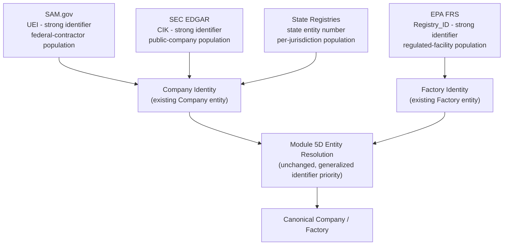
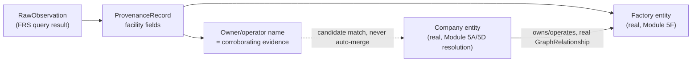
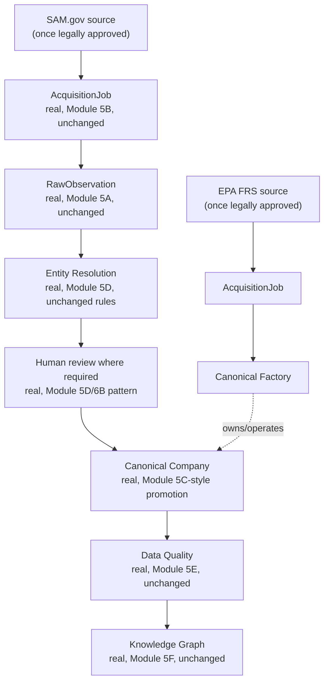
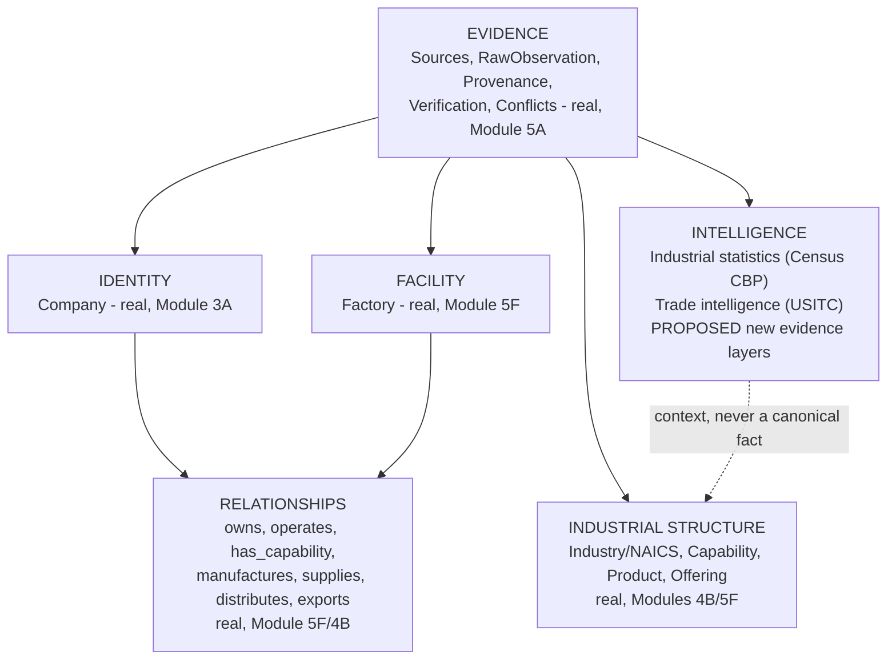
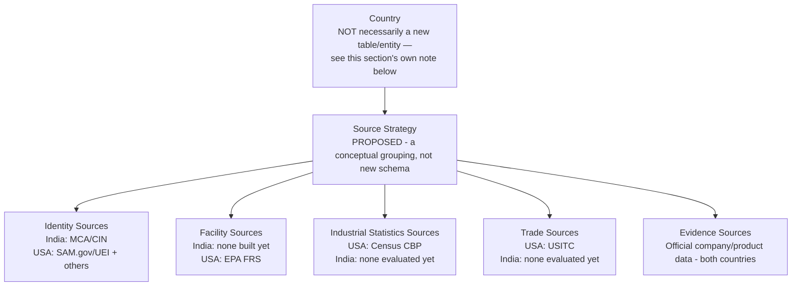

# ForgeX — Module 6C: USA-First Industrial Data Source Strategy

**Status: architecture only.** No code, migration, adapter, API client, or ingestion script was created. No data was acquired. No production `SourceRegistry` row was created. This document is the only artifact of this phase.

**Evidence basis, stated up front:** every factual claim about Census CBP, USITC DataWeb, SEC EDGAR, SAM.gov, EPA FRS, and state business registries below is drawn from real research performed during this same working session — including two *live, successful* API calls (Census CBP, using a real registered key, returning real establishment/employment/payroll data; USITC DataWeb's unauthenticated `getGlobalVars` endpoint, returning real current-period metadata) and targeted web research on the other four candidates. Anything not directly evidenced this way is explicitly marked **UNVERIFIED — requires future confirmation**, not asserted as fact.

---

## Table of Contents

1. [Executive Summary](#1-executive-summary)
2. [USA-First Rationale](#2-usa-first-rationale)
3. [Existing ForgeX Architecture](#3-existing-forgex-architecture)
4. [Lessons from India/MCA/data.gov.in](#4-lessons-from-indiamcadatagovin)
5. [The U.S. Identity-Source Problem](#5-the-us-identity-source-problem)
6. [Multi-Source Identity Architecture](#6-multi-source-identity-architecture)
7. [SAM.gov Analysis](#7-samgov-analysis)
8. [EPA FRS Analysis](#8-epa-frs-analysis)
9. [Census CBP Analysis](#9-census-cbp-analysis)
10. [SEC EDGAR Analysis](#10-sec-edgar-analysis)
11. [USITC DataWeb Analysis](#11-usitc-dataweb-analysis)
12. [Official Company / Evidence Sources](#12-official-company--evidence-sources)
13. [Source-Role Matrix](#13-source-role-matrix)
14. [Identity-Resolution Strategy](#14-identity-resolution-strategy)
15. [Factory-Resolution Strategy](#15-factory-resolution-strategy)
16. [Provenance Architecture](#16-provenance-architecture)
17. [Data-Quality Architecture](#17-data-quality-architecture)
18. [Legal / Source Governance](#18-legal--source-governance)
19. [Acquisition Architecture](#19-acquisition-architecture)
20. [Pilot Design](#20-pilot-design)
21. [USA Data-Layer Architecture](#21-usa-data-layer-architecture)
22. [Country-Extensibility Architecture](#22-country-extensibility-architecture)
23. [Global Expansion Strategy](#23-global-expansion-strategy)
24. [Data Moat](#24-data-moat)
25. [Risks and Limitations](#25-risks-and-limitations)
26. [Open Architectural Decisions](#26-open-architectural-decisions)
27. [Recommended Implementation Sequence](#27-recommended-implementation-sequence)
28. [Explicit "Not Implemented" Boundary](#28-explicit-not-implemented-boundary)

---

## 1. Executive Summary

ForgeX's India-first architecture (Modules 5C/6A/6B) was built around one structural assumption: a single national registry (MCA via data.gov.in) can serve as *the* company-identity anchor, with CIN as a strong, universal identifier. Real research performed this session, including two live-tested APIs, establishes that **no equivalent single source exists for the United States.** Five real candidates were evaluated (SAM.gov, EPA FRS, Census CBP, SEC EDGAR, USITC DataWeb) plus the general landscape of state business registries. Each plays a genuinely different, non-overlapping role. The central architectural conclusion of this document is that a USA-first strategy requires a **multi-source identity/evidence model** — not a port of the India single-source pattern — built entirely on Module 5A/5D's existing, unmodified provenance and entity-resolution mechanisms, generalized rather than replaced.

## 2. USA-First Rationale

Restated from the approving ticket, not re-litigated here: MCA/data.gov.in has never completed real legal review and remains network-unreachable from every environment tested this session (confirmed independently, multiple times, across this entire project). Rather than wait indefinitely on a blocked source, evaluating a second country gives ForgeX a real chance to prove the acquisition pipeline end-to-end. This is explicitly **not** an abandonment of the India strategy — Section 22/23 below is specifically about ensuring the USA work doesn't have to be thrown away when India (or a third country) resumes.

## 3. Existing ForgeX Architecture

Every mechanism this document proposes reusing is real, frozen, and unmodified as of this phase:

| Module | What's real and reused here |
|---|---|
| 5A — Provenance | `SourceRegistry`, `RawObservation`, `ProvenanceRecord` (7-state status), `DataConflict` — the foundation every USA source's data would flow through, unchanged |
| 5B — Acquisition | `AcquisitionJob`/`AcquisitionJobEvent`, the `SourceAdapter` abstraction, retry classification, secret redaction, source-scoped idempotency — the same pipeline shape a USA adapter would plug into |
| 5C — Source registry/adapters | `MCADataGovInAdapter` is the *pattern* to follow (real HTTP calls, real field mapping, real config validation) — not reused directly, since it's India-specific, but its shape is the template |
| 5D — Entity resolution | Deterministic, priority-ordered identity rules (exact strong identifier → domain → name+address → name → fuzzy), Company-only today — the mechanism Section 14 below extends conceptually to a *multi-identifier* U.S. reality |
| 5E — Data quality | Field-level risk/freshness classification, no composite "truth score" — the pattern Section 17 follows per-source |
| 5F — Knowledge graph | `Factory`, `Capability`, `GraphRelationship` (owns/operates/has_capability), `Offering` (manufactures/supplies/distributes/exports) — real entities this strategy's data would ultimately feed |
| 6A — Population architecture | The RAW→OBSERVED→NORMALIZED→RESOLVED→QUALITY-CHECKED→REVIEWED→VERIFIED→CANONICAL→GRAPH layer model — reused unchanged as the trust pipeline every USA fact would pass through |
| 6B — Pilot orchestration | `pilot_service.py`'s pattern (register-or-reuse source → legal gate → acquisition → entity resolution batch → reporting) — the direct template for a USA pilot orchestrator, not the same code, since the identity logic differs |

**Nothing above requires modification for this strategy to work** — the entire premise of this document is that the USA strategy is additive.

## 4. Lessons from India/MCA/data.gov.in

Three real, hard-won lessons from the India work, each directly shaping this document:

1. **Network access to a real government API cannot be assumed — it must be tested, every time, in the actual execution environment.** Confirmed repeatedly this session: `data.gov.in` returns `403` from every sandbox tested; separately, this session's own live tests of `api.census.gov` and `datawebws.usitc.gov` *succeeded* from a real Windows machine outside any sandbox. The lesson isn't "government APIs are unreachable" — it's "never claim reachability without testing it in the actual place execution will happen."
2. **A single source's field-name casing/shape should never be assumed correct until a live response is seen.** Module 5C's own adapter defended against multiple plausible field-name casings for exactly this reason, confirmed necessary in that module's own completion report. The same discipline applies to every USA source below.
3. **Legal review and technical reachability are two entirely separate questions**, and conflating them was explicitly flagged as a risk in the 6A architecture. Restated here as binding: nothing in this document should be read as a legal-approval determination for any source.

## 5. The U.S. Identity-Source Problem

**Central finding, evidenced directly this session (see the prior turn's full ranked assessment, summarized here):** no single U.S. source plays MCA's role.

| Candidate | Why it isn't a full substitute |
|---|---|
| SAM.gov | Covers only federal-contractor-eligible businesses — a self-selected population, not universal |
| EPA FRS | Covers *facilities* with an environmental-regulatory footprint, not companies generally; a clean assembly shop with no emissions permit may not appear at all |
| Census CBP | Aggregate statistics by design — cannot and must not identify individual companies (confirmed by live query: the real response returned a count and payroll total for an entire state/NAICS combination, zero company names) |
| SEC EDGAR | Covers public/securities-issuing companies — the opposite population from ForgeX's actual SME-manufacturer target segment |
| State registries | Comprehensive in principle, fragmented in practice — 51 jurisdictions, no standard schema, confirmed real examples of free-bulk states (Alaska, Colorado, Connecticut, Ohio) alongside paid-only states (Indiana, Kentucky, Maine) and at least one (Wyoming) that restricts API access entirely |

This is not a temporary gap to work around with more research — it is a structural difference between the U.S. and India's regulatory landscape, and the architecture must be designed around it as a permanent fact, not a problem to eventually solve away.

## 6. Multi-Source Identity Architecture

Proposed model — conceptual only, no schema change proposed here:



The key conceptual shift from India: **"strong identifier" is no longer a single field (CIN)** — it becomes a *set* of source-specific strong identifiers (UEI, CIK, state entity number, EPA Registry_ID), each valid only within its own source's population, combined through Module 5D's existing priority-ordering mechanism (Section 14 makes this concrete) rather than a single universal key.

## 7. SAM.gov Analysis

| Attribute | Finding | Basis |
|---|---|---|
| Source authority | General Services Administration (GSA) | Confirmed via research |
| Source role | Primary USA company/entity identity anchor candidate | This document's own conclusion |
| Entity/data type | Businesses registered to transact with the U.S. federal government | Confirmed |
| Unique identifier | **UEI** (Unique Entity Identifier) — replaced DUNS April 4, 2022; persistent for the entity's lifetime, survives name/address changes | Confirmed via research |
| Geography | National (U.S. and territories) | Confirmed |
| Classification systems | NAICS (primary + secondary codes) | Confirmed |
| Access mechanism | Official REST API, `api.sam.gov` | Confirmed |
| API/bulk/download | API confirmed; bulk "Entity Extracts" also referenced in research, not independently tested | Partially confirmed |
| Authentication | API key, requires registration | Confirmed |
| Rate limits | **UNVERIFIED — requires future confirmation.** Third-party sources cited a range (1,000/day to 1,000/hour depending on tier); the *official* government API's own documented limit was not independently confirmed this session and must not be assumed from third-party wrapper pricing pages | Not independently confirmed |
| Update frequency | Registrations require annual renewal; "Active" status is a real, meaningful freshness signal | Confirmed |
| Legal/terms status | Publicly designated for reuse per research; **full legal review not performed — pending, per Section 18** | Partially confirmed |
| Provenance requirements | Standard — source + observation + UEI + retrieval timestamp | This document's proposal |
| Reliability | High for the population it covers — this is the entity's own authoritative federal registration | Confirmed |
| Coverage | **Federal-contractor-eligible businesses only** — not a universal U.S. business registry | Confirmed, explicitly restated per this ticket's own instruction |
| Known gaps | Real, confirmed data-quality gap: approximately 28% of registered entities (≈243K of ≈873K, per one research source) have no NAICS on file — **UNVERIFIED, single-source figure, treat as directional not exact** | Partially confirmed |
| Entity-resolution value | High, for the population covered — UEI is exactly the shape of strong identifier Module 5D's priority-1 tier expects |
| Expected ForgeX destination | `Company` (identity anchor role) |

**Practical acquisition process, as found:** register a business entity in SAM.gov (the *consumer* must itself be a registered entity — a real, unusual requirement compared to MCA's simpler API-key signup), wait for entity approval (documented as up to 10 business days), then separately request and be approved for an API-access role (documented as an additional 1–2 weeks). **This is real, first-time friction that does not recur** — once granted, the API key itself functions like any other.

**How UEI participates in the existing 5D hierarchy:** proposed as a new "strong identifier" tier, evaluated with the same rigor CIN receives today — an exact UEI match reaches the equivalent of `AUTO_MATCH`; nothing weaker does. This requires no change to Module 5D's *rules*, only recognizing a second strong-identifier type alongside CIN — a generalization Section 14 makes explicit.

## 8. EPA FRS Analysis

| Attribute | Finding | Basis |
|---|---|---|
| Source authority | U.S. Environmental Protection Agency | Confirmed |
| Source role | Facility/factory identity and enrichment layer | This document's conclusion |
| Entity/data type | Physical facilities/sites subject to environmental regulation or of environmental interest — **not companies as legal entities** | Confirmed |
| `Registry_ID` | FRS's own persistent, deduplicated facility identifier — FRS runs a real internal conflation process across many EPA program databases (ICIS-AIR, RCRAInfo, NPDES, and others) to assign one ID per real-world facility | Confirmed |
| Facility name | Yes | Confirmed |
| Owner/operator | Yes — FRS explicitly links a facility to the corporation name that owns/operates it | Confirmed, and the single most valuable finding for the Company↔Factory bridge |
| Physical address | Yes | Confirmed |
| Latitude/longitude | Yes — real geocoding, using rooftop and map-interpolation methods where a direct address isn't available | Confirmed, and unique among all five candidates |
| NAICS | Yes | Confirmed |
| SIC | Yes | Confirmed |
| Facility status | **UNVERIFIED** — not directly confirmed whether an explicit active/inactive flag exists per facility; requires future confirmation against a real response |
| Geographic coverage | National — real per-state and national bulk files confirmed | Confirmed |
| API | Free, public REST API (`ofmpub.epa.gov/frs_public2/...`), **no key required for the query side** | Confirmed — the lowest-friction access of any candidate researched |
| Bulk downloads | Confirmed real — per-state CSV files and a single national ZIP (223MB, per one dated source; likely larger currently, not independently re-confirmed) |
| Update behavior | **UNVERIFIED** — real update cadence not independently confirmed this session; bulk files found were dated, suggesting periodic (not real-time) refresh |
| Legal/terms | U.S. government work, public domain per research — **full legal review pending, per Section 18** | Partially confirmed |

**Coverage limitation, restated plainly per this ticket's own instruction not to assume universality:** FRS coverage is driven by which EPA regulatory programs a facility triggers (air emissions, water discharge, hazardous waste, and others). A genuinely real manufacturing facility with no such footprint may not appear in FRS at all. This is a real, structural gap, not a data-quality issue to fix.

**How FRS connects Company → Factory through the existing graph/provenance architecture:** proposed, conceptual only —



The owner/operator name from FRS is proposed as a **corroborating signal for Company matching**, never a direct auto-merge trigger — matching Module 5D's own real, existing "name alone is never sufficient for AUTO_MATCH" rule, applied here to a name arriving from a new source rather than a new rule.

## 9. Census CBP Analysis

**Role: INDUSTRIAL STATISTICS — confirmed, live-tested this session, not merely documented.**

Real query executed and confirmed successful: `api.census.gov/data/2023/cbp?get=ESTAB,EMP,PAYANN,NAICS2017_LABEL,NAME&for=state:06&NAICS2017=333&key=<real key>` returned, verbatim: **2,094 establishments, 68,874 employees, $7,296,051 thousand ($7.296 billion) annual payroll**, for NAICS 333 (Machinery Manufacturing) in California. This is real, structured, live data — the header row and data row both confirmed by direct observation.

| Dimension | Finding |
|---|---|
| Entity identified | **None** — this is a count/aggregate for a (geography × NAICS) combination, not any individual entity |
| Legal/company name | **Never present, by design** — disclosure-avoidance rules structurally prevent this |
| Unique identifier | N/A — no entity-level identifier exists in this data |
| Fields confirmed | `ESTAB`, `EMP`, `PAYQTR1`, `PAYANN`, `LFO`, `NAICS2017` (2–6 digit), geography (state/county/MSA/CSA/ZIP/congressional district) |
| Update frequency | Annual, with a real, confirmed ~18-month lag — most recent available data is reference year **2023**, released mid-2025 |
| API/access | Free, real API key required for anything beyond a small unauthenticated allowance (confirmed: the first attempt this session without a key returned a real "Missing Key" error page, not fabricated data) |
| Legal/terms | U.S. government work, public domain — favorable, matching MCA's own tier; **not independently legally reviewed for ForgeX's specific reuse** |
| Known operational risk, found live this session | `census.gov`'s own site currently displays a notice that portions are not being updated "due to the lapse of federal funding" — a real, current operational risk, not something to assume is permanent or temporary |

**How CBP statistics should conceptually attach to the ForgeX industrial landscape:** proposed as a new, separate **Industrial Statistics** evidence layer — never attached to any individual `Company` row. A plausible future use (not designed further here, no schema proposed): a read-only, geography×NAICS-scoped context panel ("this NAICS/county combination has N establishments, average payroll $X") shown alongside search results — informational context, never a canonical fact about any specific company.

## 10. SEC EDGAR Analysis

**Role: public-company enrichment/corroboration only — never primary population, per this ticket's explicit instruction.**

| Dimension | Finding |
|---|---|
| Entity identified | Companies that file with the SEC — overwhelmingly public/securities-issuing entities |
| Unique identifier | **CIK** — SEC-assigned, persistent, stable |
| Legal name | Yes, plus former names |
| Address | Yes — business and mailing |
| Classification | SIC (older, coarser than NAICS) |
| Website/contact | Phone reliably present; website inconsistent |
| API/access | Free, no API key, **but requires a `User-Agent` header identifying a real contact (name/email)** — confirmed via research; requests without one are documented to receive `403` |
| Update frequency | Real-time as filings are disseminated — the freshest candidate researched |
| Legal/terms | U.S. government work, public domain |
| Bulk access | Real, confirmed — `submissions.zip` and `companyfacts.zip` full exports exist |

**How CIK supports entity resolution:** proposed as a second, source-scoped strong identifier (alongside UEI and Registry_ID), used exclusively as *corroboration* for a company already identified through SAM.gov or another primary source — e.g., a company already resolved via UEI, whose SEC filings (if any) are then attached as additional, freshness-advantaged evidence for fields like legal name and address. **Never proposed as a population source**, exactly matching this ticket's instruction.

## 11. USITC DataWeb Analysis

**Role: international trade intelligence — confirmed live-reachable this session (the `getGlobalVars` endpoint returned real, current metadata: `currentYear: 2026`, `currentFullReportingYear: 2025`), but the authenticated saved-query flow was explicitly paused before full validation, per this session's own prior instruction.**

| Dimension | Finding |
|---|---|
| Commodity/product classification | HTS, SITC, NAICS, and a "Commodity Translation Wizard" between them — confirmed via research |
| Company/entity data | **None in the public API** — this is the strongest "no company identity" finding of any candidate; import/export transaction-level company attribution is separately confidential Census Bureau data, not exposed here at all |
| Trade flows | Imports for consumption, general imports, domestic exports, foreign exports/re-exports, total exports, trade balance |
| Time granularity | Monthly, quarterly, annual, year-to-date, custom periods |
| Value/quantity | Both, with a real, documented caveat: some quantity fields are flagged when underlying data is confidentiality-suppressed |
| API access | Requires a DataWeb account; **API keys expire every 6 months and do not auto-renew** — a real, confirmed operational/maintenance fact, distinct from every other candidate researched |
| Access pattern | Primary method is retrieving a previously **saved query** — built via the MFA-gated (Login.gov) web UI first, then fetched by ID via API. This is real, meaningful friction not present in any other candidate's access model |

**Conceptual relationship, proposed:** trade records relate to ForgeX's `Product`/`ProductCategory` entities via HTS↔NAICS concordance (a real, existing translation the source itself provides) — never to `Company` directly, since no company identity exists in this data at all. USITC data is proposed strictly as a **product/commodity-level market-context layer**, analogous in role to Census CBP but for trade flow rather than domestic establishment counts.

## 12. Official Company / Evidence Sources

Restated from the approved 6A architecture, unchanged: company websites, product catalogues, and self-submitted data remain real, legitimate evidence sources for product/offering/capability/factory enrichment — not addressed further here since Module 6A already designed this category, and nothing about a USA focus changes that design.

## 13. Source-Role Matrix

| Source | Role | Identifies companies? | Identifies facilities? | ForgeX destination |
|---|---|---|---|---|
| SAM.gov | Identity anchor | Yes (federal-contractor population) | No | `Company` |
| EPA FRS | Facility layer | No (owner name only, as corroboration) | Yes | `Factory`, corroborates `Company` |
| Census CBP | Industrial statistics | No — structurally prevented | No | New "industrial statistics" evidence layer, never attached to a specific `Company` |
| SEC EDGAR | Enrichment/corroboration | Yes (public-company population, corroboration only) | No | Enriches existing `Company` records |
| USITC DataWeb | Trade intelligence | No | No | New "trade intelligence" evidence layer, attached to `Product`/`ProductCategory` via HTS↔NAICS |
| State registries | Deferred | Yes, per-jurisdiction | No | Future `Company` identity, deferred per Section 5's fragmentation finding |

## 14. Identity-Resolution Strategy

Extends Module 5D's real, unmodified priority-ordered rule sequence — **no rule is weakened, no automatic merge is introduced.**

```
1. Exact strong source identifier match (UEI, CIK, EPA Registry_ID, CIN for India)
   → the ONLY tier reaching the equivalent of AUTO_MATCH, exactly as CIN alone does today
2. Exact cross-source identifier match (same identifier value corroborated by a second source)
   → REVIEW_REQUIRED, exactly as Module 5D already treats this tier today
3. Verified domain
   → REVIEW_REQUIRED
4. Name + strong address match
   → REVIEW_REQUIRED
5. Name alone
   → REVIEW_REQUIRED
6. Fuzzy similarity
   → REVIEW_REQUIRED, weakest tier, never sufficient alone
```

**The generalization this document proposes:** tier 1 becomes a *set* of strong identifiers rather than one universal field. A conflicting identifier — e.g., a UEI match disagreeing with a separately-matched CIK for what looks like the same company — is proposed to route to `REVIEW_REQUIRED`/conflict, exactly mirroring Module 5D's existing "conflicting CIN never auto-merges" rule, generalized to any pair of strong identifiers. **No schema change is proposed for this** — it's a rule-sequence extension within the existing `EntityResolutionCandidate` model's real, existing state machine.

**Company identity vs. facility identity vs. source-specific identifier — kept explicitly distinct:** a UEI or CIK identifies a *company*; an EPA `Registry_ID` identifies a *facility*, which may or may not be traceable to a specific company via the owner/operator name. These are never conflated — a facility match is never treated as a company match, matching Section 15 below.

## 15. Factory-Resolution Strategy

Proposed, extending Module 5F's real, frozen `Factory` entity conceptually:

1. An EPA FRS facility record becomes a `RawObservation`, exactly as any other source's data would.
2. Its `Registry_ID` becomes the strong identifier for *that facility* specifically — not for any company.
3. Its owner/operator name is proposed as **corroborating evidence for Company matching only** — never sufficient alone (Section 8/14).
4. Once a `Factory` and its owning `Company` are both independently resolved, the real, existing `GraphRelationship` (`owns`/`operates`, Module 5F) connects them — exactly the same mechanism used today, no new relationship type required.

This is a genuinely new capability for ForgeX overall (the India architecture never had a facility-level data source at all) — worth naming explicitly as new value this strategy adds, not merely a USA-specific detail.

## 16. Provenance Architecture

**No change proposed to `provenance_records`**, per this ticket's explicit instruction and Module 6B's own established precedent (the same table was left completely untouched when Module 5F needed relationship-level evidence — a new, separate mechanism was built instead, per that module's own real, documented decision). Every fact from every USA source flows through the identical real pipeline: `SourceRegistry` → `RawObservation` → `ProvenanceRecord` (OBSERVED/EXTRACTED/CLAIMED/UNDER_REVIEW/VERIFIED/REJECTED/EXPIRED, unchanged) → `DataConflict` where sources disagree. Relationship-level facts (e.g., `owns`/`operates` between a resolved Company and Factory) use Module 5F's own separate, already-built mechanism — restated here, not redesigned.

## 17. Data-Quality Architecture

Per-source quality signals, all field-level (Module 5E's real, unmodified pattern — no composite score proposed anywhere in this document):

| Source | Proposed quality signals |
|---|---|
| SAM.gov | UEI validity, active/inactive registration status, NAICS presence (given the confirmed ~28% gap), address completeness |
| EPA FRS | `Registry_ID` validity, presence/precision of geocoding, whether an owner/operator name is present, NAICS/SIC presence |
| Census CBP | Geography-code validity, NAICS validity, reference-year consistency, and — critically — a structural flag that this is *always* aggregate/statistical, never entity-level, enforced by the destination model itself (Section 9/13), not a data-quality check |
| SEC EDGAR | CIK validity, filing recency (a real freshness signal, since filings are timestamped), name consistency across filings |
| USITC DataWeb | Classification (HTS/NAICS) validity, period validity, country-code validity, and honoring the source's own suppressed-quantity flags rather than treating a suppressed value as zero |

No numeric thresholds are proposed here beyond what Module 5E's real, existing category-based freshness policy already defines — any new threshold would be explicitly labeled proposed, not implied as settled, per this ticket's own instruction. **None are proposed in this document; that determination is deferred to implementation.**

## 18. Legal / Source Governance

Extends the framework 6A already proposed (`DISCOVERED`/`UNDER_REVIEW`/`APPROVED`/`RESTRICTED`/`REJECTED`/`EXPIRED`, mapped onto `SourceRegistry.collection_policy_status`'s real, existing enum) — restated here per-source, with the explicit distinctions this ticket requires kept separate:

| Source | Technically accessible | Publicly available | Automated retrieval permitted | Storage/redistribution permitted | Attribution required | Commercial-use restricted | Legal status |
|---|---|---|---|---|---|---|---|
| SAM.gov | Yes (confirmed access process) | Yes | **UNVERIFIED** — pending review | **UNVERIFIED** — pending review | **UNVERIFIED** | **UNVERIFIED** | `PENDING_LEGAL_REVIEW` (proposed) |
| EPA FRS | Yes (confirmed, live) | Yes | Likely favorable (public-domain government work per research) — **not a legal conclusion** | **UNVERIFIED** | **UNVERIFIED** | **UNVERIFIED** | `PENDING_LEGAL_REVIEW` (proposed) |
| Census CBP | Yes (confirmed, live, successful query) | Yes | Likely favorable — **not a legal conclusion** | **UNVERIFIED** | **UNVERIFIED** | **UNVERIFIED** | `PENDING_LEGAL_REVIEW` (proposed) |
| SEC EDGAR | Yes (confirmed via research) | Yes | Likely favorable — **not a legal conclusion** | **UNVERIFIED** | Real, confirmed requirement: `User-Agent` must identify a real contact | **UNVERIFIED** | `PENDING_LEGAL_REVIEW` (proposed) |
| USITC DataWeb | Yes (confirmed, live) | Yes | **UNVERIFIED** — the saved-query authenticated flow was never exercised | **UNVERIFIED** | **UNVERIFIED** | **UNVERIFIED** | `PENDING_LEGAL_REVIEW` (proposed) |

**Restated as this section's own governing rule, per the ticket's own explicit instruction: technical accessibility (confirmed, in several cases live) is never treated as legal approval anywhere in this table.** Every source above sits at `PENDING_LEGAL_REVIEW` — a proposed status, not an implemented one, since no `SourceRegistry` row was created this phase.

## 19. Acquisition Architecture

No new acquisition framework proposed — Module 5B's real `AcquisitionJob`/`SourceAdapter`/retry/idempotency mechanisms are reused exactly as `MCADataGovInAdapter` already demonstrates the pattern. A future (not built here) `SAMGovAdapter`, `EPAFRSAdapter`, `CensusCBPAdapter`, `SECEdgarAdapter`, and `USITCDataWebAdapter` would each be a new, independent `SourceAdapter` subclass, registered in the existing `app.collectors.registry` — the exact same extension point Module 5C already used, requiring zero change to Module 5B itself.

## 20. Pilot Design

**Conceptual only — no adapter exists yet, so no pilot can run this phase.** Proposed shape, extending Module 6B's own real, tested orchestration pattern (`pilot_service.py`):



**Realistic pilot scope, not fabricated:** proposed at the same conservative order of magnitude Module 6B's own approved pilot used (25–50 companies) — deliberately not a larger number, since the actual record counts genuinely available from SAM.gov within any given NAICS/geography scope are not yet known and should not be estimated without a real, live query first (which itself would require legal approval to run beyond a connectivity check).

## 21. USA Data-Layer Architecture



No entity in this diagram is new except the two explicitly-proposed "Intelligence" evidence layers (Census CBP, USITC) — everything else is real, frozen infrastructure from Modules 3A–5F.

## 22. Country-Extensibility Architecture



**Per this ticket's own explicit instruction, no `Country` entity/table is proposed as required.** `SourceRegistry` already carries a real `geographic_scope` field (confirmed real and used in Module 5C's own MCA source registration) — this may already be sufficient to distinguish India-scoped from USA-scoped sources without any new schema at all. Whether a fuller `Country`-as-entity concept is ever needed is explicitly left as an open decision (Section 26), not decided here.

**What must NOT be assumed uniform across countries**, restated directly per the ticket: a national company registry (India has one via MCA; the USA structurally does not), a single strong universal identifier (CIN vs. USA's fragmented UEI/CIK/state-identifier reality), facility-level data (EPA FRS has no confirmed India equivalent), industrial statistics (Census CBP has no confirmed India equivalent), and trade data (USITC has no confirmed India equivalent). Each country's source strategy is genuinely, structurally different — the architecture accommodates this by keeping identity/facility/statistics/trade as separate, independently-optional source *roles* per country, never assuming all four exist everywhere.

## 23. Global Expansion Strategy

What stays global/core, unchanged regardless of country: `SourceRegistry`, `RawObservation`, `ProvenanceRecord`, `DataConflict` (Module 5A); `AcquisitionJob`/`SourceAdapter` (Module 5B); the entity-resolution *rule engine* itself (Module 5D — the priority-ordering logic, not any specific identifier); the data-quality *mechanism* (Module 5E); `Company`/`Product`/`Offering`/`Factory`/`Capability`/`GraphRelationship` (Modules 3A–5F). What becomes country-specific: which concrete identifiers count as "strong" (CIN for India, UEI/CIK/Registry_ID for USA), which source adapters exist, and each source's own legal-review status. This is exactly the same generalization Section 14 already makes for identity resolution, restated as the governing principle for the whole strategy.

## 24. Data Moat

**Restated directly, per this ticket's explicit instruction not to overclaim:** every source evaluated in this document is public government data. Acquiring it, however completely, does not itself constitute a defensible moat — any competitor with comparable engineering effort could replicate the same acquisition pipeline against the same public sources. This is the identical conclusion Module 6A's own architecture document already reached for the India strategy, restated here because it applies with equal force to a USA-first approach — a second country does not change the underlying economics of public-data acquisition.

**The real, durable moat, unchanged from 6A's own analysis:** the verified entity graph (which facts were actually confirmed, by whom, against what evidence — not just collected), the accumulated provenance and conflict-resolution history, and — the components that don't exist from any public source at all — RFQ history, supplier responses, match outcomes, customer interactions, and historical supplier performance. These remain entirely dependent on real ForgeX platform usage, not on which country's public data was acquired first.

## 25. Risks and Limitations

| Risk | Level | Note |
|---|---|---|
| Legal/licensing uncertainty across 5 sources simultaneously | **CRITICAL** | None of the 5 candidates has completed real legal review; this document explicitly defers all 5, per Section 18 |
| Multi-source identity resolution complexity | **HIGH** | A genuinely new class of problem for ForgeX — Module 5D has never resolved identity across more than one strong-identifier type before; Section 14's proposed generalization is conceptual, unvalidated against real data |
| SAM.gov access friction (2–4 week approval process) | **MEDIUM** | Real, confirmed, one-time cost — not a recurring operational risk, but a real planning constraint |
| USITC's authenticated saved-query flow remains unvalidated | **MEDIUM** | This document cannot assess practical feasibility of that access pattern until it's actually exercised |
| Census/USITC federal-funding-lapse-related operational instability | **MEDIUM** | A real, current, live-observed condition (Section 9) — not assumed to be permanent, but not assumed resolved either |
| Coverage gaps compounding across sources | **HIGH** | SAM.gov (contractor-only) + EPA FRS (regulated-facility-only) + SEC EDGAR (public-company-only) together still may not cover a genuinely real, relevant SME manufacturer with no federal contracts, no significant environmental permitting, and no public listing — a real, structural coverage risk this document does not resolve |
| Field-name/schema drift between documented and actual API responses | **MEDIUM** | Directly evidenced this session for MCA (Module 5C's own real finding); the same discipline (defend against multiple plausible casings, verify against a real live response before trusting documentation) must apply to every USA source before implementation |

## 26. Open Architectural Decisions

Explicitly left open, not resolved in this document:

1. Whether `Country` needs to become a first-class entity/table, or whether `SourceRegistry.geographic_scope` remains sufficient (Section 22).
2. The precise mechanism for Module 5D's proposed multi-identifier generalization (Section 14) — conceptual here, not designed at the schema/service level.
3. Whether Census CBP/USITC DataWeb's proposed new "evidence layer" role requires new schema at all, or can be represented within existing `ProvenanceRecord`/`SourceRegistry` shapes — not determined here.
4. The real, current SAM.gov API rate limit (Section 7) — requires direct confirmation against official documentation, not third-party wrapper pricing pages.
5. Whether EPA FRS exposes an explicit facility active/inactive status field (Section 8) — requires a real live query to confirm.
6. Sequencing between completing India's outstanding legal review (Module 5C's own still-open item) versus proceeding with USA legal review in parallel — a resourcing decision outside this document's own scope.

## 27. Recommended Implementation Sequence

Evaluated, not accepted blindly, per this ticket's own instruction:

The ticket's own proposed order (SAM → FRS → CBP → EDGAR → USITC → official evidence) is **broadly correct and is recommended, with one clarification**: SAM.gov and EPA FRS should be pursued **in parallel, not strictly sequentially**, since they serve genuinely independent roles (Company identity vs. Factory identity) with no real dependency between them — nothing about resolving a Company via SAM.gov is a prerequisite for resolving a Factory via EPA FRS, or vice versa. Census CBP, SEC EDGAR, and USITC are correctly sequenced after both, since all three are enrichment/context layers that only become meaningful once real Company/Factory records exist to attach context to.

| Step | Scope |
|---|---|
| 6C.1 | Complete legal review for SAM.gov and EPA FRS (parallel) |
| 6C.2 | Build `SAMGovAdapter` and `EPAFRSAdapter` (parallel), following `MCADataGovInAdapter`'s established pattern |
| 6C.3 | Extend Module 5D's identifier-priority logic to support multiple strong-identifier types (Section 14) |
| 6C.4 | Run a controlled pilot (Section 20), same conservative scale as Module 6B's own approved pilot |
| 6C.5 | Legal review + adapter for Census CBP (industrial-statistics enrichment) |
| 6C.6 | Legal review + adapter for SEC EDGAR (public-company enrichment) |
| 6C.7 | Legal review + full authenticated-flow validation, then adapter, for USITC DataWeb (trade intelligence) |
| 6C.8 | Official company/product/capability evidence sources, per the existing 6A design |

## 28. Explicit "Not Implemented" Boundary

Confirmed directly: no code, migration, adapter, API client, or ingestion script was created this phase. No `SourceRegistry` row was created. No mass API calls were run beyond the two individual, human-initiated, single-query connectivity/validation tests already performed and reported in the prior turn of this session (one real Census CBP query, one real USITC `getGlobalVars` call) — both were single, deliberate, human-run validation checks, not automated or repeated acquisition. This document is the only artifact of Module 6C.

**Stop. Wait for explicit approval before Module 6D or any implementation.**
