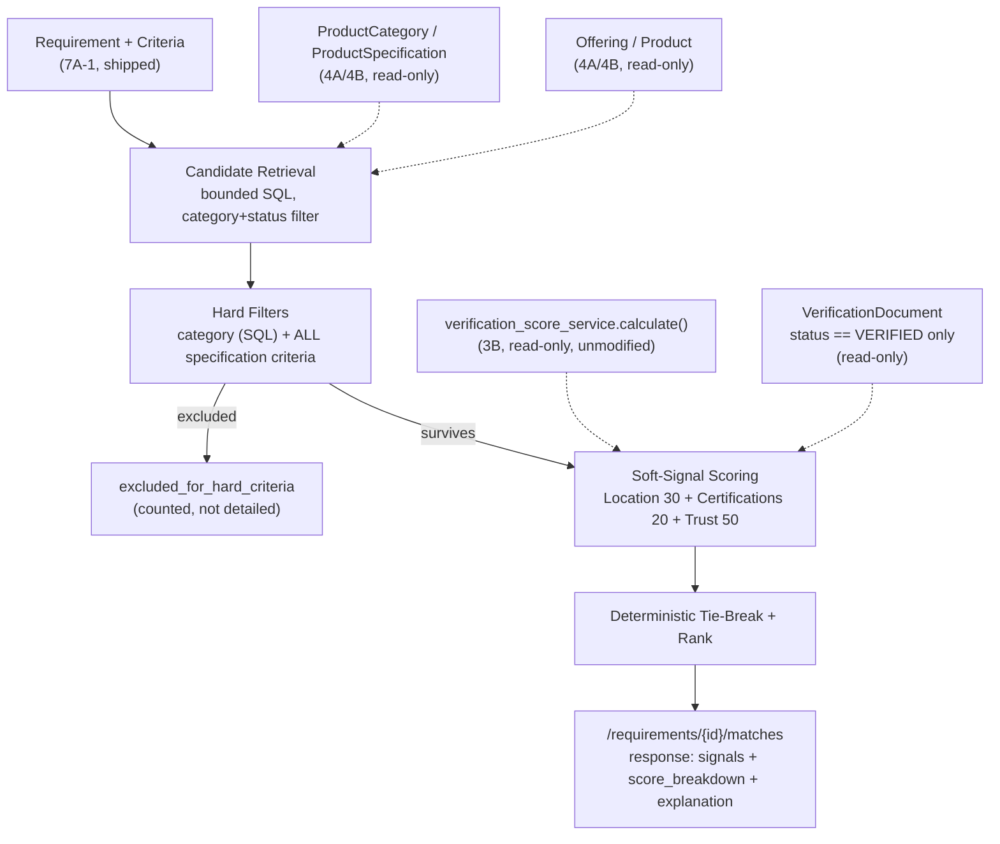

# ForgeX — Module 7A: Requirement Intelligence

**Status: 7A-1 shipped and committed (`6d1e89d`). 7A-2 is an approved design, not yet implemented.** This document is written after 7A-1 already exists in the repository — every claim about 7A-1 in this document was checked against the real code, not written from the original plan. 7A-2's content is the reviewed, decision-locked design this repository will implement next; it is not itself code, and nothing described here exists yet except where explicitly marked "shipped."

---

## Table of Contents

1. [Executive Summary](#1-executive-summary)
2. [Origin — the Phase 4A Requirement Object Vision](#2-origin--the-phase-4a-requirement-object-vision)
3. [7A-1 — As Actually Shipped](#3-7a-1--as-actually-shipped)
4. [7A-2 — Approved Design](#4-7a-2--approved-design)
5. [Candidate Retrieval](#5-candidate-retrieval)
6. [Matching Signals](#6-matching-signals)
7. [The Fact → Evidence → Signal → Score Contribution → Explanation Contract](#7-the-fact--evidence--signal--score-contribution--explanation-contract)
8. [Scoring Formula](#8-scoring-formula)
9. [Certification Matching — Deliberately Conservative](#9-certification-matching--deliberately-conservative)
10. [Trust Integration — Read-Only](#10-trust-integration--read-only)
11. [No-Category Behavior](#11-no-category-behavior)
12. [Tie-Breaking](#12-tie-breaking)
13. [API Contract](#13-api-contract)
14. [Explicit Non-Scope](#14-explicit-non-scope)
15. [Global-Extensibility Statement](#15-global-extensibility-statement)
16. [Known v1 Limitations, Stated Plainly](#16-known-v1-limitations-stated-plainly)
17. [Testing Strategy](#17-testing-strategy)
18. [Open Decisions Log](#18-open-decisions-log)
19. [Implementation Sequence](#19-implementation-sequence)

---

## 1. Executive Summary

Requirement Intelligence is ForgeX's mechanism for turning a buyer's stated need into a ranked, evidence-backed list of real suppliers — the demand-side counterpart to every supply-side module built through 6D. 7A-1 (shipped) gives a `Requirement` somewhere real to live. 7A-2 (this document's design) is what makes that `Requirement` do something: read the existing canonical Product/Offering/Company graph, apply deterministic hard filters and a fixed, auditable scoring formula, and return results where every point of every score traces back to a real, citable fact already in the database. No LLM, no embeddings, no fabricated evidence, no black-box ranking — consistent with every trust-pipeline decision made from Module 5A onward.

## 2. Origin — the Phase 4A Requirement Object Vision

`docs/product/phase-4a-industrial-product-graph-architecture.md` §8 ("Recommendation Inputs") is the earliest statement of this idea: a `RequirementObject` (category/spec/certification/location) combined with a Company's Trust Score, producing a ranked, explainable result. That document assumed a `RequirementObject` would exist by the time Product/Offering matching was needed. It did not, until 7A-1. Everything in this document is the first real implementation of that original vision — roughly two modules later than originally assumed, and built against the *actual* Product/Offering/Company/verification schema that exists today, not the one imagined in Phase 4A.

## 3. 7A-1 — As Actually Shipped

Verified against the real repository at commit `6d1e89d`, not the original plan.

**Models** (`app/models/requirement.py`):
- `Requirement` — `id, created_by (FK users, CASCADE), raw_query, product_category_id (FK product_categories, SET NULL, nullable), industry, country, state, city, certifications (JSONB list[str]), quantity, budget, timeline, status (RequirementStatus), extraction_confidence, created_at, updated_at`. Composite index `(product_category_id, status)` added specifically as a seam for 7A-2.
- `RequirementSpecificationCriterion` — `id, requirement_id (FK requirements, CASCADE), specification_id (FK product_specifications, RESTRICT), operator (CriterionOperator: eq/gte/lte/range/in), value (JSONB — scalar or array depending on operator), created_at`. Unique on `(requirement_id, specification_id)`.
- `RequirementStatus`: `draft, submitted, archived` — only `submitted` is ever set by the service layer today; `draft`/`archived` are reserved for a future editing flow.

**Service** (`app/services/requirement_service.py`): persistence and validation only — category existence, specification-belongs-to-category, operator/datatype compatibility (`gte`/`lte`/`range` require a `number` or `range` specification). Contains no matching logic by design, and its own module docstring states the boundary this document formalizes in §4 below.

**API**: `POST /api/v1/requirements` (any authenticated user, mirrors `products.create_product`'s precedent), `GET /api/v1/requirements/{id}` (ownership-scoped — 404, not 403, for a non-owner, mirroring session-ownership). No `/matches` route exists yet.

**Deliberate design choice, already made**: `RequirementSpecificationCriterion.value` is JSONB, not a delimited string — a scalar for `eq`/`gte`/`lte`, a 2-element array for `range`, an N-element array for `in`. Chosen during 7A-1's own design review specifically to remain queryable and to avoid an unprecedented micro-format.

**Migration**: `0011`, additive only, verified via a real upgrade→downgrade→upgrade round-trip against Postgres, not just `Base.metadata.create_all`.

**Tests**: 22, covering creation, retrieval, ownership, category/specification validation, operator/value shape validation, and direct relationship-integrity checks.

## 4. 7A-2 — Approved Design



`requirement_matching_service.py` (new file) is the only new logic. It reads `Requirement`/`RequirementSpecificationCriterion` (7A-1), `Product`/`ProductAttribute`/`Offering` (4A/4B), and calls `verification_score_service.calculate()` (3B) as a black box. It never imports or modifies `entity_resolution/matching.py`, `data_quality_service.py`, `company_promotion_service.py`, or anything from 5A–6D.

## 5. Candidate Retrieval

**Category boundary — exact match only.** `Product.category_id == Requirement.product_category_id`. No category-tree traversal: `ProductSpecification` is scoped to exactly one category with no inheritance mechanism, so a criterion built against one category has no guaranteed meaning for a descendant category. Tree expansion is a named future extension point, not built now.

**Filters**: `Product.status == PUBLISHED`, `Offering.status == ACTIVE` — reusing `product_service.search_products`'s and `offering_service`'s existing filters exactly, not a new policy.

**Query shape:**
```sql
SELECT offerings.*, products.*, companies.*
FROM offerings
JOIN products  ON offerings.product_id = products.id
JOIN companies ON offerings.company_id = companies.id
WHERE products.category_id = :requirement_category_id
  AND products.status = 'published'
  AND offerings.status = 'active'
ORDER BY offerings.created_at ASC, offerings.id ASC
LIMIT :candidate_ceiling   -- 500
```

**Indexes**: `ix_products_category_id` and `ix_offerings_country` already exist (confirmed against migration `0005` before this document was written — no new index migration required for 7A-2).

**Candidate retrieval vs. execution/work-budget bound — formally distinct concepts.** The *candidate universe* (every real offering matching category+status) may be arbitrarily large at global scale. *Candidate retrieval* is the mechanism that pulls a bounded working set from that universe — v1 uses a single `LIMIT 500` SQL query, a simple safety-first mechanism, never a claim about the universe's true size. The *execution/work-budget bound* is the separate concept of how much scoring work one request may do; v1 sets it equal to the retrieval bound, but a future retrieval strategy (more filters pushed into SQL before the limit, or cursor-based batching) could change which 500 get scored without changing the work-budget concept at all. This distinction must survive into the response contract, not stay implicit — see `more_candidates_may_exist` in §13.

## 6. Matching Signals

| Signal | Type | Fact | Evidence source |
|---|---|---|---|
| Category | Hard filter (SQL) | `Product.category_id` | The `Product` row |
| Specification criteria | Hard filter | `ProductAttribute.value` per `specification_id` | The `ProductAttribute` row, or its confirmed absence (`missing`, a third state distinct from matched/failed) |
| Location | Soft (30 pts) | `Offering.country` (primary); `Company.country/state/city` (fallback — **`Offering` has no state/city columns**, confirmed against the real model) | The `Offering` / `Company` row |
| Certifications | Soft (20 pts), low-confidence | `VerificationDocument` with matching `document_type` correspondence and `status == VERIFIED` only | The `VerificationDocument` row, or its confirmed absence |
| Company trust tier | Soft (50 pts) | `VerificationScore.level` | `verification_score_service.calculate(db, company)`'s live output — the underlying documents are that service's own internal concern, not re-derived here |

**All submitted specification criteria are mandatory in v1** — `RequirementSpecificationCriterion` has no required/preferred distinction in the 7A-1 schema, and none is added here. This is a stated v1 limitation (§16), not a permanent stance; a future `required: bool` column is the named extension point, requiring its own migration and its own review.

`Offering.verification_status` and `ProvenanceRecord` freshness were both considered and excluded from v1 — the former carries no real information today (no admin-review workflow ever sets it away from `unverified`), the latter is a valid future signal with no current evidence it's needed.

## 7. The Fact → Evidence → Signal → Score Contribution → Explanation Contract

Mandatory for every signal evaluator in the implementation — not descriptive prose, a structural rule. No evaluator may return a positive score contribution without a citable Evidence row. Absence of evidence produces exactly `0` points and a `missing`/`not found` label — never inferred, never a default-positive.

| Stage | Meaning |
|---|---|
| **Fact** | The canonical stored data point being checked |
| **Evidence** | The specific row(s) that prove the Fact, or its confirmed absence |
| **Signal** | The derived comparison against what the Requirement asked for |
| **Score Contribution** | Numeric points per the weight table (§8) |
| **Explanation** | A human-readable string that cites the Evidence directly |

Example (location, country only): Fact = `Offering.country`; Evidence = the `Offering` row; Signal = `country_matched: true`; Score Contribution = `15/30`; Explanation = `"Requested Germany; candidate offering is located in Germany."`

**v1 clarification:** the Explanation stage is satisfied by each signal's own structured fields in the §13 response, not by a separate free-text string. `location` exposes `requested`/`candidate`; `certifications` exposes `requested`/`evidence_found`/`note`; `criteria` exposes `candidate_value`/`status`; `trust_tier` exposes `level`. Each is self-describing and cites its Evidence by construction (the actual requested/candidate values, not a narrative sentence) — there is no additional generic `explanation` string field anywhere in the v1 JSON contract.

## 8. Scoring Formula

```
applicable_weight = 50                                    # trust — always applicable
                   + 30 if requirement specifies any location field
                   + 20 if requirement specifies any certifications

trust_points        = {unverified:0, email_verified:12.5, business_verified:25,
                        factory_verified:37.5, premium_verified:50}[level]
location_points     = 15 (country match)
                     + 10 (state match, only if country also matched)
                     + 5  (city match, only if state also matched)
certification_points = 20 × (certifications_with_VERIFIED_evidence / certifications_requested)

final_score = (trust_points + location_points + certification_points) / applicable_weight × 100
```

Always 0–100, always reproducible (pure function of current DB state, no randomness, no wall-clock dependency). Category and every specification criterion are evaluated as hard gates *before* this formula runs; a candidate failing any one never reaches it.

**Why trust is weighted highest (50 of 100 points):** ForgeX's stated moat is verified evidence, not catalog size. A location or certification match tells a buyer "this candidate is plausible"; the trust tier tells them "this candidate's entire profile has been substantiated to a known, auditable degree." Weighting trust highest means a well-verified company with a decent location fit can outrank a geographically perfect but unverified one — the literal, intended expression of "data quality over data volume" inside a ranking formula, not just a principle stated in a document.

## 9. Certification Matching — Deliberately Conservative

**Decision (final, approved):** only `DocumentStatus.VERIFIED` counts as positive certification evidence. `PENDING`, `REJECTED`, and `EXPIRED` all contribute zero — deliberately *stricter* than `verification_score_service`'s own internal `not in (REJECTED, EXPIRED)` convention (which accepts `PENDING`, because that service answers a different question: "is this company making progress toward verification," not "can I show a buyer real proof").

**Confirmed, accepted consequence:** `DocumentStatus.VERIFIED` is only reachable through the still-unbuilt admin-review workflow (ADR-0029) — no `VerificationDocument` in this system can hold that status today. **The certification signal will therefore contribute zero positive points for every candidate until that workflow ships.** This is intentional, not a bug: a signal that cannot currently produce a false positive, accepted at the cost of currently being unable to produce a true positive either, per the explicit instruction to prefer false negatives. This rule must not be weakened later merely to make the signal "do something" — it should stay strict until real admin-reviewed evidence exists.

Certification matching is additionally always labeled low-confidence in every response regardless of match outcome, because the underlying vocabulary mismatch (`Requirement.certifications` free text vs. `DocumentType`'s closed, India-biased enum) remains unresolved — this signal degrades gracefully rather than blocking or behaving differently by region.

## 10. Trust Integration — Read-Only

```python
score = await verification_score_service.calculate(db, company)
level = score.level  # VerificationLevel — the only field 7A-2 reads
```
Confirmed real signature. Zero modification to `verification_score_service.py`. 7A-2 never re-derives what the underlying documents/fields are that produced `level` — that remains entirely `verification_score_service`'s own concern.

## 11. No-Category Behavior

`Requirement.product_category_id IS NULL` → `GET .../matches` returns HTTP `200`:
```json
{"status": "category_required", "matches": [], "total_candidates_considered": 0, "returned_count": 0}
```
Never an unbounded global scan, never a silent empty-list that could be misread as "zero real matches."

## 12. Tie-Breaking

Deterministic, total ordering: `final_score DESC`, then `trust_tier DESC` (explicit secondary break for exact-score ties), then `Offering.created_at ASC`, then `Offering.id ASC`. Identical output on every run against unchanged data.

## 13. API Contract

`GET /api/v1/requirements/{id}/matches` — same ownership-scoped auth as `GET /requirements/{id}` (404, not 403, for a non-owner). Returns every surviving candidate from the bounded candidate working set, ranked — no pagination, no additional output cap beyond the 500-candidate retrieval ceiling (Option B, decided during 7A-2 review; superseded an earlier draft of this document that described this endpoint as paginated).

```json
{
  "success": true,
  "data": {
    "requirement_id": "...",
    "status": "computed",
    "total_candidates_considered": 42,
    "more_candidates_may_exist": false,
    "excluded_for_hard_criteria": 5,
    "returned_count": 10,
    "matches": [
      {
        "offering_id": "...",
        "rank": 1,
        "score": 87.5,
        "company": {"id": "...", "name": "...", "slug": "...", "verification_level": "business_verified"},
        "product": {"id": "...", "name": "...", "slug": "..."},
        "signals": {
          "category": {"matched": true},
          "criteria": [
            {"specification_id": "...", "specification_name": "Power", "operator": "gte",
             "requirement_value": 5.0, "candidate_value": "7.5", "status": "matched"}
          ],
          "location": {"requested": {"country": "Germany"}, "candidate": {"country": "Germany", "state": null},
                        "points_earned": 15, "points_possible": 30},
          "certifications": {"requested": ["ISO 9001"], "evidence_found": [],
                              "points_earned": 0, "points_possible": 20,
                              "confidence": "low", "note": "No VERIFIED evidence found."},
          "trust_tier": {"level": "business_verified", "points_earned": 25, "points_possible": 50}
        },
        "score_breakdown": [
          {"signal": "trust_tier", "weight": 50, "points_earned": 25},
          {"signal": "location", "weight": 30, "points_earned": 15},
          {"signal": "certifications", "weight": 20, "points_earned": 0}
        ]
      }
    ]
  },
  "meta": {"...": "..."}
}
```

`total_candidates_considered` is documented, in code and here, as **the size of the bounded working set retrieved for this request — never the total number of offerings in the category.** `more_candidates_may_exist` is computed by fetching one row beyond the ceiling (`LIMIT 501`) and trimming back to 500 before scoring: it is `true` only when that 501st row was actually present — i.e. only when more than 500 real candidates positively exist — not merely when the retrieved count happens to equal 500. This avoids both a false `true` on a category that has exactly 500 candidates and no more, and a separate `COUNT(*)` query.

## 14. Explicit Non-Scope

No LLM, no embeddings, no vector database, no Elasticsearch/OpenSearch, no background job queue — matching runs synchronously within the request, against a bounded candidate set, exactly like `acquisition_service.create_and_run_job` already does for acquisition. No Product/Offering entity resolution. No Product/Offering data-quality-score generalization (Company's existing verification tier is reused as-is). No certification-vocabulary globalization. No rewrite of Consult or Discover. No currency-aware budget matching, no multilingual extraction, no category-tree traversal, no per-criterion required/preferred distinction.

## 15. Global-Extensibility Statement

No signal references a country, currency, or language by name. Trust tier is the existing universal 5-level scale. Location matching is generic string comparison with no hardcoded country list. Certification matching degrades gracefully to "no evidence found" everywhere rather than behaving differently per region — its limitation (vocabulary mismatch) is a data problem, not a logic-branch problem. Named future extension points, none built now: category-tree traversal, required/preferred criteria, smarter bounded retrieval, certification-vocabulary standardization.

## 16. Known v1 Limitations, Stated Plainly

- All specification criteria are mandatory — no soft/preferred criteria yet.
- The certification signal will contribute zero positive points for every candidate until the admin-review workflow (ADR-0029) exists — by design, not oversight.
- `Offering` has no state/city columns; state/city matching falls back to the Company's own fields, which may not reflect the specific offering's actual location.
- Candidate retrieval is bounded (500) and explicitly not exhaustive at global scale — `more_candidates_may_exist` surfaces this honestly rather than hiding it.
- Category matching is exact only; a well-matching product one level up or down the category tree will not be found.

## 17. Testing Strategy

Zero candidates; exact match (full points every signal); partial match (a criterion fails → excluded, counted in `excluded_for_hard_criteria`); conflicting criteria (no real product can satisfy both → zero candidates, not an error); missing candidate data (no attribute for a required spec → excluded as `missing`, distinct from `failed`; no location/certification evidence → zero points, not full points); trust-tier tie break; deterministic ranking (same query twice → identical output); category isolation; ownership/security (non-owner → 404 on `/matches` too); bounded retrieval at scale (seed past the ceiling, confirm `LIMIT` applies and `more_candidates_may_exist` is `true`).

## 18. Open Decisions Log

**Resolved this document:**
- Certification strictness → `VERIFIED`-only, approved.
- Candidate-truncation transparency → `more_candidates_may_exist`, approved.
- No-category response shape → `200` + `status: "category_required"`, approved.
- Scoring weights → Trust 50 / Location 30 / Certifications 20, approved with justification.

**Still open, none block starting implementation, all deferred to their own future review:**
- Category-tree traversal (deferred, not decided against — just not needed for v1).
- Required/preferred criteria distinction (needs its own schema review if ever pursued).
- Certification-vocabulary globalization (`DocumentType` India-bias) — unrelated module-sized work.
- Candidate ceiling value (500) is a starting point, not evidence-derived; revisit once real usage exists.

## 19. Implementation Sequence

1. `requirement_matching_service.py` — candidate retrieval + hard filters only (category, specification criteria). Tests: category isolation, zero-candidates, missing-data-excludes.
2. Add soft-signal scoring (location, certifications, trust) + the exact formula. Tests: exact/partial match, weighting, renormalization when a requirement omits location or certifications.
3. Add the Fact→Evidence→Signal→Score→Explanation payload construction. Tests: full response-shape round-trip.
4. Add deterministic tie-breaking. Tests: run twice, compare byte-for-byte.
5. `GET /requirements/{id}/matches` route, ownership-scoped identically to the existing `GET /requirements/{id}`. Tests: security/ownership.
6. Bounded-scale test: seed past the candidate ceiling, confirm `more_candidates_may_exist: true` and no unbounded work.
7. Full verification pass identical in rigor to 7A-1's: focused tests, `ruff check`, `ruff format --check`, `mypy app`, full regression suite against the isolated test database (never the real dev database), `git diff --check`, manual diff review for scope creep — before any commit.
